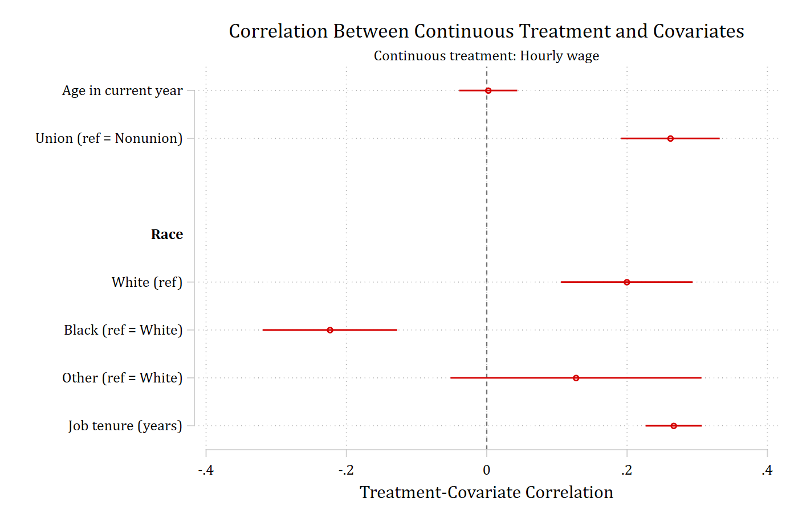
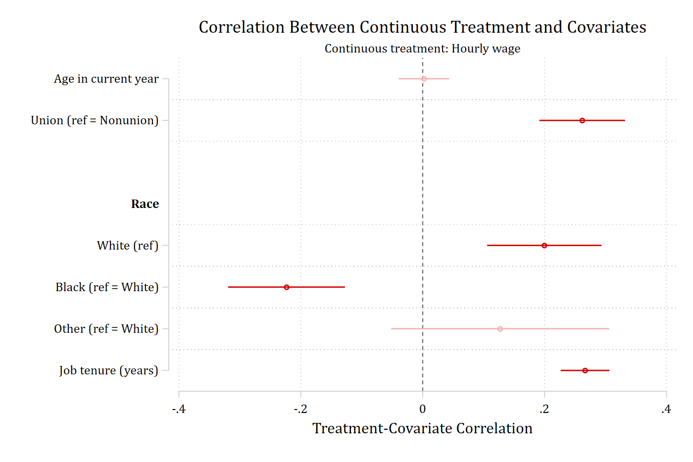

With a continuous treatment there are no groups to compare, so
`contreat(varname)` assesses balance as the correlation between the treatment
and each covariate: Pearson correlations for continuous covariates and
polyserial correlations for binary indicators, with one indicator per
category of a nominal covariate (including the reference category). The
correlations come from the user-written `polychoric` command, which must be
installed. Values closer to zero indicate less association between the
treatment and the covariate.

Here hourly wage is the treatment:

```{.stata-run}
. sysuse nlsw88, clear
(NLSW, 1988 extract)

. balanceplot age i.union i.race tenure, contreat(wage)


NOTE: 378 observations were excluded due to missing data on
a covariate, contreat(), or outcome() variable.


Continuous treatment = wage (Hourly wage)
N used in correlation calculations =        1,868

. graph export "fig/contreat-default.png", replace width(1400)
file fig/contreat-default.png saved as PNG format

```

{width=85% fig-alt="Correlations between hourly wage and age, union membership, race, and tenure, with confidence intervals."}

## The same plotting options

`threshold()`, `absolute`, `sort`, `fadens`, `noci`, `level()`, and
`graphop()` work as they do with `group()`. With `contreat()` the threshold
must be no greater than one.

```{.stata-run}
. balanceplot age i.union i.race tenure, contreat(wage) absolute sort threshold(.1)


NOTE: 378 observations were excluded due to missing data on
a covariate, contreat(), or outcome() variable.


Continuous treatment = wage (Hourly wage)
N used in correlation calculations =        1,868

. graph export "fig/contreat-absolute.png", replace width(1400)
file fig/contreat-absolute.png saved as PNG format

```

{width=85% fig-alt="Sorted absolute correlations with hourly wage and a reference line at 0.1."}

```{.stata-run}
. balanceplot age i.union i.race tenure, contreat(wage) fadens


NOTE: 378 observations were excluded due to missing data on
a covariate, contreat(), or outcome() variable.


Continuous treatment = wage (Hourly wage)
N used in correlation calculations =        1,868

. graph export "fig/contreat-fadens.png", replace width(1400)
file fig/contreat-fadens.png saved as PNG format

```

{width=85% fig-alt="Correlations with hourly wage, with nonsignificant correlations faded."}

## Tables

`table` reports each correlation and its p-value; `tablefull` adds the
standard error and confidence limits.

```{.stata-run}
. balanceplot age i.union i.race tenure, contreat(wage) table


NOTE: 378 observations were excluded due to missing data on
a covariate, contreat(), or outcome() variable.


Continuous treatment = wage (Hourly wage)
N used in correlation calculations =        1,868

Treatment-covariate correlations: Hourly wage

               Covariate | Correlat~n     p-value 
-------------------------+-----------------------
                         |                       
     Age in current year |      0.002       0.923 
  Union (ref = Nonunion) |      0.262       0.000 
-------------------------+-----------------------
Race                     |                       
              White(ref) |      0.200       0.000 
     Black (ref = White) |     -0.223       0.000 
     Other (ref = White) |      0.127       0.164 
-------------------------+-----------------------
                         |                       
      Job tenure (years) |      0.266       0.000 

. balanceplot age i.union i.race tenure, contreat(wage) tablefull


NOTE: 378 observations were excluded due to missing data on
a covariate, contreat(), or outcome() variable.


Continuous treatment = wage (Hourly wage)
N used in correlation calculations =        1,868

Treatment-covariate correlations: Hourly wage

                         |                        |         95% CI         |      _     
               Covariate | Correlat~n          SE |      Lower       Upper |    p-value 
-------------------------+------------------------+------------------------+-----------
                         |                        |                        |           
     Age in current year |      0.002       0.021 |     -0.039       0.043 |      0.923 
  Union (ref = Nonunion) |      0.262       0.036 |      0.191       0.332 |      0.000 
-------------------------+------------------------+------------------------+-----------
Race                     |                        |                        |           
              White(ref) |      0.200       0.048 |      0.106       0.293 |      0.000 
     Black (ref = White) |     -0.223       0.049 |     -0.319      -0.128 |      0.000 
     Other (ref = White) |      0.127       0.091 |     -0.052       0.306 |      0.164 
-------------------------+------------------------+------------------------+-----------
                         |                        |                        |           
      Job tenure (years) |      0.266       0.020 |      0.226       0.306 |      0.000 

```

The correlations are returned in `r(correlation)`.

## Stored results

`store(stub)` posts one set, *stub*`_correlation`, with the correlations in
`e(b)` and their squared standard errors on the diagonal of `e(V)`:

```{.stata-run}
. balanceplot age i.union i.race tenure, contreat(wage) store(ct, replace)


NOTE: 378 observations were excluded due to missing data on
a covariate, contreat(), or outcome() variable.


Continuous treatment = wage (Hourly wage)
N used in correlation calculations =        1,868

. esttab ct_correlation, se label mtitles

------------------------------------
                              (1)   
                     ct_correla~n   
------------------------------------
Age in current year       0.00205   
                         (0.0211)   

Union                       0.262***
                         (0.0359)   

White                       0.200***
                         (0.0478)   

Black                      -0.223***
                         (0.0489)   

Other                       0.127   
                         (0.0913)   

Job tenure (years)          0.266***
                         (0.0204)   
------------------------------------
Observations                 1868   
------------------------------------
Standard errors in parentheses
* p<0.05, ** p<0.01, *** p<0.001

```

`contreat()` may not be combined with `group()`, `base()`, `cohensh`, or
`matchweight()`.
