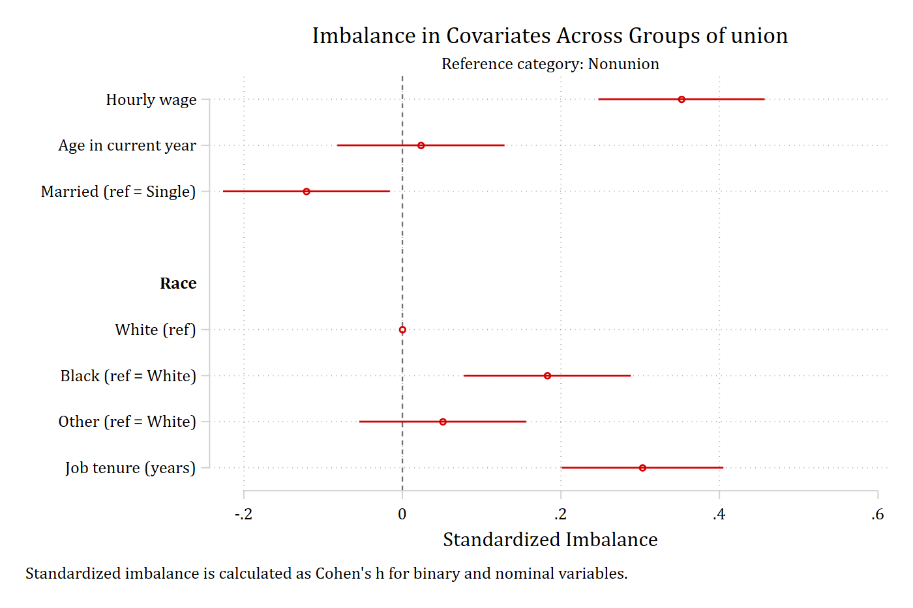
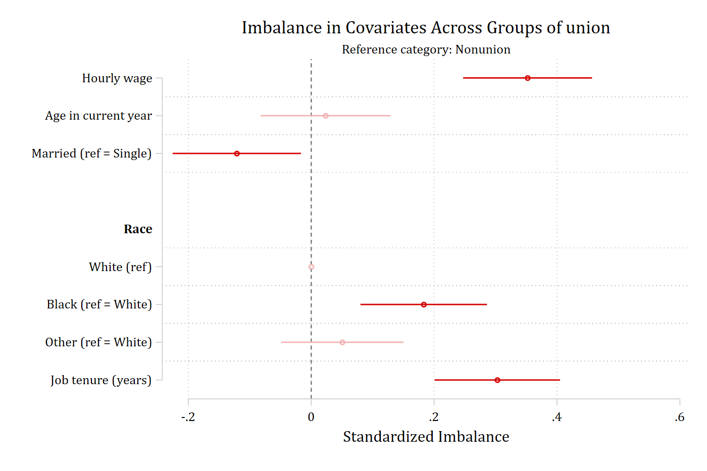
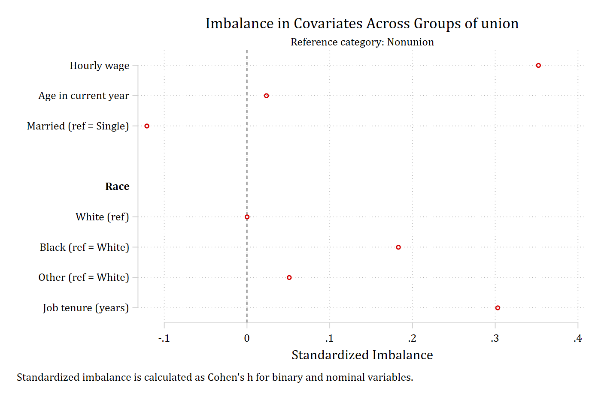
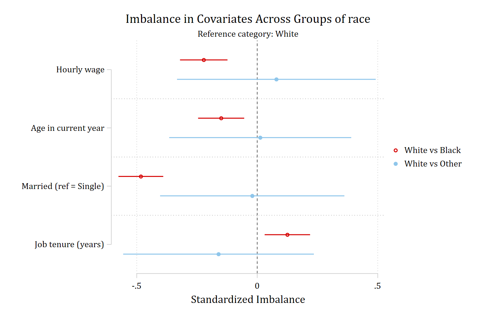
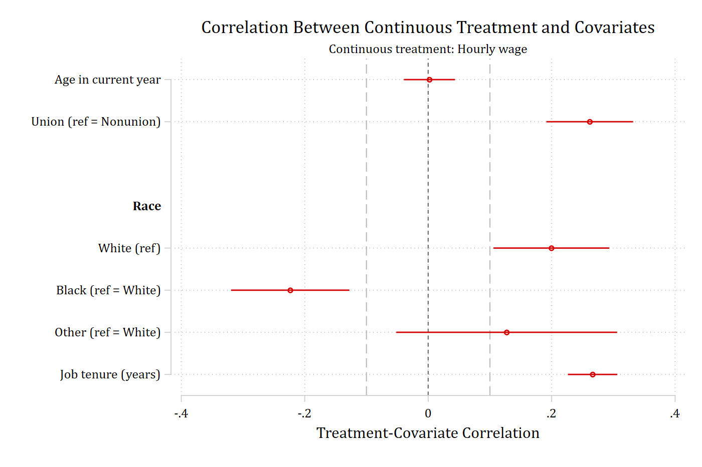
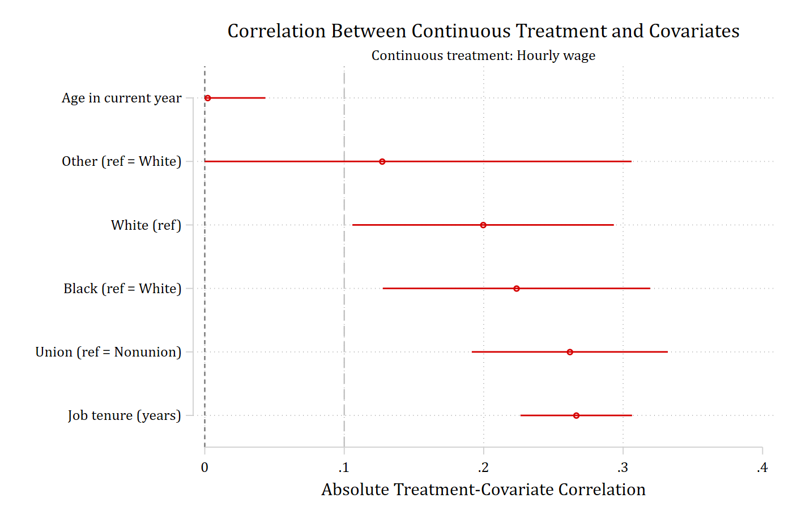
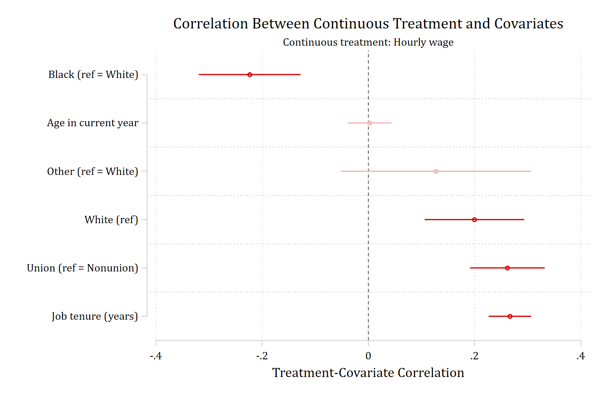

These are the examples at the end of `help balanceplot`, run in order with
their printed output and the graph each one draws. Each example adds one
option to the one before it; the sentence above each call says what the new
option does. The [Options](options.html),
[Continuous treatments](continuous-treatment.html), and
[Matching and teffects](matching.html) pages explain the options in more
detail. The session starts with `estimates clear` so that the `store()`
examples, which do not use `replace`, have nothing to collide with.

## Comparing groups

The default: `group(union)` compares union with nonunion workers on every
covariate, as standardized mean differences with 95% confidence intervals.

```{.stata-run}
. estimates clear

. sysuse nlsw88, clear
(NLSW, 1988 extract)

. balanceplot wage age i.married i.race tenure, group(union)


NOTE: 10 observations were excluded due to missing data on
at least one covariate, group(), or outcome() variable.


Base category = 0_Nonunion
Base selected by the 0/1 two-group default.


N used in balance calculations
- N for union = 0_Nonunion: 1408
- N for union = 1_Union: 460

. graph export "fig/helpex-default.png", replace width(1400)
file fig/helpex-default.png saved as PNG format

```

{width=85% fig-alt="Default balance plot: standardized imbalance of each covariate between union and nonunion workers, with confidence intervals."}

`cohensh` reports the binary and nominal covariates (married, race) as
Cohen's *h* instead of standardized mean differences; continuous covariates
are unchanged.

```{.stata-run}
. balanceplot wage age i.married i.race tenure, group(union) cohensh


NOTE: 10 observations were excluded due to missing data on
at least one covariate, group(), or outcome() variable.


Base category = 0_Nonunion
Base selected by the 0/1 two-group default.


N used in balance calculations
- N for union = 0_Nonunion: 1408
- N for union = 1_Union: 460

. graph export "fig/helpex-cohensh.png", replace width(1400)
file fig/helpex-cohensh.png saved as PNG format

```

{width=85% fig-alt="Balance plot using Cohen's h for the married and race covariates."}

`fadens` fades the point estimates and intervals that are not statistically
significant, so the imbalances that matter stand out.

```{.stata-run}
. balanceplot wage age i.married i.race tenure, group(union) fadens


NOTE: 10 observations were excluded due to missing data on
at least one covariate, group(), or outcome() variable.


Base category = 0_Nonunion
Base selected by the 0/1 two-group default.


N used in balance calculations
- N for union = 0_Nonunion: 1408
- N for union = 1_Union: 460

. graph export "fig/helpex-fadens.png", replace width(1400)
file fig/helpex-fadens.png saved as PNG format

```

{width=85% fig-alt="Balance plot with nonsignificant imbalances faded."}

`noci` drops the confidence intervals from the graph (they stay in the
returned matrices and tables); `cohensH` is a synonym for `cohensh`.

```{.stata-run}
. balanceplot wage age i.married i.race tenure, group(union) cohensH noci


NOTE: 10 observations were excluded due to missing data on
at least one covariate, group(), or outcome() variable.


Base category = 0_Nonunion
Base selected by the 0/1 two-group default.


N used in balance calculations
- N for union = 0_Nonunion: 1408
- N for union = 1_Union: 460

. graph export "fig/helpex-cohensh-noci.png", replace width(1400)
file fig/helpex-cohensh-noci.png saved as PNG format

```

{width=85% fig-alt="Balance plot with Cohen's h for the factor covariates and no confidence intervals."}

`sort` orders the covariates from the most negative to the most positive
imbalance instead of the order of the varlist; the variable headings are
dropped because the categories of a nominal variable need no longer sit
together.

```{.stata-run}
. balanceplot wage age i.married i.race tenure, group(union) sort


NOTE: 10 observations were excluded due to missing data on
at least one covariate, group(), or outcome() variable.


Base category = 0_Nonunion
Base selected by the 0/1 two-group default.


N used in balance calculations
- N for union = 0_Nonunion: 1408
- N for union = 1_Union: 460

. graph export "fig/helpex-sort.png", replace width(1400)
file fig/helpex-sort.png saved as PNG format

```

{width=85% fig-alt="Balance plot with covariates sorted from negative to positive imbalance."}

`absolute` plots the magnitude of each imbalance (so `sort` now runs from
the smallest to the largest), and `threshold(.1)` adds a dashed reference
line at 0.1, a common cutoff for acceptable balance.

```{.stata-run}
. balanceplot wage age i.married i.race tenure, group(union) absolute sort threshold(.1)


NOTE: 10 observations were excluded due to missing data on
at least one covariate, group(), or outcome() variable.


Base category = 0_Nonunion
Base selected by the 0/1 two-group default.


N used in balance calculations
- N for union = 0_Nonunion: 1408
- N for union = 1_Union: 460

. graph export "fig/helpex-absolute-sort.png", replace width(1400)
file fig/helpex-absolute-sort.png saved as PNG format

```

{width=85% fig-alt="Balance plot of absolute imbalances sorted from smallest to largest, with a reference line at 0.1."}

`threshold(.1)` on the signed plot draws the reference lines at both -0.1
and 0.1.

```{.stata-run}
. balanceplot wage age i.married i.race tenure, group(union) threshold(.1)


NOTE: 10 observations were excluded due to missing data on
at least one covariate, group(), or outcome() variable.


Base category = 0_Nonunion
Base selected by the 0/1 two-group default.


N used in balance calculations
- N for union = 0_Nonunion: 1408
- N for union = 1_Union: 460

. graph export "fig/helpex-threshold.png", replace width(1400)
file fig/helpex-threshold.png saved as PNG format

```

{width=85% fig-alt="Default balance plot with dashed reference lines at -0.1 and 0.1."}

## Tables

`table` prints a compact table -- the two group means, the standardized
imbalance, and its p-value -- alongside the graph, which is the default one
shown above. The same numbers are returned in `r(table1)`
whether or not a table is printed.

```{.stata-run}
. balanceplot wage age i.married i.race tenure, group(union) table


NOTE: 10 observations were excluded due to missing data on
at least one covariate, group(), or outcome() variable.


Base category = 0_Nonunion
Base selected by the 0/1 two-group default.


N used in balance calculations
- N for union = 0_Nonunion: 1408
- N for union = 1_Union: 460

Balance results: Nonunion (N=1,408) vs Union (N=460)

                         |   union=0  |   union=1  | Standard~d |      _     
               Covariate |       Mean |       Mean |  Imbalance |    p-value 
-------------------------+------------+------------+------------+-----------
                         |            |            |            |           
             Hourly wage |      7.227 |      8.685 |      0.352 |      0.000 
     Age in current year |     39.205 |     39.276 |      0.023 |      0.664 
  Married (ref = Single) |      0.665 |      0.607 |     -0.121 |      0.023 
-------------------------+------------+------------+------------+-----------
Race                     |            |            |            |           
              White(ref) |      0.743 |      0.654 |      0.000 |      1.000 
     Black (ref = White) |      0.246 |      0.328 |      0.183 |      0.001 
     Other (ref = White) |      0.011 |      0.017 |      0.051 |      0.319 
-------------------------+------------+------------+------------+-----------
                         |            |            |            |           
      Job tenure (years) |      6.141 |      7.888 |      0.303 |      0.000 

. matrix list r(table1)

r(table1)[7,4]
                mean_g0       mean_g1  std_imbala~e       p_value
     wage     7.2269385     8.6845396     .35213133     5.918e-11
      age     39.205256     39.276087      .0233567     .66430587
1.married     .66477273     .60652174    -.12117473     .02291971
  1b.race     .74289773     .65434783             0             1
   2.race     .24573864     .32826087     .18305107     .00050025
   3.race     .01136364      .0173913     .05061108      .3192061
   tenure     6.1407434     7.8882246      .3028704     6.944e-09

```

`tablefull` prints the detailed table, adding the standard error and the
confidence limits; the matrix version is `r(tablefull1)`.

```{.stata-run}
. balanceplot wage age i.married i.race tenure, group(union) tablefull


NOTE: 10 observations were excluded due to missing data on
at least one covariate, group(), or outcome() variable.


Base category = 0_Nonunion
Base selected by the 0/1 two-group default.


N used in balance calculations
- N for union = 0_Nonunion: 1408
- N for union = 1_Union: 460

Balance results: Nonunion (N=1,408) vs Union (N=460)

                         |   union=0  |   union=1  | Standard~d |      _     
               Covariate |       Mean |       Mean |  Imbalance |         SE 
-------------------------+------------+------------+------------+------------
                         |            |            |            |            
             Hourly wage |      7.227 |      8.685 |      0.352 |      0.053 
     Age in current year |     39.205 |     39.276 |      0.023 |      0.054 
  Married (ref = Single) |      0.665 |      0.607 |     -0.121 |      0.053 
-------------------------+------------+------------+------------+------------
Race                     |            |            |            |            
              White(ref) |      0.743 |      0.654 |      0.000 |      0.000 
     Black (ref = White) |      0.246 |      0.328 |      0.183 |      0.052 
     Other (ref = White) |      0.011 |      0.017 |      0.051 |      0.051 
-------------------------+------------+------------+------------+------------
                         |            |            |            |            
      Job tenure (years) |      6.141 |      7.888 |      0.303 |      0.052 

                         |         95% CI         |      _     
               Covariate |      Lower       Upper |    p-value 
-------------------------+------------------------+-----------
                         |                        |           
             Hourly wage |      0.247       0.457 |      0.000 
     Age in current year |     -0.082       0.129 |      0.664 
  Married (ref = Single) |     -0.226      -0.017 |      0.023 
-------------------------+------------------------+-----------
Race                     |                        |           
              White(ref) |      0.000       0.000 |      1.000 
     Black (ref = White) |      0.080       0.286 |      0.001 
     Other (ref = White) |     -0.049       0.150 |      0.319 
-------------------------+------------------------+-----------
                         |                        |           
      Job tenure (years) |      0.201       0.405 |      0.000 

. matrix list r(tablefull1)

r(tablefull1)[7,7]
                mean_g0       mean_g1  std_imbala~e       std_err        ci_low       ci_high
     wage     7.2269385     8.6845396     .35213133      .0534793      .2472458     .45701686
      age     39.205256     39.276087      .0233567      .0538117    -.08218074     .12889415
1.married     .66477273     .60652174    -.12117473     .05322493    -.22556139    -.01678808
  1b.race     .74289773     .65434783             0             0             0             0
   2.race     .24573864     .32826087     .18305107     .05249912     .08008791     .28601423
   3.race     .01136364      .0173913     .05061108     .05079615    -.04901217     .15023433
   tenure     6.1407434     7.8882246      .3028704     .05204687      .2007942      .4049466

                p_value
     wage     5.918e-11
      age     .66430587
1.married     .02291971
  1b.race             1
   2.race     .00050025
   3.race      .3192061
   tenure     6.944e-09

```

`labwidth(30)` widens the label column so that long variable and category
labels are not abbreviated, and `width(11)` widens every statistic column.

```{.stata-run}
. balanceplot wage age i.married i.race tenure, group(union) table labwidth(30) width(11)


NOTE: 10 observations were excluded due to missing data on
at least one covariate, group(), or outcome() variable.


Base category = 0_Nonunion
Base selected by the 0/1 two-group default.


N used in balance calculations
- N for union = 0_Nonunion: 1408
- N for union = 1_Union: 460

Balance results: Nonunion (N=1,408) vs Union (N=460)

                               |   union=0   |   union=1   | Standardi~d |      _      
                     Covariate |        Mean |        Mean |   Imbalance |     p-value 
-------------------------------+-------------+-------------+-------------+------------
                               |             |             |             |            
                   Hourly wage |       7.227 |       8.685 |       0.352 |       0.000 
           Age in current year |      39.205 |      39.276 |       0.023 |       0.664 
        Married (ref = Single) |       0.665 |       0.607 |      -0.121 |       0.023 
-------------------------------+-------------+-------------+-------------+------------
Race                           |             |             |             |            
                    White(ref) |       0.743 |       0.654 |       0.000 |       1.000 
           Black (ref = White) |       0.246 |       0.328 |       0.183 |       0.001 
           Other (ref = White) |       0.011 |       0.017 |       0.051 |       0.319 
-------------------------------+-------------+-------------+-------------+------------
                               |             |             |             |            
            Job tenure (years) |       6.141 |       7.888 |       0.303 |       0.000 

```

## More than two groups

A grouping variable with three categories gives one comparison per nonbase
category, each in its own color; the base is the largest complete-case
category (White) unless `base()` says otherwise.

```{.stata-run}
. balanceplot wage age i.married tenure, group(race)


NOTE: 15 observations were excluded due to missing data on
at least one covariate, group(), or outcome() variable.


Base category = 1_White
Base selected as the largest complete-case group.


N used in balance calculations
- N for race = 1_White: 1627
- N for race = 2_Black: 578
- N for race = 3_Other: 26

. graph export "fig/helpex-groups.png", replace width(1400)
file fig/helpex-groups.png saved as PNG format

```

{width=85% fig-alt="Balance plot comparing Black and Other workers with White workers."}

## Store results for esttab

`store(bp)` posts the group means and the imbalances as estimation results
(`bp_mean_g0`, `bp_mean_g1`, `bp_imbalance`) so that `esttab` can lay them
out as three aligned columns; the graph is the default one.

```{.stata-run}
. balanceplot wage age i.married i.race tenure, group(union) store(bp)


NOTE: 10 observations were excluded due to missing data on
at least one covariate, group(), or outcome() variable.


Base category = 0_Nonunion
Base selected by the 0/1 two-group default.


N used in balance calculations
- N for union = 0_Nonunion: 1408
- N for union = 1_Union: 460

. esttab bp_mean_g0 bp_mean_g1 bp_imbalance, se label mtitles

--------------------------------------------------------------------
                              (1)             (2)             (3)   
                       bp_mean_g0      bp_mean_g1    bp_imbalance   
--------------------------------------------------------------------
Hourly wage                 7.227           8.685           0.352***
                                                         (0.0535)   

Age in current year         39.21           39.28          0.0234   
                                                         (0.0538)   

Married                     0.665           0.607          -0.121*  
                                                         (0.0532)   

White                       0.743           0.654               0   
                                                              (.)   

Black                       0.246           0.328           0.183***
                                                         (0.0525)   

Other                      0.0114          0.0174          0.0506   
                                                         (0.0508)   

Job tenure (years)          6.141           7.888           0.303***
                                                         (0.0520)   
--------------------------------------------------------------------
Observations                 1408             460            1868   
--------------------------------------------------------------------
Standard errors in parentheses
* p<0.05, ** p<0.01, *** p<0.001

```

With three groups, `store(br)` posts one mean result per group and one
imbalance result per nonbase comparison (`br_imb_g2`, `br_imb_g3`); the
graph is the three-group plot above.

```{.stata-run}
. balanceplot wage age i.married tenure, group(race) store(br)


NOTE: 15 observations were excluded due to missing data on
at least one covariate, group(), or outcome() variable.


Base category = 1_White
Base selected as the largest complete-case group.


N used in balance calculations
- N for race = 1_White: 1627
- N for race = 2_Black: 578
- N for race = 3_Other: 26

. esttab br_mean_g1 br_mean_g2 br_mean_g3 br_imb_g2 br_imb_g3, se label mtitles

----------------------------------------------------------------------------------------------------
                              (1)             (2)             (3)             (4)             (5)   
                       br_mean_g1      br_mean_g2      br_mean_g3       br_imb_g2       br_imb_g3   
----------------------------------------------------------------------------------------------------
Hourly wage                 8.106           6.876           8.551          -0.222***       0.0795   
                                                                         (0.0502)         (0.210)   

Age in current year         39.27           38.81           39.31          -0.150**        0.0124   
                                                                         (0.0488)         (0.193)   

Married                     0.702           0.471           0.692          -0.483***      -0.0207   
                                                                         (0.0474)         (0.195)   

Job tenure (years)          5.808           6.502           4.949           0.125**        -0.161   
                                                                         (0.0481)         (0.202)   
----------------------------------------------------------------------------------------------------
Observations                 1627             578              26            2205            1653   
----------------------------------------------------------------------------------------------------
Standard errors in parentheses
* p<0.05, ** p<0.01, *** p<0.001

```

## Continuous treatment

`contreat(wage)` replaces `group()` with a continuous treatment: each row is
the correlation between wages and the covariate, with its confidence
interval. The correlations are returned in `r(correlation)`.

```{.stata-run}
. balanceplot age i.union i.race tenure, contreat(wage)


NOTE: 378 observations were excluded due to missing data on
a covariate, contreat(), or outcome() variable.


Continuous treatment = wage (Hourly wage)
N used in correlation calculations =        1,868

. graph export "fig/helpex-contreat.png", replace width(1400)
file fig/helpex-contreat.png saved as PNG format

. matrix list r(correlation)

r(correlation)[6,5]
         correlation      std_err       ci_low      ci_high      p_value
    age     .0020476    .02110997   -.03932719    .04342238    .92272904
1.union    .26175184    .03586242     .1914628    .33204088    2.904e-13
1b.race    .19959395    .04782955    .10584975    .29333815    .00003006
 2.race   -.22349596    .04891626   -.31937007   -.12762184    4.902e-06
 3.race    .12716398    .09126594   -.05171398    .30604194    .16351867
 tenure    .26637895    .02041563    .22636506    .30639284    6.541e-39

```

{width=85% fig-alt="Balance plot for a continuous treatment: the correlation of wages with each covariate, with confidence intervals."}

`threshold(.1)` adds reference lines at -0.1 and 0.1 on the correlation
scale.

```{.stata-run}
. balanceplot age i.union i.race tenure, contreat(wage) threshold(.1)


NOTE: 378 observations were excluded due to missing data on
a covariate, contreat(), or outcome() variable.


Continuous treatment = wage (Hourly wage)
N used in correlation calculations =        1,868

. graph export "fig/helpex-contreat-threshold.png", replace width(1400)
file fig/helpex-contreat-threshold.png saved as PNG format

```

{width=85% fig-alt="Correlation balance plot with dashed reference lines at -0.1 and 0.1."}

`abs` (the shortest abbreviation of `absolute`) plots the magnitude of each
correlation, `sort` orders them from smallest to largest, and only the
positive threshold line is drawn.

```{.stata-run}
. balanceplot age i.union i.race tenure, contreat(wage) abs sort threshold(.1)


NOTE: 378 observations were excluded due to missing data on
a covariate, contreat(), or outcome() variable.


Continuous treatment = wage (Hourly wage)
N used in correlation calculations =        1,868

. graph export "fig/helpex-contreat-absolute.png", replace width(1400)
file fig/helpex-contreat-absolute.png saved as PNG format

```

{width=85% fig-alt="Absolute correlations sorted from smallest to largest, with a reference line at 0.1."}

`fadens` fades the correlations that are not significant, `sort` orders the
signed correlations, and `tablefull` prints the detailed table (correlation,
standard error, confidence limits, p-value) as well.

```{.stata-run}
. balanceplot age i.union i.race tenure, contreat(wage) fadens sort tablefull


NOTE: 378 observations were excluded due to missing data on
a covariate, contreat(), or outcome() variable.


Continuous treatment = wage (Hourly wage)
N used in correlation calculations =        1,868

Treatment-covariate correlations: Hourly wage

                         |                        |         95% CI         |      _     
               Covariate | Correlat~n          SE |      Lower       Upper |    p-value 
-------------------------+------------------------+------------------------+-----------
                         |                        |                        |           
     Age in current year |      0.002       0.021 |     -0.039       0.043 |      0.923 
  Union (ref = Nonunion) |      0.262       0.036 |      0.191       0.332 |      0.000 
-------------------------+------------------------+------------------------+-----------
Race                     |                        |                        |           
              White(ref) |      0.200       0.048 |      0.106       0.293 |      0.000 
     Black (ref = White) |     -0.223       0.049 |     -0.319      -0.128 |      0.000 
     Other (ref = White) |      0.127       0.091 |     -0.052       0.306 |      0.164 
-------------------------+------------------------+------------------------+-----------
                         |                        |                        |           
      Job tenure (years) |      0.266       0.020 |      0.226       0.306 |      0.000 

. graph export "fig/helpex-contreat-fadens.png", replace width(1400)
file fig/helpex-contreat-fadens.png saved as PNG format

```

{width=85% fig-alt="Sorted correlation balance plot with nonsignificant correlations faded."}

`store(ct)` posts the correlations as the estimation result
`ct_correlation` for `esttab`; the graph is the default `contreat()` plot
above.

```{.stata-run}
. balanceplot age i.union i.race tenure, contreat(wage) store(ct)


NOTE: 378 observations were excluded due to missing data on
a covariate, contreat(), or outcome() variable.


Continuous treatment = wage (Hourly wage)
N used in correlation calculations =        1,868

. esttab ct_correlation, se label mtitles

------------------------------------
                              (1)   
                     ct_correla~n   
------------------------------------
Age in current year       0.00205   
                         (0.0211)   

Union                       0.262***
                         (0.0359)   

White                       0.200***
                         (0.0478)   

Black                      -0.223***
                         (0.0489)   

Other                       0.127   
                         (0.0913)   

Job tenure (years)          0.266***
                         (0.0204)   
------------------------------------
Observations                 1868   
------------------------------------
Standard errors in parentheses
* p<0.05, ** p<0.01, *** p<0.001

```

## Matching-weight examples

After ATT matching with `psmatch2`, `_weight` equals 1 for treated
observations and records how often or how strongly each matched control
contributes; unmatched controls have missing weights. `matchweight(_weight)`
shows the original complete-case balance and the weighted matched balance in
the same graph, with one marker symbol for each.

```{.stata-run}
. sysuse nlsw88, clear
(NLSW, 1988 extract)

. psmatch2 union age tenure grade, neighbor(1) logit

Logistic regression                                     Number of obs =  1,866
                                                        LR chi2(3)    =  42.83
                                                        Prob > chi2   = 0.0000
Log likelihood = -1019.5818                             Pseudo R2     = 0.0206

------------------------------------------------------------------------------
       union | Coefficient  Std. err.      z    P>|z|     [95% conf. interval]
-------------+----------------------------------------------------------------
         age |      0.003      0.018    0.164   0.870       -0.032       0.038
      tenure |      0.048      0.009    5.208   0.000        0.030       0.067
       grade |      0.072      0.022    3.338   0.001        0.030       0.115
       _cons |     -2.534      0.771   -3.289   0.001       -4.045      -1.024
------------------------------------------------------------------------------

. balanceplot age tenure grade, group(union) matchweight(_weight)


NOTE: 12 observations were excluded due to missing data on
at least one covariate, group(), or outcome() variable.
NOTE: 1060 additional base-group observations were excluded from
weighted calculations due to a zero or missing matchweight().


Base category = 0_Nonunion
Base selected by the 0/1 two-group default.


N used in unweighted balance calculations
- N for union = 0_Nonunion: 1407
- N for union = 1_Union: 459
N used in weighted balance calculations
matchweight(_weight) applies to the base group only; all nonbase groups have weight 1.
- N for union = 0_Nonunion: 347; sum of matching weights =          459
- N for union = 1_Union: 459

. graph export "fig/helpex-matchweight.png", replace width(1400)
(file fig/helpex-matchweight.png not found)
file fig/helpex-matchweight.png saved as PNG format

```

{width=85% fig-alt="Balance plot showing unweighted and matching-weighted imbalance for each covariate, before and after propensity-score matching."}

With `matchweight()`, `store(bm)` posts two complete sets of results, the
unweighted set with the prefix `bm_unw_` and the weighted set with `bm_w_`,
so each can be passed to `esttab` on its own; the graph is the one above.

```{.stata-run}
. balanceplot age tenure grade, group(union) matchweight(_weight) store(bm)


NOTE: 12 observations were excluded due to missing data on
at least one covariate, group(), or outcome() variable.
NOTE: 1060 additional base-group observations were excluded from
weighted calculations due to a zero or missing matchweight().


Base category = 0_Nonunion
Base selected by the 0/1 two-group default.


N used in unweighted balance calculations
- N for union = 0_Nonunion: 1407
- N for union = 1_Union: 459
N used in weighted balance calculations
matchweight(_weight) applies to the base group only; all nonbase groups have weight 1.
- N for union = 0_Nonunion: 347; sum of matching weights =          459
- N for union = 1_Union: 459

. esttab bm_unw_mean_g0 bm_unw_mean_g1 bm_unw_imbalance, se label mtitles

--------------------------------------------------------------------
                              (1)             (2)             (3)   
                     bm_unw_mea~0    bm_unw_mea~1    bm_unw_imb~e   
--------------------------------------------------------------------
Age in current year         39.20           39.28          0.0254   
                                                         (0.0539)   

Job tenure (years)          6.136           7.871           0.301***
                                                         (0.0521)   

Current grade comp~d        13.04           13.58           0.207***
                                                         (0.0521)   
--------------------------------------------------------------------
Observations                 1407             459            1866   
--------------------------------------------------------------------
Standard errors in parentheses
* p<0.05, ** p<0.01, *** p<0.001

. esttab bm_w_mean_g0 bm_w_mean_g1 bm_w_imbalance, se label mtitles

--------------------------------------------------------------------
                              (1)             (2)             (3)   
                     bm_w_mean_g0    bm_w_mean_g1    bm_w_imbal~e   
--------------------------------------------------------------------
Age in current year         39.39           39.28         -0.0361   
                                                         (0.0660)   

Job tenure (years)          7.865           7.871        0.000878   
                                                         (0.0660)   

Current grade comp~d        13.58           13.58               0   
                                                         (0.0660)   
--------------------------------------------------------------------
Observations                  347             459             806   
--------------------------------------------------------------------
Standard errors in parentheses
* p<0.05, ** p<0.01, *** p<0.001

```

Official `teffects` and `stteffects` estimators provide raw and matched or
weighted standardized differences through `tebalance summarize`;
`balanceplot, tebalance` calls that command and plots the results for every
covariate of the treatment model. No confidence intervals are available in
this mode because `tebalance summarize` does not return standard errors.

```{.stata-run}
. sysuse nlsw88, clear
(NLSW, 1988 extract)

. teffects psmatch (wage) (union age tenure grade), atet

Treatment-effects estimation                   Number of obs      =      1,866
Estimator      : propensity-score matching     Matches: requested =          1
Outcome model  : matching                                     min =          1
Treatment model: logit                                        max =          3
--------------------------------------------------------------------------------------
                     |              AI robust
                wage | Coefficient  std. err.      z    P>|z|     [95% conf. interval]
---------------------+----------------------------------------------------------------
ATET                 |
               union |
(Union vs Nonunion)  |      0.891      0.280    3.180   0.001        0.342       1.439
--------------------------------------------------------------------------------------

. balanceplot, tebalance

. graph export "fig/helpex-tebalance.png", replace width(1400)
(file fig/helpex-tebalance.png not found)
file fig/helpex-tebalance.png saved as PNG format

```

{width=85% fig-alt="Raw and matched standardized differences for age, tenure, and grade after teffects psmatch."}

A varlist restricts the `tebalance` plot to selected covariates, and
`absolute sort threshold(.1)` work as they do in the other modes.

```{.stata-run}
. balanceplot age tenure, tebalance absolute sort threshold(.1)

. graph export "fig/helpex-tebalance-sorted.png", replace width(1400)
(file fig/helpex-tebalance-sorted.png not found)
file fig/helpex-tebalance-sorted.png saved as PNG format

```

{width=85% fig-alt="Absolute raw and matched standardized differences for age and tenure, sorted, with a reference line at 0.1."}
