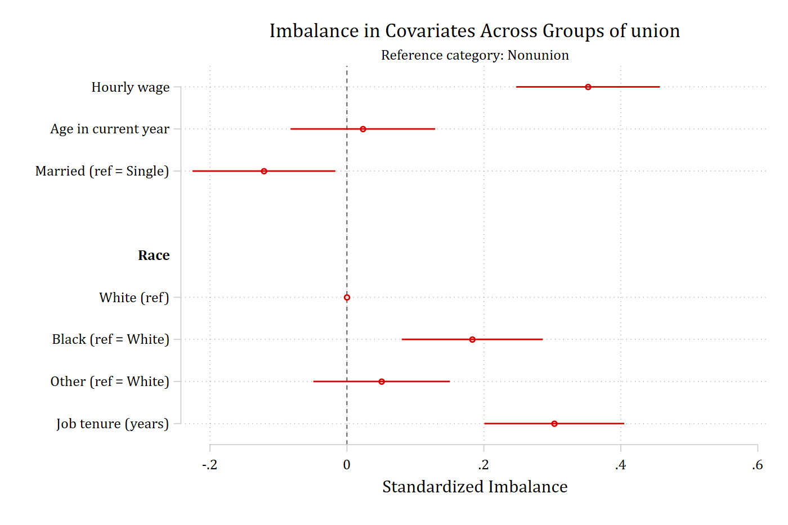

`balanceplot` calculates and plots covariate imbalance for categorical or
continuous treatment variables. Standardized imbalance provides a useful way
to present differences across covariates even when they are measured on
different metrics. `balanceplot` can also be used to compare covariate balance
before and after matching or weighting.

The command supports factor-variable syntax and uses `coefplot` (Jann) to
create the graphs. Continuous-treatment analyses also require the user-written
`polychoric` command, and the examples on these pages use `esttab` (from
`estout`) and `psmatch2`. All four are on SSC:

```stata
ssc install coefplot
ssc install polychoric
ssc install estout
ssc install psmatch2
```

## Installation

```stata
net install balanceplot, from("https://tdmize.github.io/data") replace
```

`help balanceplot` documents the syntax and options; the same help file is on
this site as [help balanceplot](help.html).

## Citation

> Mize, Trenton D. 2018. "balanceplot: Stata command for plots of
> standardized covariate imbalance."
> <https://www.trentonmize.com/software/balanceplot>

## Background

Balance plots come from the experimental and causal inference (matching)
literature. In an experiment the treatment and control groups should be
"balanced" due to random assignment: the covariate distributions should be
the same across conditions. When using a matching method, the pre-matched
sample is imbalanced but the post-matched sample should be balanced. Despite
these origins, balance plots are applicable in any analysis of groups.

[Rosenbaum and Rubin (1985)](https://www.tandfonline.com/doi/abs/10.1080/00031305.1985.10479383)
proposed the commonly used measure of "standardized difference" or "bias" to
quantify differences in balance across groups, which is similar to Cohen's
*d*:

$$
\text{Standardized imbalance} =
\frac{\text{Mean}_{\text{group}} - \text{Mean}_{\text{base}}}
{\sqrt{\left[\dfrac{\text{SD}^2_{\text{group}} + \text{SD}^2_{\text{base}}}{2}\right]}}
$$

Values closer to zero indicate greater balance between groups.

For binary and nominal covariates, `balanceplot` can instead use Cohen's *h*,
a standardized measure of the difference between proportions:

$$
\text{Cohen's } h =
2 \sin^{-1}\!\left(\sqrt{p_{\text{group}}}\right) -
2 \sin^{-1}\!\left(\sqrt{p_{\text{base}}}\right)
$$

The `cohensh` option uses Cohen's *h* for binary and nominal covariates while
continuing to use standardized differences for continuous covariates.

For a continuous treatment variable, balance is assessed using the correlation
between the treatment and each covariate. `balanceplot` uses Pearson
correlations for continuous covariates and polyserial correlations for binary
indicators, including separate indicators for each category of nominal
covariates. Values closer to zero indicate less association between the
treatment and the covariates.

## The three uses

```stata
balanceplot varlist, group(groupvar)

balanceplot varlist, contreat(varname)

balanceplot, tebalance
```

`group()` compares covariate balance across the categories of a categorical
variable. `contreat()` plots correlations between a continuous treatment and
the covariates. `tebalance` plots balance before and after matching or
weighting, following supported `teffects` and `stteffects` commands.

Categorical covariates are specified with factor-variable syntax (`i.`); bare
variables and `c.` variables are treated as continuous.

## Where to start

- [Options](options.html) runs every option of the `group()` form, with a
  graph or table for each.
- [Tables and stored results](tables.html): `table`, `tablefull`, the
  formatting options, `store()` with `esttab`, and the returned matrices.
- [Continuous treatments](continuous-treatment.html): `contreat()`.
- [Matching and teffects](matching.html): `matchweight()` after `psmatch2`
  and `tebalance` after `teffects`.
- [Examples from the help file](help-examples.html) runs the help file's
  examples in full, and the [help file](help.html) is on the site, rendered
  from the installed version.

## A first example

The basic use of `balanceplot` compares standardized covariate imbalance
across the groups of a categorical variable:

```{.stata-run}
. sysuse nlsw88, clear
(NLSW, 1988 extract)

. balanceplot wage age i.married i.race tenure, group(union)


NOTE: 10 observations were excluded due to missing data on
at least one covariate, group(), or outcome() variable.


Base category = 0_Nonunion
Base selected by the 0/1 two-group default.


N used in balance calculations
- N for union = 0_Nonunion: 1408
- N for union = 1_Union: 460

. graph export "fig/index-default.png", replace width(1400)
file fig/index-default.png saved as PNG format

```

{width=85% fig-alt="Default balance plot comparing union and nonunion workers on wage, age, marital status, race, and tenure, with 95% confidence intervals."}

Each covariate's standardized imbalance is plotted with its confidence
interval, and the categories of a nominal covariate are grouped under a
heading with the reference category shown at zero. The output reports the
observations excluded for missing data and the size of each group.
