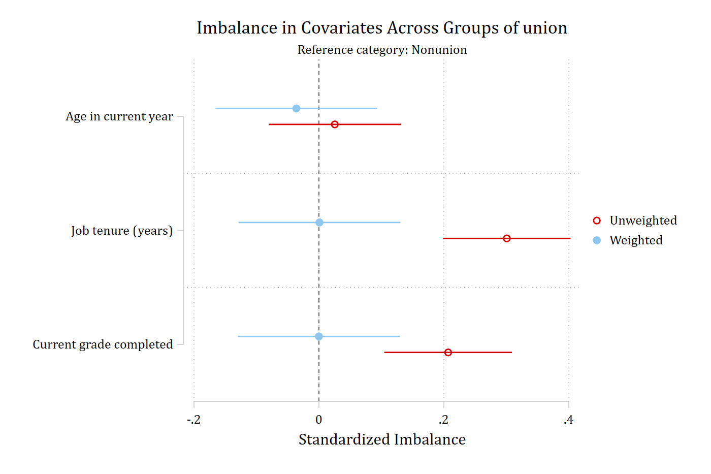
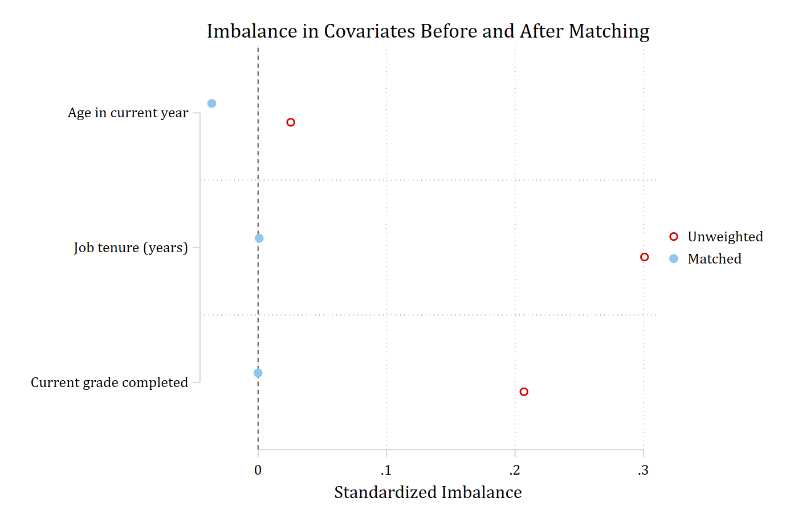
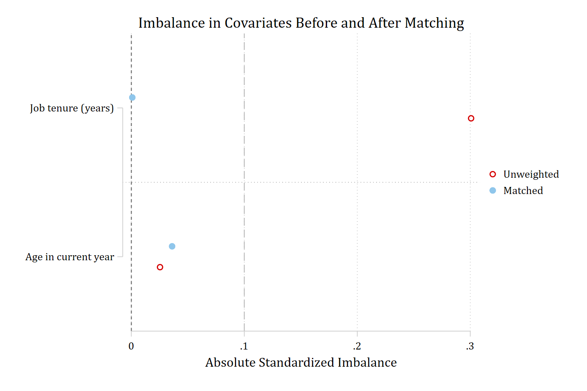

The original use of a balance plot is to show that matching or weighting has
done its job: the covariates that were imbalanced before matching are
balanced after it. `balanceplot` supports this two ways. `matchweight()`
takes the matching weights produced by a command such as `psmatch2` and plots
the unweighted and weighted balance together. `tebalance` works after Stata's
own `teffects` and `stteffects` estimators, plotting the standardized
differences that `tebalance summarize` returns.

## matchweight() after psmatch2

After ATT matching with `psmatch2`, `_weight` is 1 for treated observations
and records how often each matched control was used; unmatched controls have
a missing weight. `matchweight(_weight)` applies those weights to the base
group (the controls) and shows the original complete-case balance and the
weighted matched balance in one graph, one color per comparison and a
different marker for the unweighted and weighted estimates.

```{.stata-run}
. sysuse nlsw88, clear
(NLSW, 1988 extract)

. psmatch2 union age tenure grade, neighbor(1) logit

Logistic regression                                     Number of obs =  1,866
                                                        LR chi2(3)    =  42.83
                                                        Prob > chi2   = 0.0000
Log likelihood = -1019.5818                             Pseudo R2     = 0.0206

------------------------------------------------------------------------------
       union | Coefficient  Std. err.      z    P>|z|     [95% conf. interval]
-------------+----------------------------------------------------------------
         age |      0.003      0.018    0.164   0.870       -0.032       0.038
      tenure |      0.048      0.009    5.208   0.000        0.030       0.067
       grade |      0.072      0.022    3.338   0.001        0.030       0.115
       _cons |     -2.534      0.771   -3.289   0.001       -4.045      -1.024
------------------------------------------------------------------------------

. balanceplot age tenure grade, group(union) matchweight(_weight)


NOTE: 12 observations were excluded due to missing data on
at least one covariate, group(), or outcome() variable.
NOTE: 1060 additional base-group observations were excluded from
weighted calculations due to a zero or missing matchweight().


Base category = 0_Nonunion
Base selected by the 0/1 two-group default.


N used in unweighted balance calculations
- N for union = 0_Nonunion: 1407
- N for union = 1_Union: 459
N used in weighted balance calculations
matchweight(_weight) applies to the base group only; all nonbase groups have weight 1.
- N for union = 0_Nonunion: 347; sum of matching weights =          459
- N for union = 1_Union: 459

. graph export "fig/matching-matchweight.png", replace width(1400)
file fig/matching-matchweight.png saved as PNG format

```

{width=85% fig-alt="Standardized imbalance of age, tenure, and grade between union and nonunion workers, unweighted and after propensity-score matching."}

This matches `psmatch2`'s convention of controls coded 0 and treated coded
1. If the control category is not the default base, name it with `base()`.
`fadens` fades each estimate according to its own p-value, and `sort` orders
the covariates by the weighted estimates.

With `table`, an unweighted table is followed by a weighted one:

```{.stata-run}
. balanceplot age tenure grade, group(union) matchweight(_weight) table


NOTE: 12 observations were excluded due to missing data on
at least one covariate, group(), or outcome() variable.
NOTE: 1060 additional base-group observations were excluded from
weighted calculations due to a zero or missing matchweight().


Base category = 0_Nonunion
Base selected by the 0/1 two-group default.


N used in unweighted balance calculations
- N for union = 0_Nonunion: 1407
- N for union = 1_Union: 459
N used in weighted balance calculations
matchweight(_weight) applies to the base group only; all nonbase groups have weight 1.
- N for union = 0_Nonunion: 347; sum of matching weights =          459
- N for union = 1_Union: 459

Unweighted balance results: Nonunion (N=1,407) vs Union (N=459)

                         |   union=0  |   union=1  | Standard~d |      _     
               Covariate |       Mean |       Mean |  Imbalance |    p-value 
-------------------------+------------+------------+------------+-----------
     Age in current year |     39.204 |     39.281 |      0.025 |      0.637 
      Job tenure (years) |      6.136 |      7.871 |      0.301 |      0.000 
 Current grade completed |     13.036 |     13.580 |      0.207 |      0.000 

Weighted balance results: Nonunion (N=347; sum w=459) vs Union (N=459)

                         |   union=0  |   union=1  | Standard~d |      _     
               Covariate |       Mean |       Mean |  Imbalance |    p-value 
-------------------------+------------+------------+------------+-----------
     Age in current year |     39.392 |     39.281 |     -0.036 |      0.585 
      Job tenure (years) |      7.865 |      7.871 |      0.001 |      0.989 
 Current grade completed |     13.580 |     13.580 |      0.000 |      1.000 

```

`store()` posts both sets, with the prefixes *stub*`_unw_` and *stub*`_w_`:

```{.stata-run}
. balanceplot age tenure grade, group(union) matchweight(_weight) store(bm, replace)


NOTE: 12 observations were excluded due to missing data on
at least one covariate, group(), or outcome() variable.
NOTE: 1060 additional base-group observations were excluded from
weighted calculations due to a zero or missing matchweight().


Base category = 0_Nonunion
Base selected by the 0/1 two-group default.


N used in unweighted balance calculations
- N for union = 0_Nonunion: 1407
- N for union = 1_Union: 459
N used in weighted balance calculations
matchweight(_weight) applies to the base group only; all nonbase groups have weight 1.
- N for union = 0_Nonunion: 347; sum of matching weights =          459
- N for union = 1_Union: 459

. esttab bm_unw_mean_g0 bm_unw_mean_g1 bm_unw_imbalance, se label mtitles

--------------------------------------------------------------------
                              (1)             (2)             (3)   
                     bm_unw_mea~0    bm_unw_mea~1    bm_unw_imb~e   
--------------------------------------------------------------------
Age in current year         39.20           39.28          0.0254   
                                                         (0.0539)   

Job tenure (years)          6.136           7.871           0.301***
                                                         (0.0521)   

Current grade comp~d        13.04           13.58           0.207***
                                                         (0.0521)   
--------------------------------------------------------------------
Observations                 1407             459            1866   
--------------------------------------------------------------------
Standard errors in parentheses
* p<0.05, ** p<0.01, *** p<0.001

. esttab bm_w_mean_g0 bm_w_mean_g1 bm_w_imbalance, se label mtitles

--------------------------------------------------------------------
                              (1)             (2)             (3)   
                     bm_w_mean_g0    bm_w_mean_g1    bm_w_imbal~e   
--------------------------------------------------------------------
Age in current year         39.39           39.28         -0.0361   
                                                         (0.0660)   

Job tenure (years)          7.865           7.871        0.000878   
                                                         (0.0660)   

Current grade comp~d        13.58           13.58               0   
                                                         (0.0660)   
--------------------------------------------------------------------
Observations                  347             459             806   
--------------------------------------------------------------------
Standard errors in parentheses
* p<0.05, ** p<0.01, *** p<0.001

```

## tebalance after teffects and stteffects

After a supported `teffects` estimator (`aipw`, `ipw`, `ipwra`, `nnmatch`,
`psmatch`) or `stteffects` estimator (`ipw`, `ipwra`), `balanceplot,
tebalance` calls `tebalance summarize` and plots its raw and matched or
weighted standardized differences.

```{.stata-run}
. sysuse nlsw88, clear
(NLSW, 1988 extract)

. teffects psmatch (wage) (union age tenure grade), atet

Treatment-effects estimation                   Number of obs      =      1,866
Estimator      : propensity-score matching     Matches: requested =          1
Outcome model  : matching                                     min =          1
Treatment model: logit                                        max =          3
--------------------------------------------------------------------------------------
                     |              AI robust
                wage | Coefficient  std. err.      z    P>|z|     [95% conf. interval]
---------------------+----------------------------------------------------------------
ATET                 |
               union |
(Union vs Nonunion)  |      0.891      0.280    3.180   0.001        0.342       1.439
--------------------------------------------------------------------------------------

. balanceplot, tebalance

. graph export "fig/matching-tebalance.png", replace width(1400)
file fig/matching-tebalance.png saved as PNG format

```

{width=85% fig-alt="Standardized differences in age, tenure, and grade before and after propensity-score matching, from tebalance summarize."}

A *varlist* restricts the plot to some of the treatment-model covariates, and
`sort`, `absolute`, `threshold()`, `graphop()`, and `plotcommand` are
available:

```{.stata-run}
. balanceplot age tenure, tebalance absolute sort threshold(.1)

. graph export "fig/matching-tebalance-sorted.png", replace width(1400)
file fig/matching-tebalance-sorted.png saved as PNG format

```

{width=85% fig-alt="Sorted absolute standardized differences for age and tenure before and after matching, with a reference line at 0.1."}

Because `tebalance summarize` does not return standard errors, confidence
intervals and `fadens` are not available in this mode. With a multivalued
treatment, each nonbase comparison is shown as its own block under the
treatment category's heading. The matrices from `tebalance summarize` are
returned in `r(table)` and `r(size)`, and its two standardized-difference
columns in `r(balance)`.
