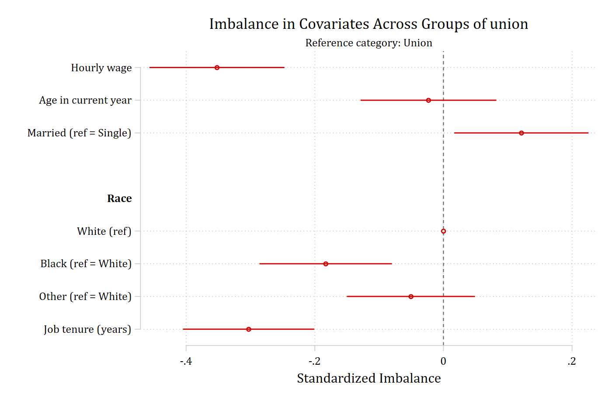
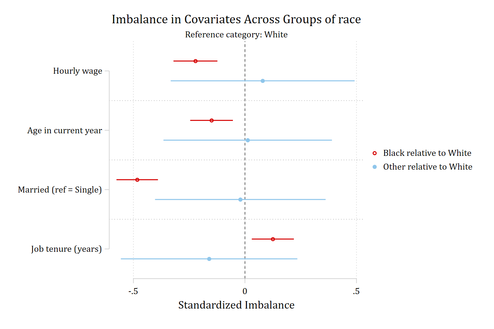
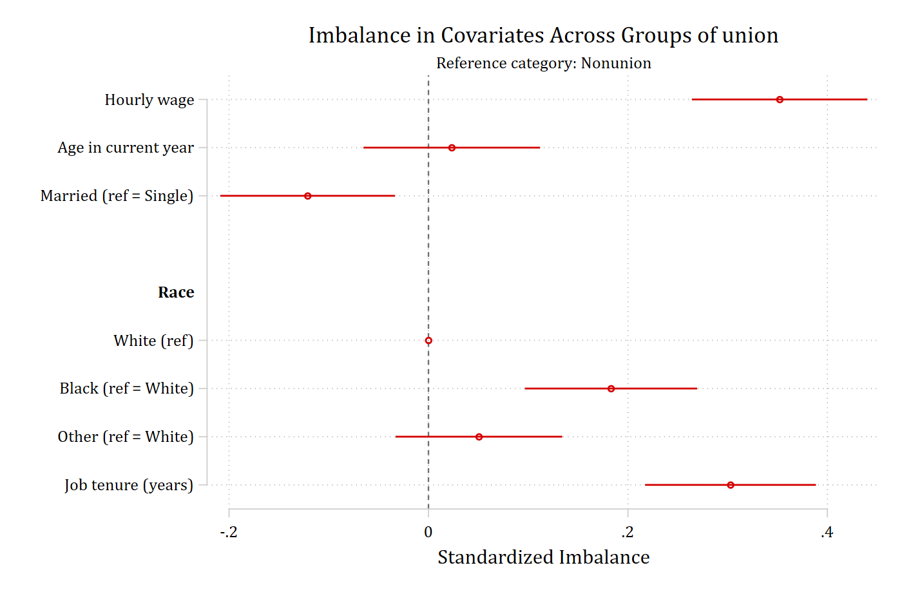
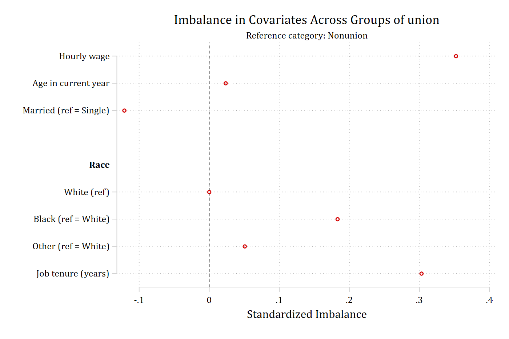
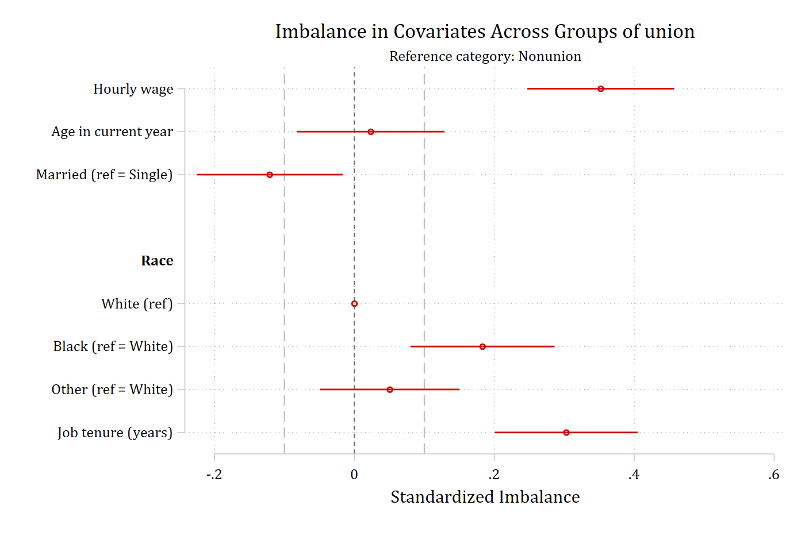
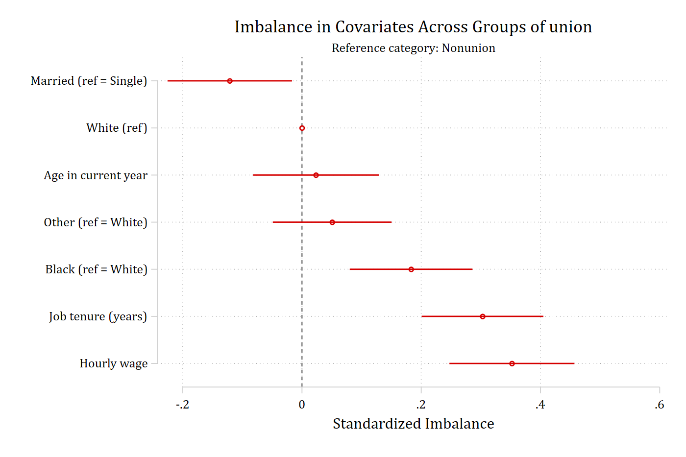
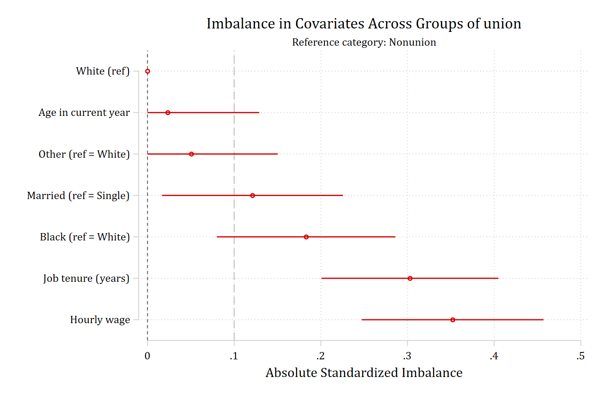
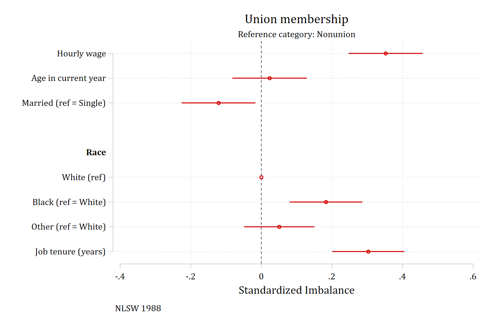

```stata
balanceplot varlist [if] [in], group(varname) [options]
```

The examples use the `nlsw88` data that ships with Stata and compare union
and nonunion workers. The `contreat()` and `tebalance` forms of the command,
and the table and `store()` options, have their own pages.

```{.stata-run}
. sysuse nlsw88, clear
(NLSW, 1988 extract)

. balanceplot wage age i.married i.race tenure, group(union)


NOTE: 10 observations were excluded due to missing data on
at least one covariate, group(), or outcome() variable.


Base category = 0_Nonunion
Base selected by the 0/1 two-group default.


N used in balance calculations
- N for union = 0_Nonunion: 1408
- N for union = 1_Union: 460

. graph export "fig/options-default.png", replace width(1400)
(file fig/options-default.png not found)
file fig/options-default.png saved as PNG format

```

{width=85% fig-alt="Default balance plot: standardized imbalance of each covariate between union and nonunion workers, with confidence intervals."}

## Which group is the base: base()

Each nonbase group is compared with the base. For a binary grouping variable
the lowest category is the base by default; for three or more categories, the
largest complete-case category. `base()` picks another.

```{.stata-run}
. balanceplot wage age i.married i.race tenure, group(union) base(1)


NOTE: 10 observations were excluded due to missing data on
at least one covariate, group(), or outcome() variable.


Base category = 1_Union


N used in balance calculations
- N for union = 0_Nonunion: 1408
- N for union = 1_Union: 460

. graph export "fig/options-base.png", replace width(1400)
(file fig/options-base.png not found)
file fig/options-base.png saved as PNG format

```

{width=85% fig-alt="Balance plot with union members as the reference category, so every sign is reversed."}

## More than two groups

A grouping variable with several categories produces one comparison per
nonbase category, each in its own color. `leg1()` and `leg2()` relabel the
first two comparisons in the legend.

```{.stata-run}
. balanceplot wage age i.married tenure, group(race)


NOTE: 15 observations were excluded due to missing data on
at least one covariate, group(), or outcome() variable.


Base category = 1_White
Base selected as the largest complete-case group.


N used in balance calculations
- N for race = 1_White: 1627
- N for race = 2_Black: 578
- N for race = 3_Other: 26

. graph export "fig/options-groups.png", replace width(1400)
(file fig/options-groups.png not found)
file fig/options-groups.png saved as PNG format

```

{width=85% fig-alt="Balance plot comparing Black and Other workers with White workers."}

```{.stata-run}
. balanceplot wage age i.married tenure, group(race) ///
>     leg1("Black relative to White") leg2("Other relative to White")


NOTE: 15 observations were excluded due to missing data on
at least one covariate, group(), or outcome() variable.


Base category = 1_White
Base selected as the largest complete-case group.


N used in balance calculations
- N for race = 1_White: 1627
- N for race = 2_Black: 578
- N for race = 3_Other: 26

. graph export "fig/options-legend.png", replace width(1400)
(file fig/options-legend.png not found)
file fig/options-legend.png saved as PNG format

```

{width=85% fig-alt="The same plot with the legend labels supplied by leg1() and leg2()."}

## Cohen's h for binary and nominal covariates: cohensh

By default every covariate is reported as a standardized mean difference.
`cohensh` switches the binary and nominal covariates to Cohen's *h*; the
continuous covariates are unchanged. `cohensH` is a synonym.

```{.stata-run}
. balanceplot wage age i.married i.race tenure, group(union) cohensh


NOTE: 10 observations were excluded due to missing data on
at least one covariate, group(), or outcome() variable.


Base category = 0_Nonunion
Base selected by the 0/1 two-group default.


N used in balance calculations
- N for union = 0_Nonunion: 1408
- N for union = 1_Union: 460

. graph export "fig/options-cohensh.png", replace width(1400)
(file fig/options-cohensh.png not found)
file fig/options-cohensh.png saved as PNG format

```

{width=85% fig-alt="Balance plot using Cohen's h for the married and race covariates."}

## The estimation sample: outcome()

`outcome()` names a variable that is used only for listwise deletion, so that
the balance sample matches a model that will include it. The variable is not
plotted.

```{.stata-run}
. balanceplot age i.married i.race tenure, group(union) outcome(wage)


NOTE: 10 observations were excluded due to missing data on
at least one covariate, group(), or outcome() variable.


Base category = 0_Nonunion
Base selected by the 0/1 two-group default.


N used in balance calculations
- N for union = 0_Nonunion: 1408
- N for union = 1_Union: 460
Complete-case sample additionally restricted by outcome(wage).

```

## Confidence intervals: level(), noci, and fadens

`level()` sets the confidence level (the default is 95) and `noci` drops the
intervals from the graph; they remain in the returned matrices and in the
tables. `fadens` keeps the intervals but fades the estimates that are not
significant.

```{.stata-run}
. balanceplot wage age i.married i.race tenure, group(union) level(90)


NOTE: 10 observations were excluded due to missing data on
at least one covariate, group(), or outcome() variable.


Base category = 0_Nonunion
Base selected by the 0/1 two-group default.


N used in balance calculations
- N for union = 0_Nonunion: 1408
- N for union = 1_Union: 460

. graph export "fig/options-level.png", replace width(1400)
(file fig/options-level.png not found)
file fig/options-level.png saved as PNG format

```

{width=85% fig-alt="Balance plot with 90% confidence intervals."}

```{.stata-run}
. balanceplot wage age i.married i.race tenure, group(union) noci


NOTE: 10 observations were excluded due to missing data on
at least one covariate, group(), or outcome() variable.


Base category = 0_Nonunion
Base selected by the 0/1 two-group default.


N used in balance calculations
- N for union = 0_Nonunion: 1408
- N for union = 1_Union: 460

. graph export "fig/options-noci.png", replace width(1400)
(file fig/options-noci.png not found)
file fig/options-noci.png saved as PNG format

```

{width=85% fig-alt="Balance plot without confidence intervals."}

```{.stata-run}
. balanceplot wage age i.married i.race tenure, group(union) fadens


NOTE: 10 observations were excluded due to missing data on
at least one covariate, group(), or outcome() variable.


Base category = 0_Nonunion
Base selected by the 0/1 two-group default.


N used in balance calculations
- N for union = 0_Nonunion: 1408
- N for union = 1_Union: 460

. graph export "fig/options-fadens.png", replace width(1400)
(file fig/options-fadens.png not found)
file fig/options-fadens.png saved as PNG format

```

{width=85% fig-alt="Balance plot with the nonsignificant estimates faded."}

## Reference lines: threshold()

`threshold(#)` adds dashed reference lines at `-#` and `#`, a common
convention being 0.1.

```{.stata-run}
. balanceplot wage age i.married i.race tenure, group(union) threshold(.1)


NOTE: 10 observations were excluded due to missing data on
at least one covariate, group(), or outcome() variable.


Base category = 0_Nonunion
Base selected by the 0/1 two-group default.


N used in balance calculations
- N for union = 0_Nonunion: 1408
- N for union = 1_Union: 460

. graph export "fig/options-threshold.png", replace width(1400)
(file fig/options-threshold.png not found)
file fig/options-threshold.png saved as PNG format

```

{width=85% fig-alt="Balance plot with reference lines at plus and minus 0.1."}

## Ordering and sign: sort and absolute

By default covariates appear in the order of *varlist*, with the categories
of a nominal covariate kept together under a heading. `sort` orders them from
the most negative to the most positive imbalance (and drops the headings,
since categories may no longer be adjacent). `absolute` plots the magnitude
of each imbalance; combined with `sort`, the covariates run from the most to
the least balanced. `abs` is the shortest abbreviation.

```{.stata-run}
. balanceplot wage age i.married i.race tenure, group(union) sort


NOTE: 10 observations were excluded due to missing data on
at least one covariate, group(), or outcome() variable.


Base category = 0_Nonunion
Base selected by the 0/1 two-group default.


N used in balance calculations
- N for union = 0_Nonunion: 1408
- N for union = 1_Union: 460

. graph export "fig/options-sort.png", replace width(1400)
(file fig/options-sort.png not found)
file fig/options-sort.png saved as PNG format

```

{width=85% fig-alt="Balance plot with covariates sorted by imbalance."}

```{.stata-run}
. balanceplot wage age i.married i.race tenure, group(union) absolute sort threshold(.1)


NOTE: 10 observations were excluded due to missing data on
at least one covariate, group(), or outcome() variable.


Base category = 0_Nonunion
Base selected by the 0/1 two-group default.


N used in balance calculations
- N for union = 0_Nonunion: 1408
- N for union = 1_Union: 460

. graph export "fig/options-absolute.png", replace width(1400)
(file fig/options-absolute.png not found)
file fig/options-absolute.png saved as PNG format

```

{width=85% fig-alt="Balance plot of sorted absolute imbalance with a reference line at 0.1."}

## The graph itself: graphop(), leftmargin(), and plotcommand

`balanceplot` draws with `coefplot`, and `graphop()` passes any options
through to it. `leftmargin(#)` widens the left margin of the graph region for
long labels. `plotcommand` prints the `coefplot` command that produced the
graph, which is the starting point for a fully customized version.

```{.stata-run}
. balanceplot wage age i.married i.race tenure, group(union) ///
>     graphop(title("Union membership") xlabel(-.4(.2).6) note("NLSW 1988"))


NOTE: 10 observations were excluded due to missing data on
at least one covariate, group(), or outcome() variable.


Base category = 0_Nonunion
Base selected by the 0/1 two-group default.


N used in balance calculations
- N for union = 0_Nonunion: 1408
- N for union = 1_Union: 460

. graph export "fig/options-graphop.png", replace width(1400)
(file fig/options-graphop.png not found)
file fig/options-graphop.png saved as PNG format

```

{width=85% fig-alt="Balance plot with a custom title, axis labels, and note passed through graphop()."}

```{.stata-run}
. balanceplot wage age i.married i.race tenure, group(union) plotcommand


NOTE: 10 observations were excluded due to missing data on
at least one covariate, group(), or outcome() variable.


Base category = 0_Nonunion
Base selected by the 0/1 two-group default.


N used in balance calculations
- N for union = 0_Nonunion: 1408
- N for union = 1_Union: 460


Matrices used for the plot:  bias_0_1
Basic plot command:
coefplot  (matrix(bias_0_1[,4]), ci((bias_0_1[,6] bias_0_1[,7]))   label(`"Nonunion vs Union"'))

```

The command is also returned in `r(plotcommand)`.

## Tables and stored results

`table`, `tablefull`, their formatting options `decimals()`, `width()`, and
`labwidth()`, the `store()` option for `esttab`, and the returned matrices
are on the [Tables and stored results](tables.html) page. `matchweight()`,
which adds the balance after matching to the same graph, is on the
[Matching and teffects](matching.html) page.
