Each example below draws the same graph twice: once with `scheme(cleanplots)`
and once with `scheme(s2color)`, Stata's long-standing default scheme
(Stata 18 introduced `stcolor` as the new default; `s2color` is used here
because the contrast is clearer). Nothing else about the commands changes.
The graphs are drawn with the data from [`usetdm`](../usetdm/index.html),
so every example can be run as shown. With `set scheme cleanplots, perm` in
place, the `scheme()` option is not needed.

## Histogram

```{.stata-run}
. use "https://tdmize.github.io/data/data/addhealth4", clear
(addhealth4_dmv.dta | Add Health Wave IV | DMV Workshop)

. 
. hist vidtv, percent scheme(cleanplots)
(bin=36, start=0, width=4.6666667)

. graph export "fig/ex-hist-cleanplots.png", replace width(1400)
file fig/ex-hist-cleanplots.png saved as PNG format

. hist vidtv, percent scheme(s2color)
(bin=36, start=0, width=4.6666667)

. graph export "fig/ex-hist-s2color.png", replace width(1400)
(file fig/ex-hist-s2color.png not found)
file fig/ex-hist-s2color.png saved as PNG format

```

::: {layout-ncol=2}
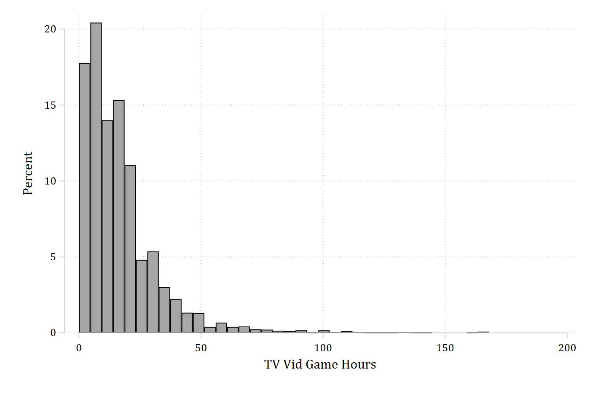{fig-alt="Histogram of hours of video and television per week with the cleanplots scheme: white background, light gridlines, horizontal axis labels."}

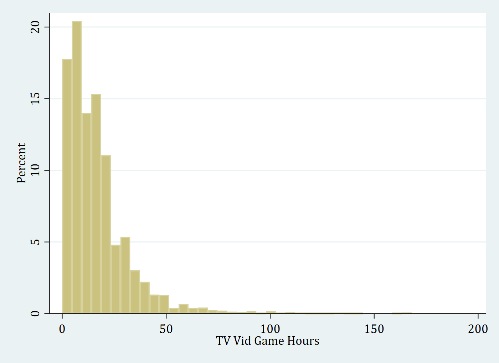{fig-alt="The same histogram in the s2color scheme."}
:::

## Predictions from an ordinal logit with dashed confidence intervals

```{.stata-run}
. quietly ologit health orole vrole i.woman age income i.race i.educ

. quietly margins, at(orole=(0(1)10))

. 
. marginsplot, recastci(rline) ciopts(lpattern(dash) color(*.5)) scheme(cleanplots) ///
>     legend(order(6 "Poor" 7 "Fair" 8 "Good" 9 "Very Good" 10 "Excellent"))

Variables that uniquely identify margins: orole

. graph export "fig/ex-ologit-cleanplots.png", replace width(1400)
file fig/ex-ologit-cleanplots.png saved as PNG format

. marginsplot, recastci(rline) ciopts(lpattern(dash) color(*.5)) scheme(s2color) ///
>     legend(order(6 "Poor" 7 "Fair" 8 "Good" 9 "Very Good" 10 "Excellent"))

Variables that uniquely identify margins: orole

. graph export "fig/ex-ologit-s2color.png", replace width(1400)
(file fig/ex-ologit-s2color.png not found)
file fig/ex-ologit-s2color.png saved as PNG format

```

::: {layout-ncol=2}
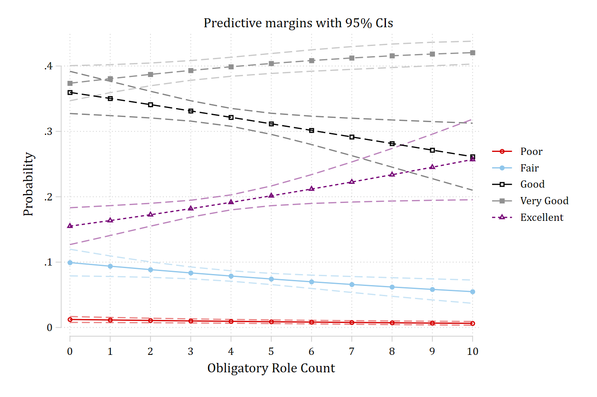{fig-alt="Predicted probabilities of five self-rated health categories across a count of obligatory roles, with dashed confidence-interval lines, in the cleanplots scheme: each category has its own color, marker, and line pattern."}

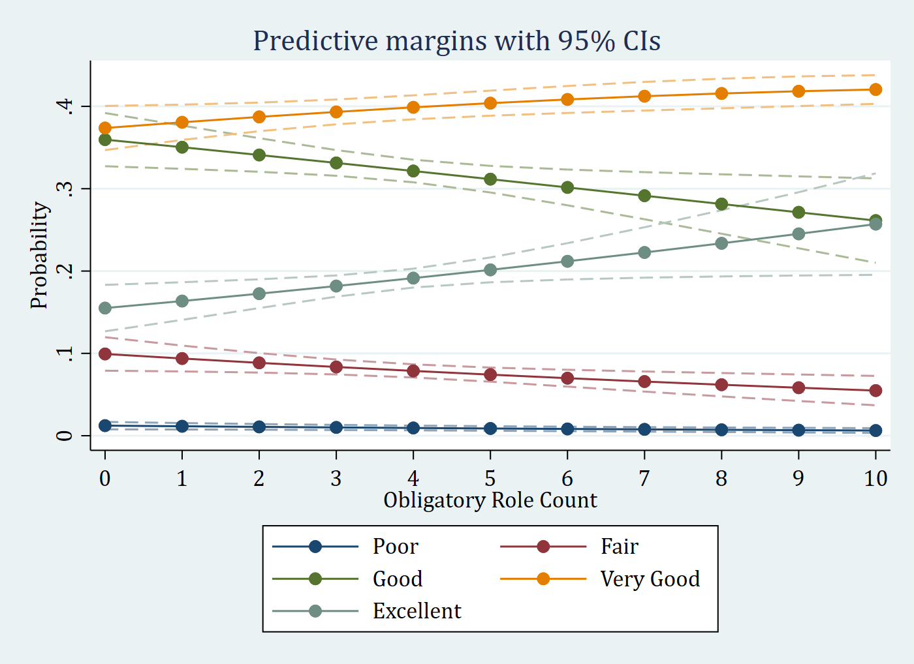{fig-alt="The same plot in the s2color scheme."}
:::

## Predictions at combinations of two nominal variables

```{.stata-run}
. quietly logit alcB i.woman##i.parrole c.age i.race i.educ c.wages

. quietly margins, at(woman=(0 1) educ=(0(1)4))

. 
. marginsplot, recast(scatter) x(educ) scheme(cleanplots)

Variables that uniquely identify margins: woman educ

. graph export "fig/ex-pred-cleanplots.png", replace width(1400)
file fig/ex-pred-cleanplots.png saved as PNG format

. marginsplot, recast(scatter) x(educ) scheme(s2color)

Variables that uniquely identify margins: woman educ

. graph export "fig/ex-pred-s2color.png", replace width(1400)
(file fig/ex-pred-s2color.png not found)
file fig/ex-pred-s2color.png saved as PNG format

```

::: {layout-ncol=2}
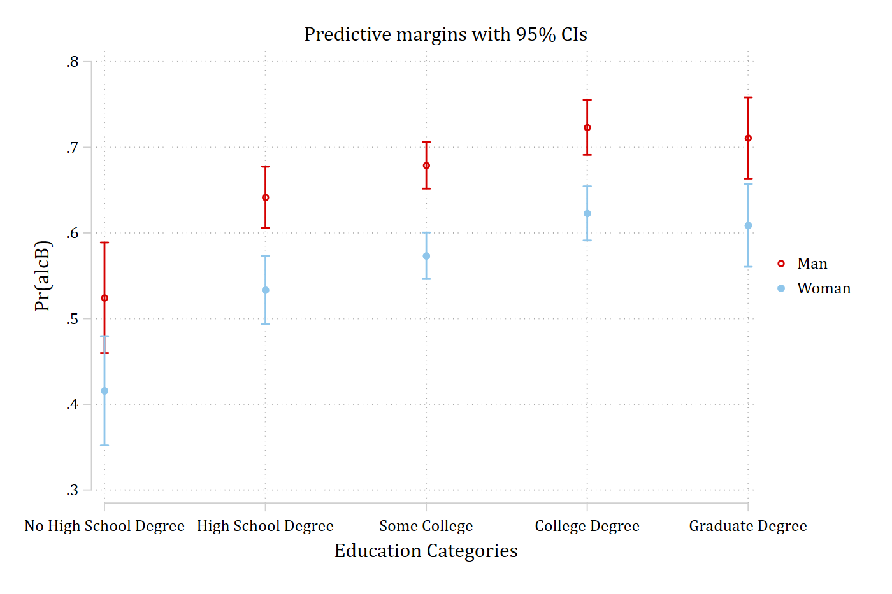{fig-alt="Predicted probability of drinking alcohol by education level for men and women, as points with confidence intervals, in the cleanplots scheme."}

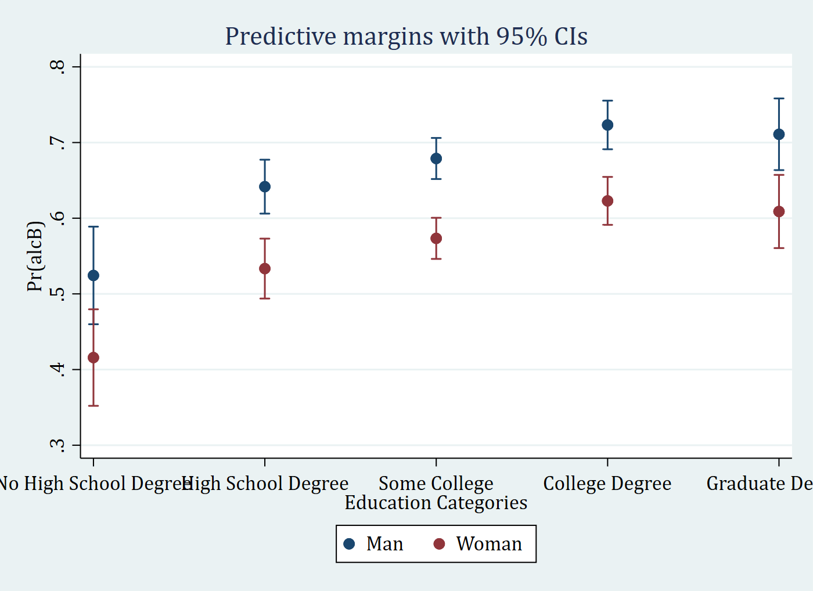{fig-alt="The same plot in the s2color scheme."}
:::

## Bar chart

`cleanplots` uses its softer palette for the bars.

```{.stata-run}
. use "https://tdmize.github.io/data/data/cda_gss", clear
(cda_gss.dta |  GSS 1972-2021 CDA - Categorical Data Analysis | date created 2023)

. 
. graph bar income, over(degree) over(woman) asyvars scheme(cleanplots)

. graph export "fig/ex-bar-cleanplots.png", replace width(1400)
file fig/ex-bar-cleanplots.png saved as PNG format

. graph bar income, over(degree) over(woman) asyvars scheme(s2color)

. graph export "fig/ex-bar-s2color.png", replace width(1400)
(file fig/ex-bar-s2color.png not found)
file fig/ex-bar-s2color.png saved as PNG format

```

::: {layout-ncol=2}
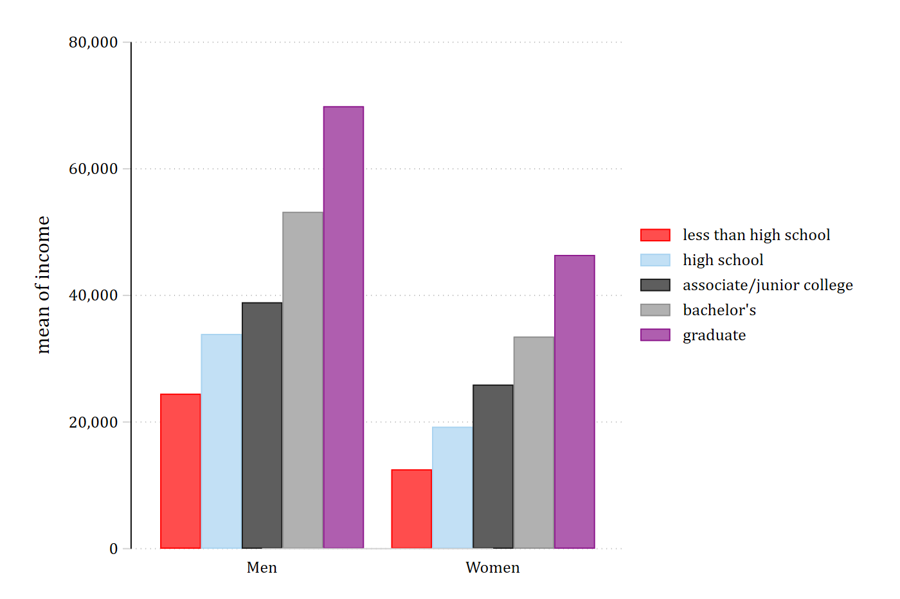{fig-alt="Bar chart of mean income by degree, grouped by gender, in the cleanplots scheme: softer bar colors and a light grid."}

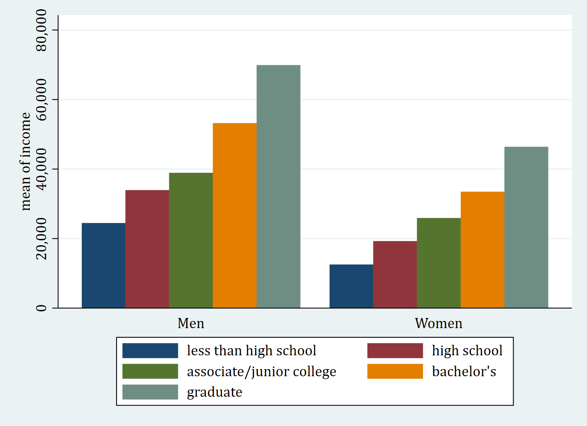{fig-alt="The same bar chart in the s2color scheme."}
:::

## Residual and influence plot

```{.stata-run}
. use "https://tdmize.github.io/data/data/pew16", clear
(pew16_dmv.dta | Pew 2016 Pre-Election Data | DMV Workshop)

. 
. quietly logit trump i.woman c.age ib4.educ i.race i.polparty3 ///
>               i.religB c.income ib3.region

. gen index = _n

. predict residstd, rs

. predict influence, dbeta

. 
. twoway scatter residstd index [w=influence], scheme(cleanplots)
(analytic weights assumed)
(analytic weights assumed)
(analytic weights assumed)

. graph export "fig/ex-resid-cleanplots.png", replace width(1400)
file fig/ex-resid-cleanplots.png saved as PNG format

. twoway scatter residstd index [w=influence], scheme(s2color)
(analytic weights assumed)
(analytic weights assumed)
(analytic weights assumed)

. graph export "fig/ex-resid-s2color.png", replace width(1400)
(file fig/ex-resid-s2color.png not found)
file fig/ex-resid-s2color.png saved as PNG format

```

::: {layout-ncol=2}
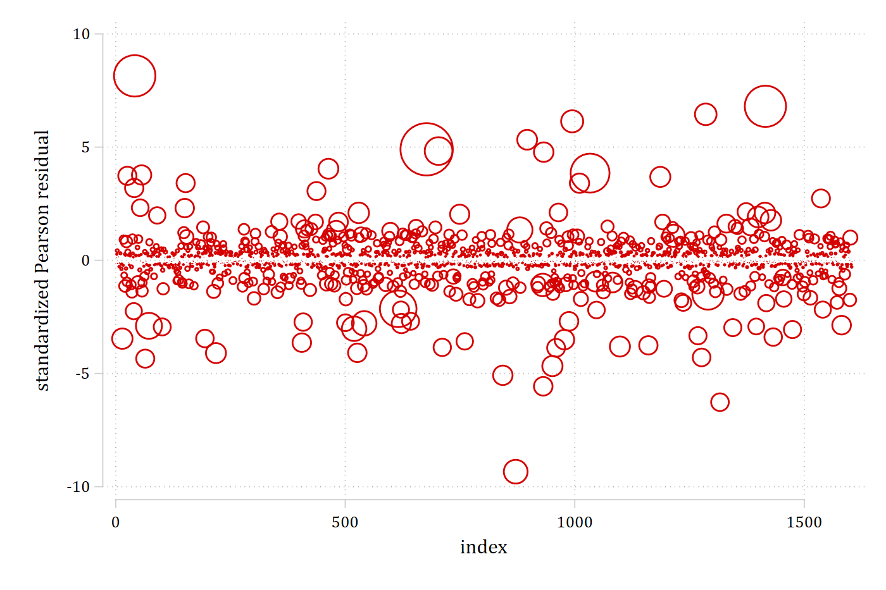{fig-alt="Scatter plot of standardized residuals against observation number with markers sized by influence, in the cleanplots scheme."}

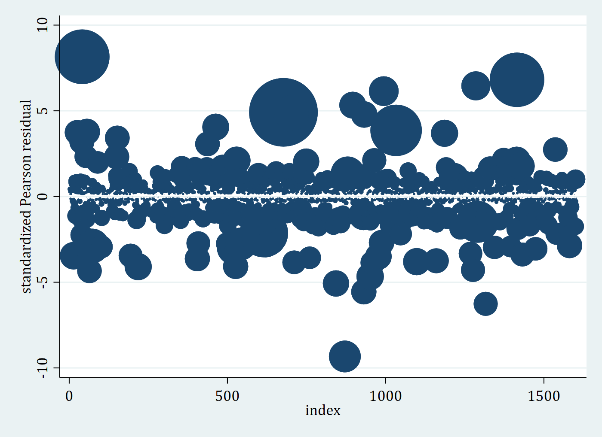{fig-alt="The same plot in the s2color scheme."}
:::

## Lowess plot

```{.stata-run}
. use "https://tdmize.github.io/data/data/scireview3", clear
(Biochemist data - updated for CDA Stata guide)

. sort phd

. 
. lowess jobimp phd, scheme(cleanplots)

. graph export "fig/ex-lowess-cleanplots.png", replace width(1400)
file fig/ex-lowess-cleanplots.png saved as PNG format

. lowess jobimp phd, scheme(s2color)

. graph export "fig/ex-lowess-s2color.png", replace width(1400)
(file fig/ex-lowess-s2color.png not found)
file fig/ex-lowess-s2color.png saved as PNG format

```

::: {layout-ncol=2}
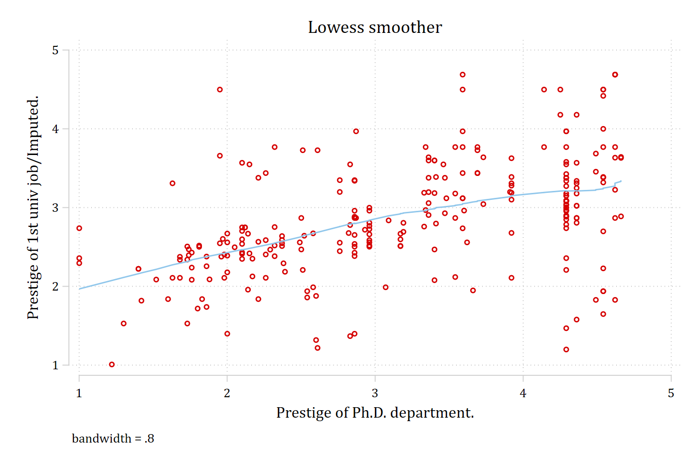{fig-alt="Lowess smoother of job importance against PhD prestige with the scatter of points, in the cleanplots scheme."}

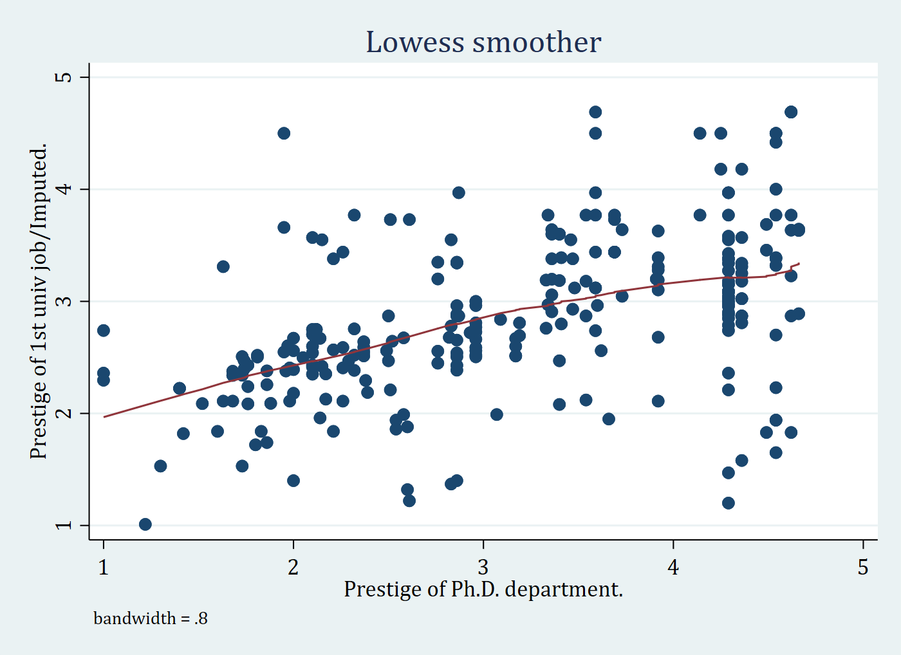{fig-alt="The same lowess plot in the s2color scheme."}
:::

## All ten colors

A scatter plot with ten groups and the matching bar chart show the full
palette, with the darker and lighter colors alternating.

```{.stata-run}
. use "https://tdmize.github.io/data/data/cda_gss", clear
(cda_gss.dta |  GSS 1972-2021 CDA - Categorical Data Analysis | date created 2023)

. 
. twoway scatter income occprest if isco88cat == 1, msize(large) || ///
>        scatter income occprest if isco88cat == 2, msize(large) || ///
>        scatter income occprest if isco88cat == 3, msize(large) || ///
>        scatter income occprest if isco88cat == 4, msize(large) || ///
>        scatter income occprest if isco88cat == 5, msize(large) || ///
>        scatter income occprest if isco88cat == 6, msize(large) || ///
>        scatter income occprest if isco88cat == 7, msize(large) || ///
>        scatter income occprest if isco88cat == 8, msize(large) || ///
>        scatter income occprest if isco88cat == 9, msize(large) || ///
>        scatter income occprest if isco88cat == 10, msize(large) || ///
>        , scheme(cleanplots)

. graph export "fig/ex-ten-scatter-cleanplots.png", replace width(1400)
file fig/ex-ten-scatter-cleanplots.png saved as PNG format

. 
. graph bar income, over(isco88cat) asyvars scheme(cleanplots) ///
>     title("Average income by occupation")

. graph export "fig/ex-ten-bar-cleanplots.png", replace width(1400)
file fig/ex-ten-bar-cleanplots.png saved as PNG format

```

::: {layout-ncol=2}
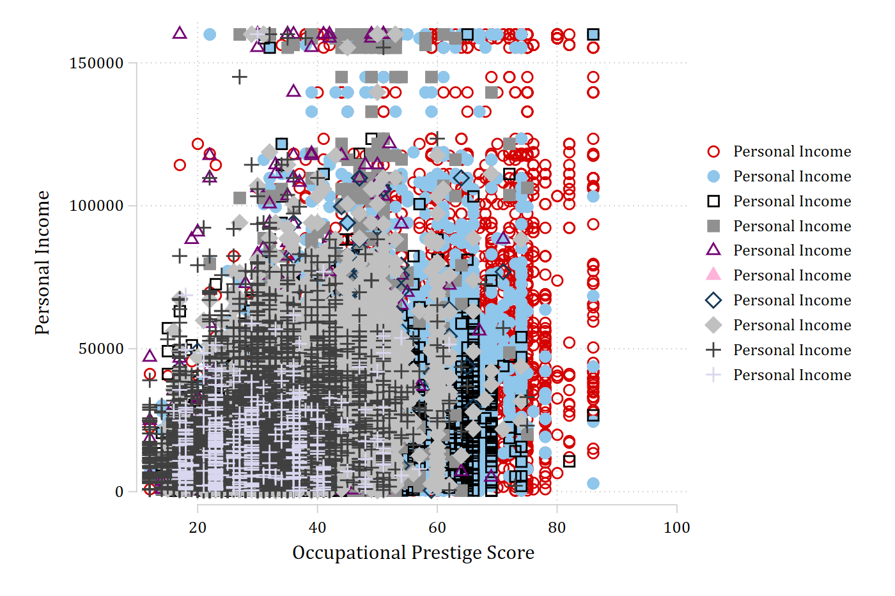{fig-alt="Scatter plot of income against occupational prestige with ten occupation groups in the ten cleanplots colors and marker symbols."}

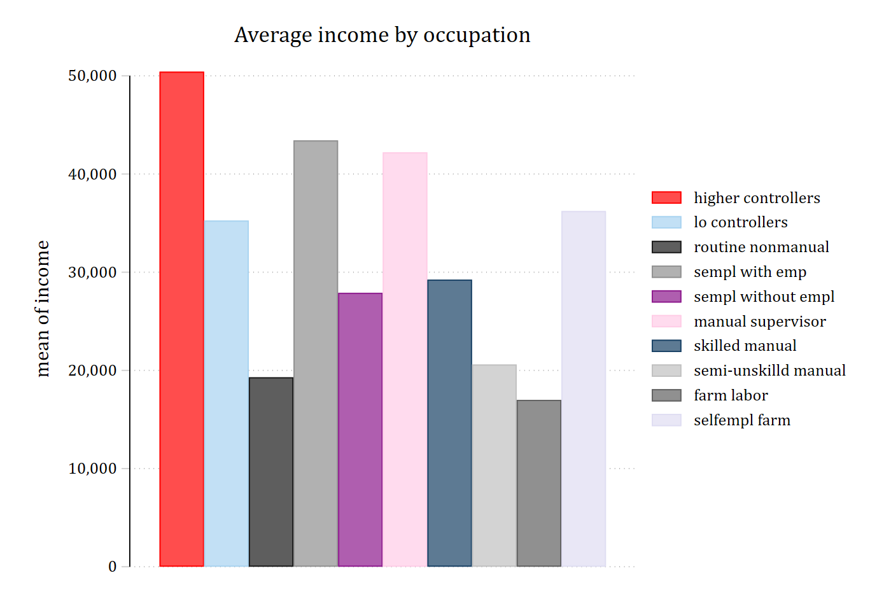{fig-alt="Bar chart of average income for ten occupation groups in the softer cleanplots bar colors."}
:::
