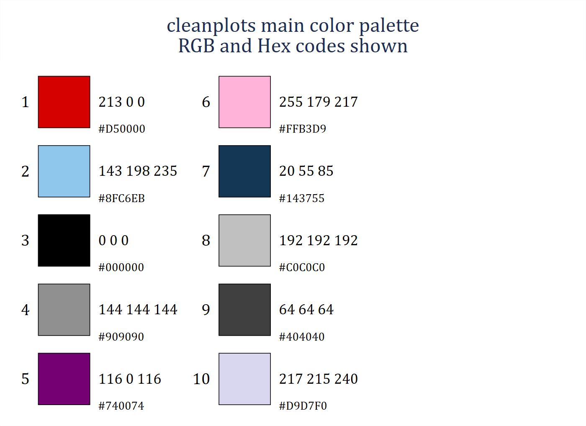
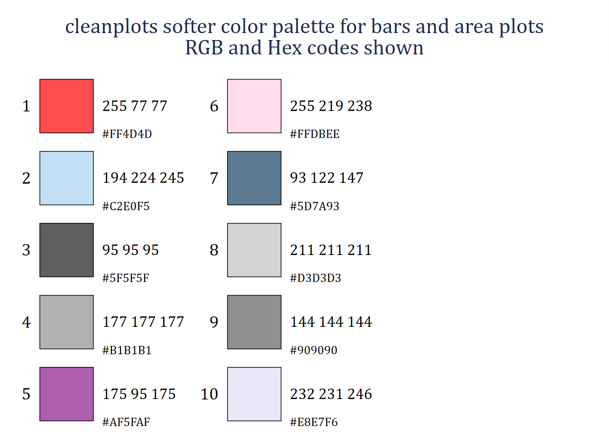
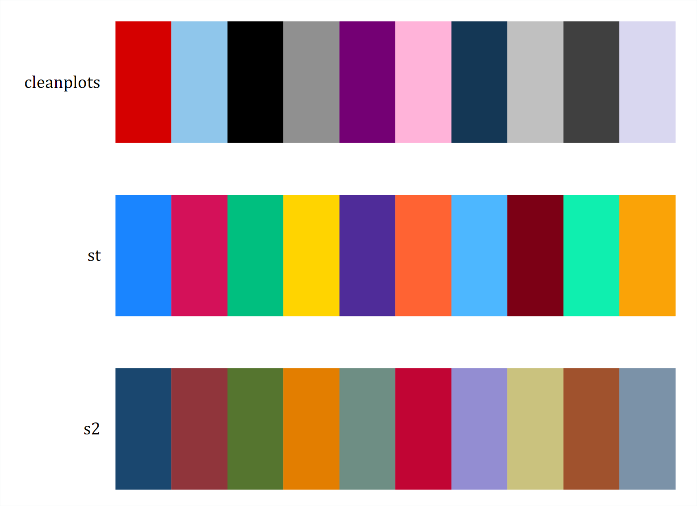
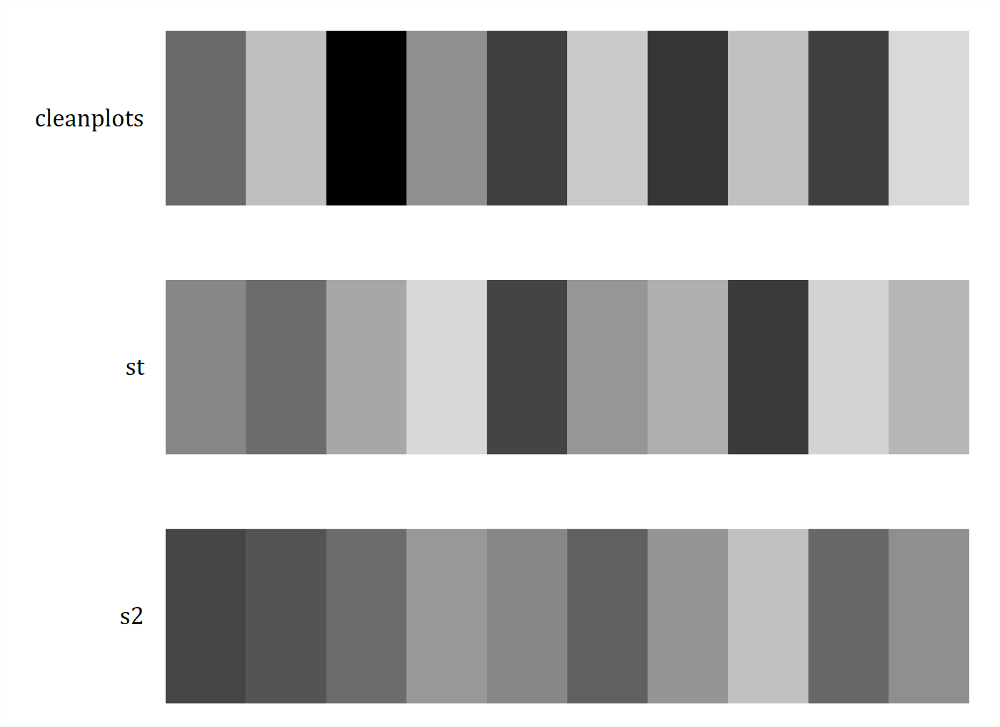
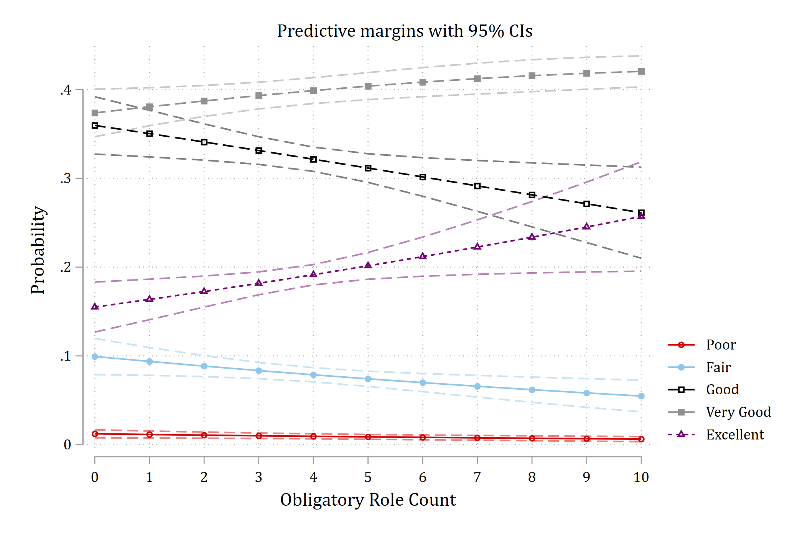
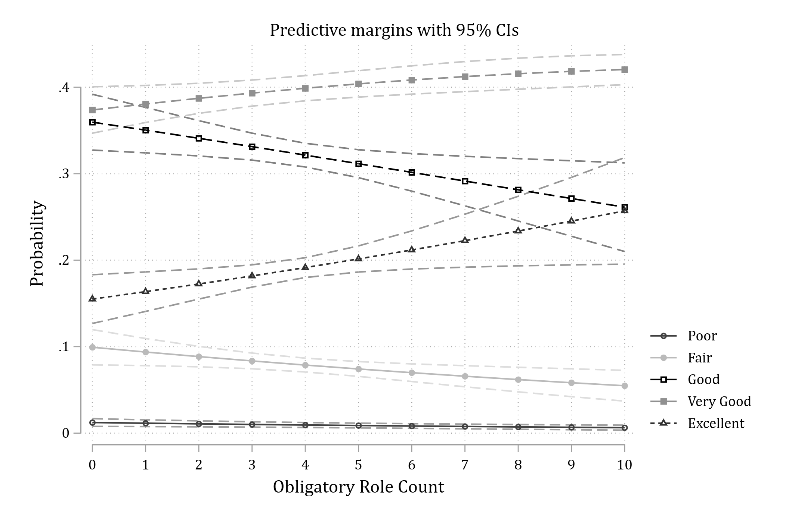
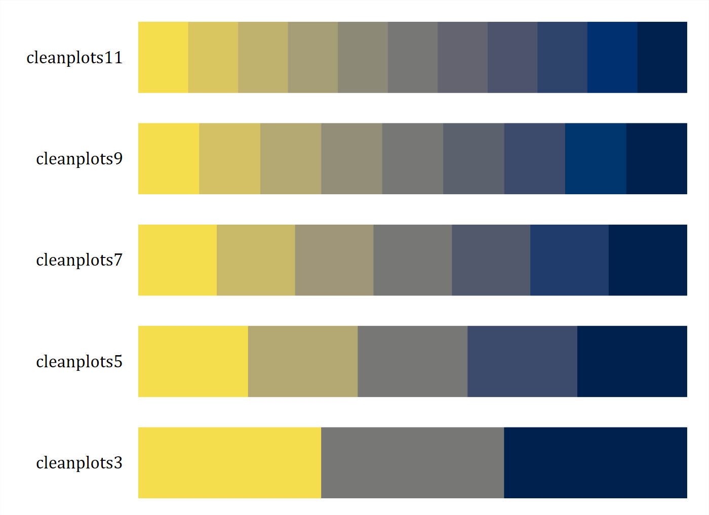
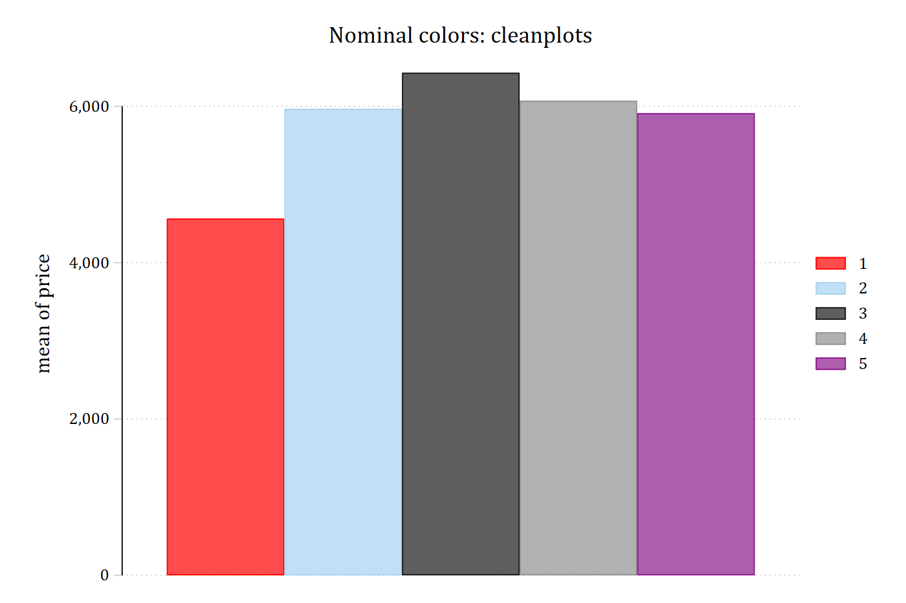
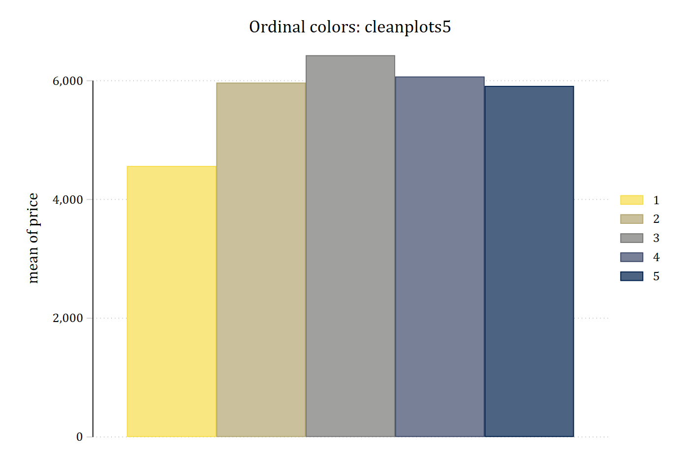

`cleanplots` is a Stata and R graphics scheme that changes the default look
of Stata graphics and of R graphics made with ggplot. It is designed to
implement data visualization best practices by default -- limiting the
amount of time you have to spend tweaking a graph to be maximally readable
and usable. The color palette is chosen to be colorblind friendly and to
work when printed in black and white, so that a single figure will do for
both color and grayscale.

This page covers the Stata scheme. The companion R package is documented at
[tdmize.github.io/cleanplots](https://tdmize.github.io/cleanplots/).

## Installation

```stata
net install cleanplots, from("https://tdmize.github.io/data") replace
```

To make `cleanplots` the scheme for all of your graphs, permanently:

```stata
set scheme cleanplots, perm
```

Or apply it to a single graph with the `scheme()` option:

```stata
sysuse auto, clear
graph twoway scatter price weight, scheme(cleanplots)
```

To read the help file in Stata, type `help cleanplots`; it is also
[on this site](help.html).

## Citation

In general, I do not think the use of a graphics scheme requires citation.
So for most cases, feel free to use `cleanplots` without citation. But, if
you need or want a citation you can cite `cleanplots` as:

> Mize, Trenton D. 2017. "cleanplots: Stata graphics scheme for easy and
> effective data visualizations."
> <https://www.trentonmize.com/software/cleanplots>

If you use the ordinal `cleanplots#` schemes, please also credit the
cividis colors (Nunez, Anderton, and Renslow 2018; reference below).

## What cleanplots changes

- Default colors are easier to distinguish from each other and are more
  aesthetically pleasing.
- Default colors are colorblind friendly.
- Default colors allow you to make one graph which is effective in both
  color and when printed in black and white.
- Nominal and ordinal color palettes are available so your colors match your
  data.
- Marker shapes and line features (e.g. solid, dashed) better distinguish
  lines and ensure lines will be distinguishable if printing in black and
  white.
- All axis markers are horizontal, and thus easier to read.
- A non-invasive light grid is placed on all plots, with both vertical and
  horizontal gridlines.
- The background of the plot is white.
- Legends are placed to the right of the graph, close to the data.
- Text colors on the graph are consistent.
- Bar charts, area plots, and pie charts automatically use softer versions
  of the colors, since these elements use far more ink than points and
  lines.
- And many more.

The [Examples](examples.html) page shows six common graphs drawn with
`cleanplots` next to the same graphs in Stata's default scheme.

## The colors

The ten main colors are used, in order, for markers, lines, and confidence
intervals. Beyond the first few, distinct marker symbols and line patterns
carry most of the work of telling groups apart, since color alone reliably
distinguishes about four or five groups. The palette shown with its RGB
and hex codes (this and the following palette figures are drawn with Ben
Jann's `colorpalette` command):

```{.stata-run}
. colorpalette #D50000 #8FC6EB #000000 #909090 #740074 #FFB3D9 ///
>              #143755 #C0C0C0 #404040 #D9D7F0, rows(5) ///
>      title("cleanplots main color palette" "RGB and Hex codes shown")

. graph export "fig/palette-main.png", replace width(1400)
(file fig/palette-main.png not found)
file fig/palette-main.png saved as PNG format

```

{width=85% fig-alt="The ten cleanplots colors as swatches in two columns of five, each labeled with its RGB and hex code: red, light blue, black, gray, purple, pink, navy, light gray, dark gray, and lavender."}

Bars, areas, and pies use softer, less saturated versions of the same
colors:

```{.stata-run}
. colorpalette #FF4D4D #C2E0F5 #5F5F5F #B1B1B1 #AF5FAF #FFDBEE ///
>              #5D7A93 #D3D3D3 #909090 #E8E7F6, rows(5) ///
>     title("cleanplots softer color palette for bars and area plots" ///
>           "RGB and Hex codes shown")

. graph export "fig/palette-bars.png", replace width(1400)
(file fig/palette-bars.png not found)
file fig/palette-bars.png saved as PNG format

```

{width=85% fig-alt="The ten softer cleanplots colors used for bars and areas, as swatches labeled with RGB and hex codes."}

For comparison, the `cleanplots` colors beside the colors of Stata's
current default scheme (`stcolor`, since Stata 18) and its previous default
(`s2color`):

```{.stata-run}
. colorpalette, span n(10) : cleanplots / st / s2

. graph export "fig/palette-compare.png", replace width(1400)
(file fig/palette-compare.png not found)
file fig/palette-compare.png saved as PNG format

```

{width=85% fig-alt="Three rows of ten color swatches: the cleanplots palette, the stcolor palette, and the s2color palette."}

## Color figures convert automatically to grayscale

One benefit of the `cleanplots` scheme is that you only need to create one
set of figures: the colors and the markers, symbols, and lines that
`cleanplots` uses can be printed in black and white or grayscale and still
be easily distinguished. The palette alternates darker and lighter colors
so that the first several groups differ in lightness alone, and every
series also gets its own marker symbol and line pattern. The same palettes
as above, in grayscale:

```{.stata-run}
. colorpalette, gscale span n(10) : cleanplots / st / s2

. graph export "fig/palette-compare-gray.png", replace width(1400)
(file fig/palette-compare-gray.png not found)
file fig/palette-compare-gray.png saved as PNG format

```

{width=85% fig-alt="The same three palettes converted to grayscale; the cleanplots row alternates dark and light swatches while the other two rows have several swatches of similar gray."}

A plot of predicted probabilities from an ordinal logit model, in color and
as it prints in grayscale; the five outcome categories remain
distinguishable by their line patterns and markers:

::: {layout-ncol=2}
{fig-alt="Predicted probabilities of five self-rated health categories across a count of obligatory roles, in color, with dashed confidence-interval lines."}

{fig-alt="The same plot converted to grayscale; the five lines are still told apart by their markers, line patterns, and shades of gray."}
:::

## Creating figures considerate of colorblindness

About 5% of the population has some form of colorblindness, red-green being
the most common -- which is why you should always avoid having red and
green together on a figure. The `cleanplots` colors were selected because
they are easily distinguishable across all types of colorblindness: there
is no red-green pair, and the first five colors pass deuteranopia,
protanopia, and tritanopia simulation checks. You can check the palette,
or any set of colors, interactively at
[Coloring for Colorblindness](https://davidmathlogic.com/colorblind/#%23D50000-%238FC6EB-%23000000-%23909090-%23740074-%23FFB3D9-%23143755-%23C0C0C0-%23404040-%23D9D7F0).

## Ordinal color palettes: cleanplots3 to cleanplots11

The default `cleanplots` colors are nominal, with no implied ordering. To
have the colors reflect ordering, use the `cleanplots#` schemes on a single
graph. Five are available -- `cleanplots3`, `cleanplots5`, `cleanplots7`,
`cleanplots9`, and `cleanplots11` -- where the number is how many
sequential colors the scheme provides. The colors run from light yellow to
dark navy, so higher categories are darker; they are from the cividis
palette, a variant of viridis optimized so that readers with red-green
color blindness see essentially the same palette as everyone else, and the
ordering survives black and white printing.

```{.stata-run}
. colorpalette, span : cleanplots11 / cleanplots9 / cleanplots7 / cleanplots5 / cleanplots3

. graph export "fig/palette-ordinal.png", replace width(1400)
(file fig/palette-ordinal.png not found)
file fig/palette-ordinal.png saved as PNG format

```

{width=85% fig-alt="Five rows of swatches running from light yellow through gray to dark navy, with eleven, nine, seven, five, and three steps."}

The same bar chart with the nominal palette and with `cleanplots5`, which
matches the five ordered repair-record categories of Stata's `auto` data:

```{.stata-run}
. sysuse auto, clear
(1978 automobile data)

. graph bar price, over(rep78) asyvars scheme(cleanplots) ///
>     title("Nominal colors: cleanplots")

. graph export "fig/ordinal-nominal.png", replace width(1400)
(file fig/ordinal-nominal.png not found)
file fig/ordinal-nominal.png saved as PNG format

. graph bar price, over(rep78) asyvars scheme(cleanplots5) ///
>     title("Ordinal colors: cleanplots5")

. graph export "fig/ordinal-ordinal.png", replace width(1400)
(file fig/ordinal-ordinal.png not found)
file fig/ordinal-ordinal.png saved as PNG format

```

::: {layout-ncol=2}
{fig-alt="Bar chart of mean price by repair record with the nominal cleanplots colors, one distinct color per bar."}

{fig-alt="The same bar chart with the cleanplots5 scheme: bars run from light yellow to dark navy in the order of the repair-record categories."}
:::

The `cleanplots#` schemes inherit all layout, sizing, and legend settings
from the main scheme, and each series still gets a distinct line pattern
and marker symbol. If a graph has more groups than the scheme has colors,
the colors recycle while the patterns and symbols continue to vary.

## Version history

`cleanplots` was given an update in July 2026. For the primary palette, of
most focus is the color choices for colors 6--10, which are now more
colorblind friendly and more easily distinguishable. And, the intensity of
colors now alternates for each odd and even aspect of the graph, aiding in
black and white printing. In addition, the `cleanplots#` schemes now
provide options for ordinal palettes. Finally, the legend is now due right
of the graph, instead of in the bottom right.

I recommend using the most up to date version. But, if you are feeling
nostalgic and want the original scheme, it is preserved as
`cleanplots_classic`:

```stata
set scheme cleanplots_classic
```

Many of the features of `cleanplots` are adapted from the excellent black
and white scheme `plotplain` (Bischof 2017).

## R package version

A companion `cleanplots` package is available for R. It shares this
scheme's colors, marker symbols, line patterns, and layout for ggplot2.
Read more about the R package at
[tdmize.github.io/cleanplots](https://tdmize.github.io/cleanplots/).

## References

> Bischof, Daniel. 2017. "New Graphic Schemes for Stata: plotplain and
> plottig." *The Stata Journal* 17(3): 748--759.

> Nunez, Jamie R., Christopher R. Anderton, and Ryan S. Renslow. 2018.
> "Optimizing Colormaps with Consideration for Color Vision Deficiency to
> Enable Accurate Interpretation of Scientific Data." *PLOS ONE* 13(7):
> e0199239.
