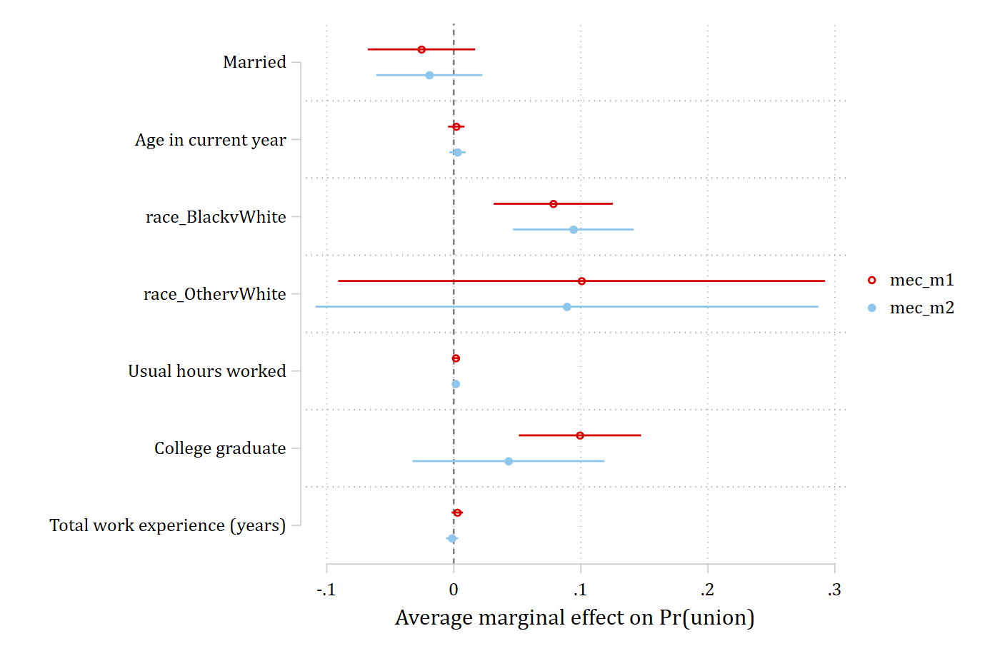
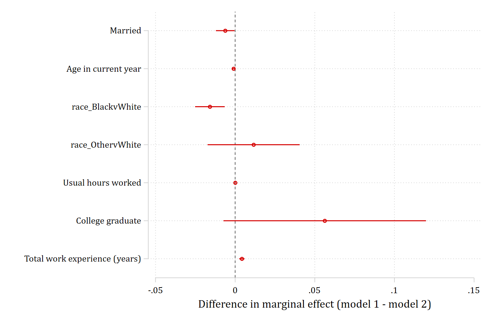
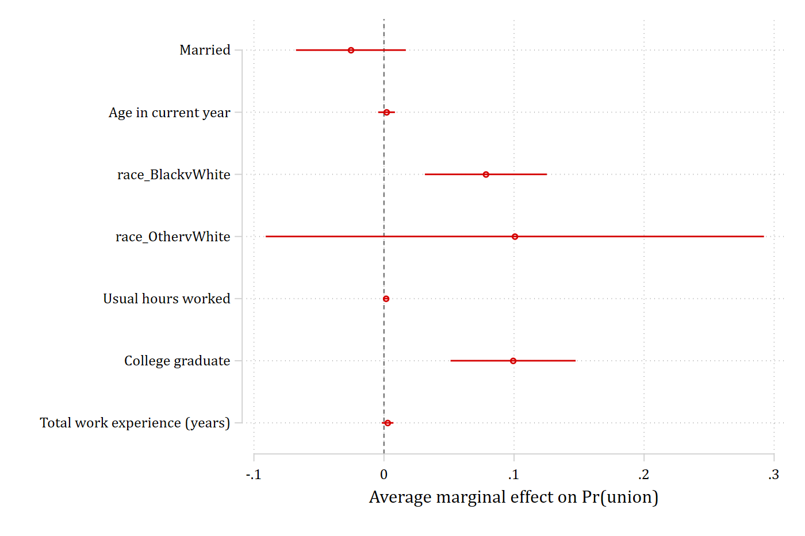
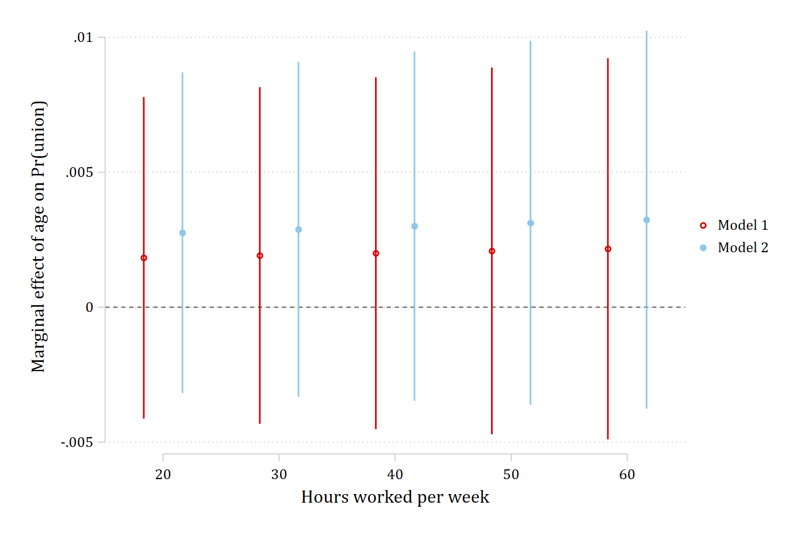
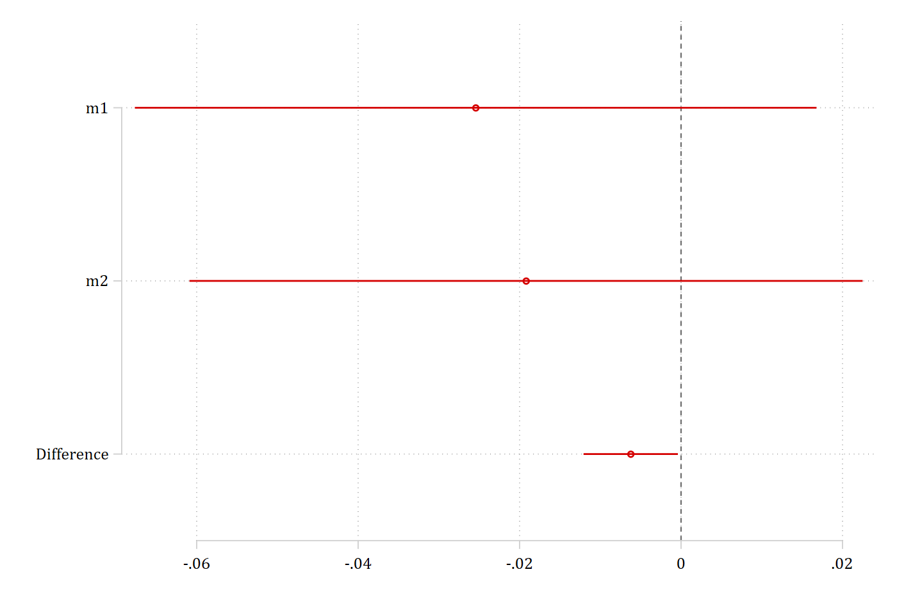

<<dd_version: 2>>

`mecompare` posts its table to `e(b)` and `e(V)`, and the `store(stub)`
option additionally saves the marginal effects as separate stored estimates --
`stub_model1`, `stub_model2`, and `stub_diff` -- each keyed by variable. That is
the form `coefplot` (Jann) and `esttab` (Jann's `estout`) expect, so plots and
tables of marginal effects take one line each. Install the two packages once
with `ssc install coefplot` and `ssc install estout`.

## Fit, store, compare

```{.stata-run}
<<dd_do>>
sysuse nlsw88, clear
drop if missing(union, married, age, race, hours, collgrad, ttl_exp, grade, wage)

quietly logit union i.married age i.race hours i.collgrad ttl_exp, vce(robust)
estimates store m1
quietly logit union i.married age i.race hours i.collgrad ttl_exp grade wage, vce(robust)
estimates store m2

mecompare i.married age i.race hours i.collgrad ttl_exp, models(m1 m2) store(mec)
<</dd_do>>
```

This saved `mec_m1`, `mec_m2`, and `mec_diff`.

## Plotting both models' marginal effects

```{.stata-run}
<<dd_do>>
coefplot mec_m1 mec_m2, xline(0) xtitle("Average marginal effect on Pr(union)")
graph export "fig/plotting-both-models.png", replace width(1400)
<</dd_do>>
```

{width=80%}

## Plotting the cross-model differences

```{.stata-run}
<<dd_do>>
coefplot mec_diff, xline(0) xtitle("Difference in marginal effect (model 1 - model 2)")
graph export "fig/plotting-differences.png", replace width(1400)
<</dd_do>>
```

{width=80%}

## A three-column table

```{.stata-run}
<<dd_do>>
esttab mec_m1 mec_m2 mec_diff, se mtitles("Model 1" "Model 2" "Difference") nonumbers
<</dd_do>>
```

`esttab` takes all of its usual options (`b(3)`, `star`, `label`,
`using file.rtf`, ...), so the same line writes a publication table.

## One model

With one model `store()` saves a single estimate, `stub_model1`:

```{.stata-run}
<<dd_do>>
mecompare i.married age i.race hours i.collgrad ttl_exp, models(m1) store(me1)
coefplot me1_m1, xline(0) xtitle("Average marginal effect on Pr(union)")
graph export "fig/plotting-one-model.png", replace width(1400)
<</dd_do>>
```

{width=80%}

## Effects across levels of a moderator

With `by()`, `over()`, or a `covariates()` value list, each stored estimate
carries one coefficient per level, so the plot shows how an effect changes
across the moderator. The coefficient names are *variable_moderator_level*;
`coeflabels()` relabels them.

```{.stata-run}
<<dd_do>>
mecompare age, models(m1 m2) covariates(hours=(20 30 40 50 60)) store(byhrs)
coefplot (byhrs_m1, label("Model 1")) (byhrs_m2, label("Model 2")), vertical yline(0) ///
    coeflabels(age_hours_20 = "20" age_hours_30 = "30" age_hours_40 = "40" ///
               age_hours_50 = "50" age_hours_60 = "60") ///
    xtitle("Hours worked per week") ytitle("Marginal effect of age on Pr(union)")
graph export "fig/plotting-moderator.png", replace width(1400)
<</dd_do>>
```

{width=80%}

The [interactions pages](interactions/index.html) use this pattern to
reproduce the marginal-effect figures of Mize (2019).

## Without store(): plotting e(b) directly

Because `mecompare` is an e-class command, `coefplot` with no arguments plots
the active results -- the whole table, differences included:

```{.stata-run}
<<dd_do>>
mecompare i.married i.collgrad, models(m1 m2)
coefplot, xline(0)
graph export "fig/plotting-eb.png", replace width(1400)
<</dd_do>>
```

{width=80%}
