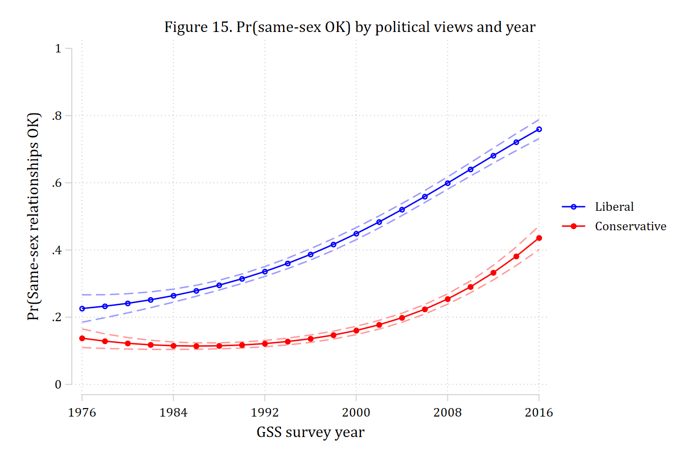
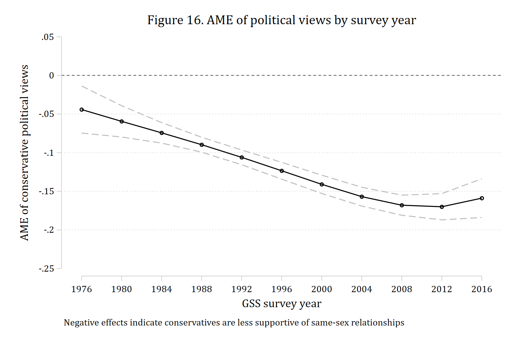
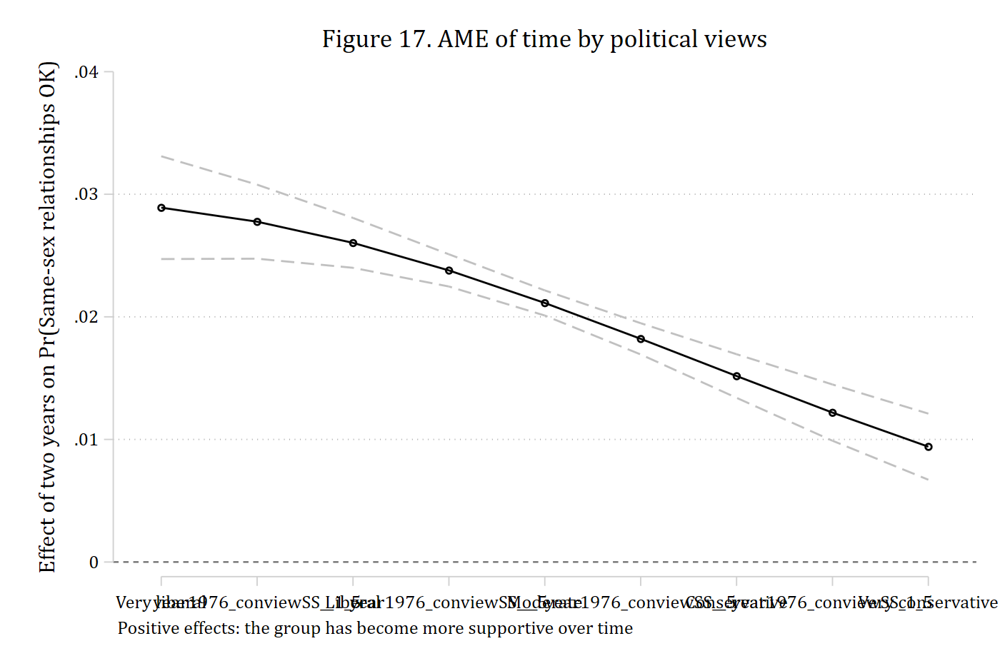
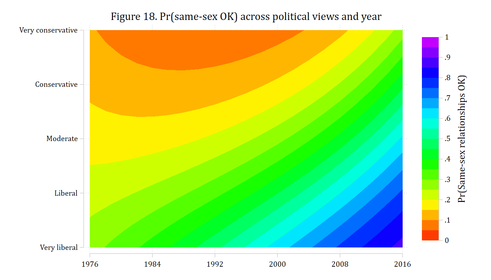

Interactions between two continuous variables are the hardest to present 
because there are an almost unlimited number of combinations of the two variables 
at which one could examine the effects.
The article's example is whether the growth in acceptance of same-sex
relationships in the GSS between 1976 and 2016 has been broad-based or
concentrated among people with particular political views. Political views are
a standardized scale (0 = moderate, negative = liberal, positive =
conservative); year is coded as years since 1976.

## The model

```{.stata-run}
. use "https://tdmize.github.io/data/data/nli_gss", clear
(GSS 1972-2016 | NLI NonLinear Interaction Effects | 2018-12-17)

. drop if missing(sameokB, year1976, conviewSS, age, white, male, income, married, college)
(42,940 observations deleted)

. 
. quietly logit sameokB c.year1976##c.year1976##c.conviewSS c.age i.white i.male ///
>               c.income i.married i.college, vce(robust)

. estimates store samemod

```

## Average effects of each variable

Before looking at the interaction, the average effect of a standard-deviation
increase in each variable (the `mchange` line of the replication file):

```{.stata-run}
. mecompare year1976 conviewSS, models(samemod) amount(sd) uncentered


Predicting: Pr(sameokB)

Marginal effects (N_samemod=19337)

                                 |  ME #   Estimate  Robust SE      P>|z|
---------------------------------+---------------------------------------
year1976 + SD (uncentered)       |                                       
                         samemod |     1      0.150      0.003      0.000
---------------------------------+---------------------------------------
conviewSS + SD (uncentered)      |                                       
                         samemod |     2     -0.078      0.003      0.000

```

More conservative individuals are less likely to view same-sex relationships 
as acceptable, and acceptance has risen over time.

## Ideal types (Figure 15)

The first way to present the interaction is to pick "ideal types" on one
variable -- here one standard deviation below and above the mean of political
views, labeled liberal and conservative -- and plot the predictions across the
other.

`mecompare` leaves its own table as the active estimates, so the model is
restored first.

```{.stata-run}
. estimates restore samemod
(results samemod are active now)

. quietly margins, at(conviewSS=(-1 1) year1976=(0(2)40))

. marginsplot, x(year1976) recastci(rline) ciopts(lpattern(dash)) ylabel(0(0.2)1) ///
>     plot1opts(lcolor(blue) mcolor(blue)) ci1opts(color(blue*.4)) ///
>     plot2opts(lcolor(red) mcolor(red)) ci2opts(color(red*.4)) ///
>     xlabel(0 "1976" 8 "1984" 16 "1992" 24 "2000" 32 "2008" 40 "2016") ///
>     xtitle("GSS survey year") ytitle("Pr(Same-sex relationships OK)") ///
>     legend(order(3 "Liberal" 4 "Conservative")) ///
>     title("Figure 15. Pr(same-sex OK) by political views and year")

Variables that uniquely identify margins: conviewSS year1976

. graph export "fig/nli-sameok-predictions.png", replace width(1400)
file fig/nli-sameok-predictions.png saved as PNG format

```

{width=80% fig-alt="Probability of viewing same-sex relationships as acceptable, over time, for liberals and conservatives, with confidence intervals."}

The effect of time at the two ideal types, and whether it differs, is the
marginal effect of year with `conviewSS` held at each value:

```{.stata-run}
. mecompare year1976, models(samemod) covariates(conviewSS=(-1 1)) amount(rate)


Predicting: Pr(sameokB)

Marginal effects (N_samemod=19337)

                                 |  ME #   Estimate  Robust SE      P>|z|
---------------------------------+---------------------------------------
year1976(rate)                   |                                       
                    conviewSS=-1 |     1      0.013      0.001      0.000
                     conviewSS=1 |     2      0.007      0.000      0.000

. metest 1 - 2

                                 |  estimate         se     pvalue 
---------------------------------+--------------------------------
 year1976_con~1 - year1976_con~1 |     0.006      0.001      0.000 

```

One standard deviation above and below the mean are conventional ideal types,
but a good default for any continuous moderator is its 10th, 50th, and 90th
percentiles: a low, a typical, and a high value that are all in the range of
the data. `summarize, detail` returns them (rounded here to two decimals so
the row labels stay readable), and they go straight into `covariates()`. The
joint test is the test of interaction on this side, and any pair can be
tested as before:

```{.stata-run}
. quietly summarize conviewSS, detail

. local p10 : display %5.2f r(p10)

. local p50 : display %5.2f r(p50)

. local p90 : display %5.2f r(p90)

. mecompare year1976, models(samemod) covariates(conviewSS=(`p10' `p50' `p90')) amount(rate)


Predicting: Pr(sameokB)

Marginal effects (N_samemod=19337)

                                 |  ME #   Estimate  Robust SE      P>|z|
---------------------------------+---------------------------------------
year1976(rate)                   |                                       
                   conviewSS=-.8 |     1      0.012      0.000      0.000
                      convie..07 |     2      0.010      0.000      0.000
                   conviewSS=.87 |     3      0.007      0.000      0.000

. metest 1 = 2 = 3

Tests of equality

                                 |      chi2         df     pvalue 
---------------------------------+--------------------------------
  year19~8 = year1~07 = year1~87 |    75.993      2.000      0.000 

. metest 3 - 1

                                 |  estimate         se     pvalue 
---------------------------------+--------------------------------
 year1976_co~87 - year1976_con~8 |    -0.005      0.001      0.000 

```

## The effect of political views across years (Figure 16)

The second way to present the interaction is to plot the marginal effect of one
variable across the range of the other. First the test the article reports:
the effect of political views in 1976 versus 2016, the instantaneous effect
(`amount(rate)`) with year held at 0 and at 40.

```{.stata-run}
. mecompare conviewSS, models(samemod) covariates(year1976=(0 40)) amount(rate)


Predicting: Pr(sameokB)

Marginal effects (N_samemod=19337)

                                 |  ME #   Estimate  Robust SE      P>|z|
---------------------------------+---------------------------------------
conviewSS(rate)                  |                                       
                      year1976=0 |     1     -0.044      0.016      0.005
                     year1976=40 |     2     -0.159      0.013      0.000

. metest 2 - 1

                                 |  estimate         se     pvalue 
---------------------------------+--------------------------------
 conviewSS_y~40 - conviewSS_ye~0 |    -0.115      0.016      0.000 

```

Political views matter more in 2016 than in 1976: the effect is negative in
both years and significantly larger in magnitude in the later one. The same
test at the 10th, 50th, and 90th percentiles of survey year:

```{.stata-run}
. quietly summarize year1976, detail

. mecompare conviewSS, models(samemod) covariates(year1976=(`r(p10)' `r(p50)' `r(p90)')) amount(rate
> )


Predicting: Pr(sameokB)

Marginal effects (N_samemod=19337)

                                 |  ME #   Estimate  Robust SE      P>|z|
---------------------------------+---------------------------------------
conviewSS(rate)                  |                                       
                      year1976=4 |     1     -0.059      0.010      0.000
                     year1976=18 |     2     -0.115      0.005      0.000
                     year1976=36 |     3     -0.170      0.009      0.000

. metest 1 = 2 = 3

Tests of equality

                                 |      chi2         df     pvalue 
---------------------------------+--------------------------------
  convie~4 = convi~18 = convi~36 |    72.929      2.000      0.000 

. metest 3 - 1

                                 |  estimate         se     pvalue 
---------------------------------+--------------------------------
 conviewSS_y~36 - conviewSS_ye~4 |    -0.111      0.013      0.000 

```

Across all years:

```{.stata-run}
. mecompare conviewSS, models(samemod) covariates(year1976=(0(4)40)) amount(rate) store(pv)


Predicting: Pr(sameokB)

Marginal effects (N_samemod=19337)

                                 |  ME #   Estimate  Robust SE      P>|z|
---------------------------------+---------------------------------------
conviewSS(rate)                  |                                       
                      year1976=0 |     1     -0.044      0.016      0.005
                      year1976=4 |     2     -0.059      0.010      0.000
                      year1976=8 |     3     -0.074      0.007      0.000
                     year1976=12 |     4     -0.090      0.005      0.000
                     year1976=16 |     5     -0.106      0.005      0.000
                     year1976=20 |     6     -0.123      0.006      0.000
                     year1976=24 |     7     -0.141      0.006      0.000
                     year1976=28 |     8     -0.157      0.006      0.000
                     year1976=32 |     9     -0.168      0.007      0.000
                     year1976=36 |    10     -0.170      0.009      0.000
                     year1976=40 |    11     -0.159      0.013      0.000

. 
. coefplot pv_samemod, vertical recast(connected) color(black) ///
>     ciopts(recast(rline) lpattern(dash) color(gs12)) yline(0) ///
>     coeflabels(conviewSS_year1976_0 = "1976" conviewSS_year1976_4 = "1980" ///
>                conviewSS_year1976_8 = "1984" conviewSS_year1976_12 = "1988" ///
>                conviewSS_year1976_16 = "1992" conviewSS_year1976_20 = "1996" ///
>                conviewSS_year1976_24 = "2000" conviewSS_year1976_28 = "2004" ///
>                conviewSS_year1976_32 = "2008" conviewSS_year1976_36 = "2012" ///
>                conviewSS_year1976_40 = "2016") ///
>     ylabel(-0.25(0.05)0.05) xtitle("GSS survey year") ///
>     ytitle("AME of conservative political views") ///
>     title("Figure 16. AME of political views by survey year") ///
>     note("Negative effects indicate conservatives are less supportive of same-sex relationships")

. graph export "fig/nli-sameok-views-by-year.png", replace width(1400)
file fig/nli-sameok-views-by-year.png saved as PNG format

```

{width=80% fig-alt="The marginal effect of conservative political views on acceptance, by survey year, with confidence intervals."}

## The effect of time across political views (Figure 17)

The other side: how much acceptance has changed over time for people with
different views. The article reports a two-year change (the survey interval)
for liberals and conservatives:

```{.stata-run}
. mecompare year1976, models(samemod) covariates(conviewSS=(-1 1)) amount(2) uncentered


Predicting: Pr(sameokB)

Marginal effects (N_samemod=19337)

                                 |  ME #   Estimate  Robust SE      P>|z|
---------------------------------+---------------------------------------
year1976 + 2 (uncentered)        |                                       
                    conviewSS=-1 |     1      0.026      0.001      0.000
                     conviewSS=1 |     2      0.015      0.001      0.000

. metest 1 - 2

                                 |  estimate         se     pvalue 
---------------------------------+--------------------------------
 year1976_con~1 - year1976_con~1 |     0.011      0.002      0.000 

```

Everyone has become more accepting, liberals significantly more so than
conservatives per two-year interval. Across the range of political views, from
two standard deviations below the mean to two above, in steps of one half so
that the line is smooth. Only the whole-number points are labeled; the half
points get an empty label:

```{.stata-run}
. mecompare year1976, models(samemod) covariates(conviewSS=(-2(0.5)2)) amount(2) uncentered store(tm
> )


Predicting: Pr(sameokB)

Marginal effects (N_samemod=19337)

                                 |  ME #   Estimate  Robust SE      P>|z|
---------------------------------+---------------------------------------
year1976 + 2 (uncentered)        |                                       
                    conviewSS=-2 |     1      0.029      0.002      0.000
                       convie..5 |     2      0.028      0.002      0.000
                    conviewSS=-1 |     3      0.026      0.001      0.000
                   conviewSS=-.5 |     4      0.024      0.001      0.000
                     conviewSS=0 |     5      0.021      0.001      0.000
                    conviewSS=.5 |     6      0.018      0.001      0.000
                     conviewSS=1 |     7      0.015      0.001      0.000
                   conviewSS=1.5 |     8      0.012      0.001      0.000
                     conviewSS=2 |     9      0.009      0.001      0.000

. 
. coefplot tm_samemod, vertical recast(connected) color(black) ///
>     ciopts(recast(rline) lpattern(dash) color(gs12)) yline(0) ///
>     coeflabels(year1976_conviewSS__2 = "Very liberal" year1976_conviewSS__1_5 = "" ///
>                year1976_conviewSS__1 = "Liberal" year1976_conviewSS___5 = "" ///
>                year1976_conviewSS_0 = "Moderate" year1976_conviewSS__5 = "" ///
>                year1976_conviewSS_1 = "Conservative" year1976_conviewSS_1_5 = "" ///
>                year1976_conviewSS_2 = "Very conservative") ///
>     xtitle("") ytitle("Effect of two years on Pr(Same-sex relationships OK)") ///
>     title("Figure 17. AME of time by political views") ///
>     note("Positive effects: the group has become more supportive over time")

. graph export "fig/nli-sameok-time-by-views.png", replace width(1400)
file fig/nli-sameok-time-by-views.png saved as PNG format

```

{width=80% fig-alt="The marginal effect of two years of time on acceptance, across political views, with confidence intervals."}

## Predictions over both variables (Figure 18)

The article's final presentation shows the predictions at every combination of
the two variables as a contour plot. This is `margins` and `twoway contour`
rather than a marginal-effects calculation, but it is often the clearest single
picture of a continuous-by-continuous interaction. `margins` evaluates the
predictions on a grid of both variables and saves them to a dataset with
`saving()`; `nose` skips the standard errors, which the plot does not use.
The saved dataset holds the predictions in `_margin` and the grid values in
`_at1` and `_at2`, in the order the variables enter the model.

```{.stata-run}
. estimates restore samemod
(results samemod are active now)

. tempfile preds

. quietly margins, at(conviewSS=(-2(.1)2) year1976=(0(2)40)) nose saving(`preds', replace)

. 
. use `preds', clear
(Created by command margins; also see char list)

. rename _at1 year1976

. rename _at2 conviewSS

. rename _margin pr_sameok

. 
. twoway (contour pr_sameok conviewSS year1976, ccuts(0(0.05)1) ///
>         scolor(red) ecolor(purple) crule(hue)), ///
>     xlabel(0 "1976" 8 "1984" 16 "1992" 24 "2000" 32 "2008" 40 "2016") ///
>     ylabel(-2 "Very liberal" -1 "Liberal" 0 "Moderate" 1 "Conservative" 2 "Very conservative") ///
>     zlabel(0(0.1)1) ztitle("Pr(Same-sex relationships OK)") ///
>     xtitle("") ytitle("") xsize(7) ysize(4) ///
>     title("Figure 18. Pr(same-sex OK) across political views and year")

. graph export "fig/nli-sameok-contour.png", replace width(1400)
(file fig/nli-sameok-contour.png not found)
file fig/nli-sameok-contour.png saved as PNG format

```

{width=90% fig-alt="Contour plot of the predicted probability of viewing same-sex relationships as acceptable at every combination of political views and survey year."}

The replication files at
[trentonmize.com/research](https://www.trentonmize.com/research/mize_2019_SocSci)
also include a grayscale version (`scolor(black) ecolor(gs16) crule(linear)`).
