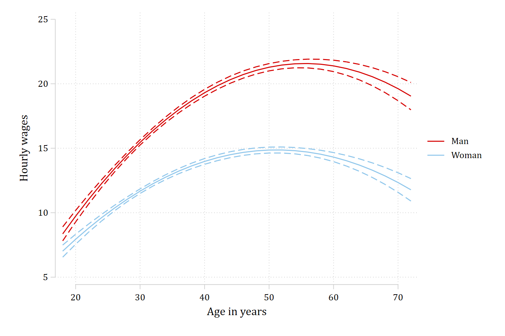
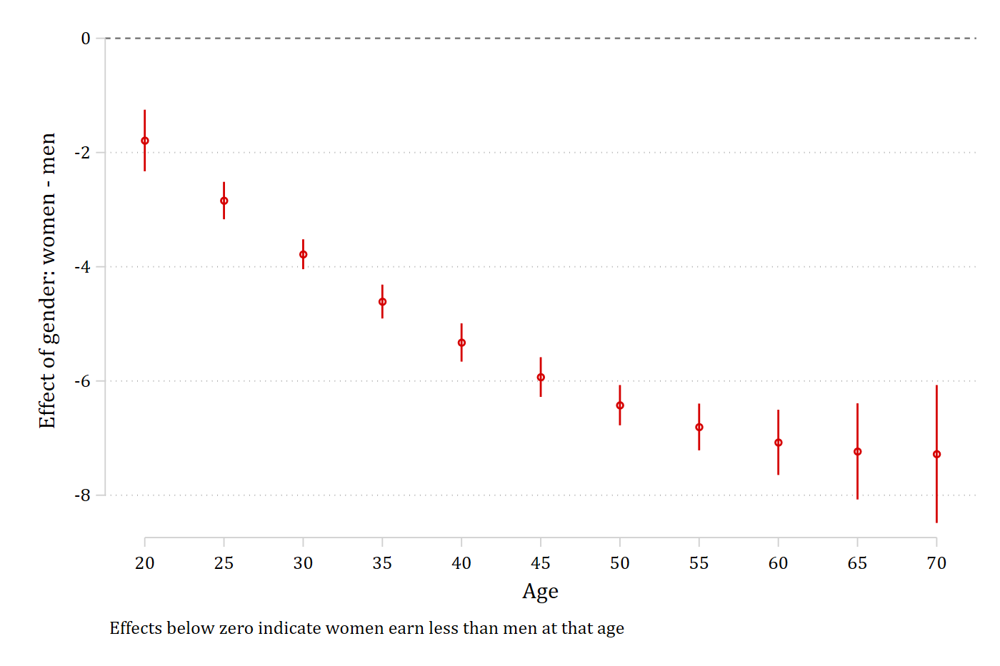

Even in linear regression, an effect is nonlinear when the model has a squared
term or a product term, and then "does the effect of age differ for men and
women?" has no single answer: it depends on where in the range of age you ask.
The article's first example regresses hourly wages on age, age², gender, and
their products, using employed respondents from the pooled GSS.

## The model

```{.stata-run}
. use "https://tdmize.github.io/data/data/nli_gss", clear
(GSS 1972-2016 | NLI NonLinear Interaction Effects | 2018-12-17)

. drop if missing(wages, age, woman, parent, year, race, college, parttime, employed)
(31,346 observations deleted)

. keep if employed == 1
(0 observations deleted)

. 
. quietly regress wages c.age##c.age##i.woman i.parent c.year i.race i.college i.parttime, vce(robus
> t)

. estimates store regwages

```

## Start with the predictions (Figure 1)

The recommendation in the article is to plot the predictions first and let the
plot guide the tests. That is `margins` and `marginsplot`; `mecompare` takes
over from here.

```{.stata-run}
. quietly margins woman, at(age=(18(2)72))

. marginsplot, recastci(rline) ciopts(lpattern(dash)) plotopts(msymbol(none)) ///
>     xtitle("Age in years") ytitle("Hourly wages") title("")

Variables that uniquely identify margins: age woman

. graph export "fig/nli-wages-predictions.png", replace width(1400)
(file fig/nli-wages-predictions.png not found)
file fig/nli-wages-predictions.png saved as PNG format

```

{width=80%}

Wages rise with age and then fall, and the curves for men and women are not
parallel. Whether the effect of age differs by gender therefore has to be asked
at particular ages, or on average across the sample. Table 2 of the article
does both.

## The effect of age for men and women (Table 2)

The first row of Table 2 is the effect of aging from 25 to 30. `start(age=25)`
puts everyone at 25, `amount(5) uncentered` moves them to 30, and `by(woman)`
does it for men and for women. The two rows are numbered, and the second
difference -- whether the effect of aging is the same for men and women -- is
`metest 1 - 2`.

```{.stata-run}
. mecompare age, models(regwages) start(age=25) amount(5) uncentered by(woman)


Predicting: Linear prediction

Marginal effects (N_regwages=30931)

                                 |  ME #   Estimate  Robust SE      P>|z|
---------------------------------+---------------------------------------
age + 5 (uncentered)             |                                       
                             Man |     1      2.628      0.089      0.000
                           Woman |     2      1.688      0.077      0.000

. metest 1 - 2

                                 |  estimate         se     pvalue 
---------------------------------+--------------------------------
       age_woman_0 - age_woman_1 |     0.940      0.109      0.000 

```

The same test from 65 to 70:

```{.stata-run}
. mecompare age, models(regwages) start(age=65) amount(5) uncentered by(woman)


Predicting: Linear prediction

Marginal effects (N_regwages=30931)

                                 |  ME #   Estimate  Robust SE      P>|z|
---------------------------------+---------------------------------------
age + 5 (uncentered)             |                                       
                             Man |     1     -1.118      0.160      0.000
                           Woman |     2     -1.165      0.135      0.000

. metest 1 - 2

                                 |  estimate         se     pvalue 
---------------------------------+--------------------------------
       age_woman_0 - age_woman_1 |     0.046      0.206      0.823 

```

Getting older raises wages more for men than for women in the twenties, while
in the sixties the effect is negative and the same for both. An interaction
that exists at one part of the range of age need not exist at another.

Absent a specific age of interest, the last row of Table 2 asks the question on
average: a five-year increase from each person's own age, averaged over the
sample. Dropping `start()` does that.

```{.stata-run}
. mecompare age, models(regwages) amount(5) uncentered by(woman)


Predicting: Linear prediction

Marginal effects (N_regwages=30931)

                                 |  ME #   Estimate  Robust SE      P>|z|
---------------------------------+---------------------------------------
age + 5 (uncentered)             |                                       
                             Man |     1      1.158      0.039      0.000
                           Woman |     2      0.569      0.033      0.000

. metest 1 - 2

                                 |  estimate         se     pvalue 
---------------------------------+--------------------------------
       age_woman_0 - age_woman_1 |     0.589      0.050      0.000 

```

## The other side: the effect of gender across age (Figure 2)

An interaction has two sides. The gender gap in wages at a given age is the
marginal effect of `woman` with age held at that value, and
`covariates(age=(25 55))` reports it at 25 and at 55 in one table so that the
two can be compared.

```{.stata-run}
. mecompare i.woman, models(regwages) covariates(age=(25 55))


Predicting: Linear prediction

Marginal effects (N_regwages=30931)

                                 |  ME #   Estimate  Robust SE      P>|z|
---------------------------------+---------------------------------------
woman                            |                                       
                 Woman - Man     |                                       
                          age=25 |     1     -2.841      0.167      0.000
                          age=55 |     2     -6.805      0.209      0.000

. metest 2 - 1

                                 |  estimate         se     pvalue 
---------------------------------+--------------------------------
     woman_age_55 - woman_age_25 |    -3.964      0.278      0.000 

```

Women earn less than men at both ages, and the gap is significantly larger at
55. The full picture is the effect of gender across the whole range of age:
give `covariates()` the range, save the results with `store()`, and plot them
with `coefplot`.

```{.stata-run}
. mecompare i.woman, models(regwages) covariates(age=(20(5)70)) store(gap)


Predicting: Linear prediction

Marginal effects (N_regwages=30931)

                                 |  ME #   Estimate  Robust SE      P>|z|
---------------------------------+---------------------------------------
woman                            |                                       
                 Woman - Man     |                                       
                          age=20 |     1     -1.789      0.275      0.000
                          age=25 |     2     -2.841      0.167      0.000
                          age=30 |     3     -3.781      0.134      0.000
                          age=35 |     4     -4.609      0.151      0.000
                          age=40 |     5     -5.326      0.171      0.000
                          age=45 |     6     -5.931      0.177      0.000
                          age=50 |     7     -6.424      0.180      0.000
                          age=55 |     8     -6.805      0.209      0.000
                          age=60 |     9     -7.075      0.291      0.000
                          age=65 |    10     -7.232      0.430      0.000
                          age=70 |    11     -7.278      0.616      0.000

. 
. coefplot gap_regwages, vertical yline(0) ///
>     coeflabels(woman_age_20 = "20" woman_age_25 = "25" woman_age_30 = "30" ///
>                woman_age_35 = "35" woman_age_40 = "40" woman_age_45 = "45" ///
>                woman_age_50 = "50" woman_age_55 = "55" woman_age_60 = "60" ///
>                woman_age_65 = "65" woman_age_70 = "70") ///
>     xtitle("Age") ytitle("Effect of gender: women - men") ///
>     note("Effects below zero indicate women earn less than men at that age")

. graph export "fig/nli-wages-gender-gap.png", replace width(1400)
(file fig/nli-wages-gender-gap.png not found)
file fig/nli-wages-gender-gap.png saved as PNG format

```

{width=80%}

The gap is significant at every age (no interval crosses zero) and grows with
age. Because these are direct tests of the group difference, the confidence
intervals here say what overlapping intervals on the predictions plot cannot.
