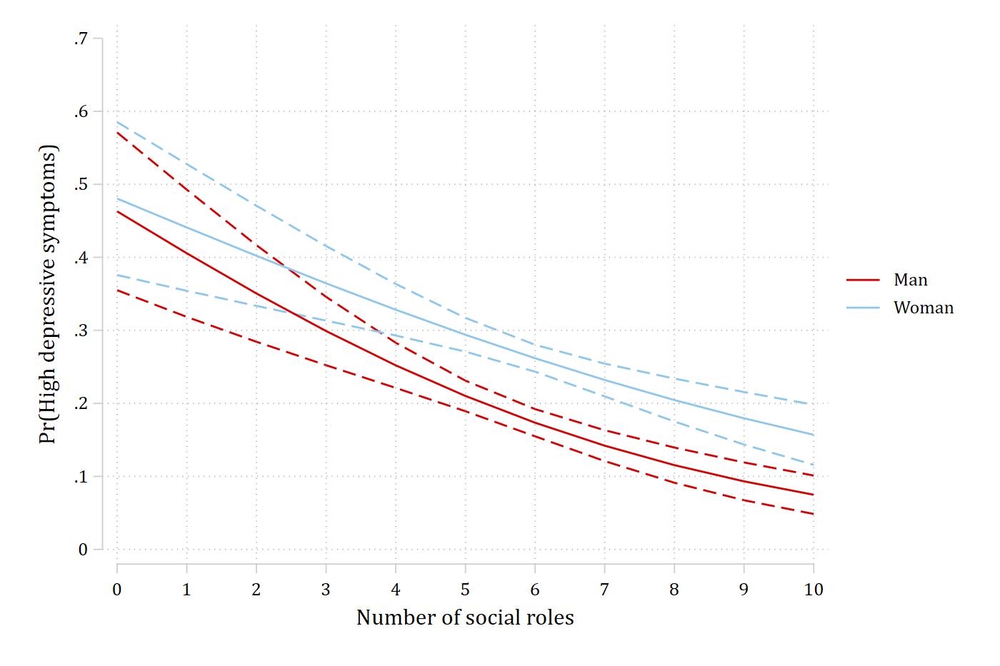
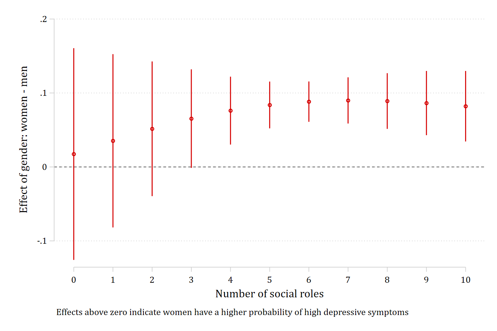

When one of the interacting variables is continuous, a plot of the predictions
is almost always needed, and the tests have two sides: the effect of the
continuous variable within each group, and the group difference at each value
of the continuous variable. The article's example is whether holding more
social roles protects against high depressive symptoms equally for men and
women (Add Health Wave IV).

## The model

```{.stata-run}
. use "https://tdmize.github.io/data/data/nli_ah4", clear
(Add Health Wave IV | NLI - Nonlinear Interaction Effects | 2018-12-17)

. 
. quietly logit depB c.role##i.woman i.parrole c.age i.race c.income i.college, vce(robust)

. estimates store depmod

```

## The predictions (Figure 14)

```{.stata-run}
. quietly margins woman, at(role=(0(1)10))

. marginsplot, xdimension(role) recastci(rline) ciopts(lpattern(dash)) plotopts(msymbol(none)) ///
>     xlabel(0(1)10) ylabel(0(0.1)0.7) xtitle("Number of social roles") ///
>     ytitle("Pr(High depressive symptoms)") title("")

Variables that uniquely identify margins: role woman

. graph export "fig/nli-roles-predictions.png", replace width(1400)
(file fig/nli-roles-predictions.png not found)
file fig/nli-roles-predictions.png saved as PNG format

```

{width=80%}

Both curves fall as roles accumulate, and women sit above men. The two
questions are whether the slope differs by gender and where along the range of
roles the gender gap is significant.

## The effect of social roles for men and women

The average effect of one additional role, for men and for women, and the
second difference. `uncentered` makes the change run from each person's
observed count to one more, as in the article; the default would center the
one-unit change on the observed value.

```{.stata-run}
. mecompare role, models(depmod) by(woman) uncentered


Predicting: Pr(depB)

Marginal effects (N_depmod=4307)

                                 |  ME #   Estimate  Robust SE      P>|z|
---------------------------------+---------------------------------------
role + 1 (uncentered)            |                                       
                             Man |     1     -0.032      0.005      0.000
                           Woman |     2     -0.030      0.006      0.000

. metest 1 - 2

                                 |  estimate         se     pvalue 
---------------------------------+--------------------------------
     role_woman_0 - role_woman_1 |    -0.002      0.008      0.758 

```

Each additional role lowers the probability of high depressive symptoms by
about three percentage points for both men and women; the second difference
is not significant. The instantaneous version of the same effect, the
`dydx()` of `margins`, is `amount(rate)`:

```{.stata-run}
. mecompare role, models(depmod) by(woman) amount(rate)


Predicting: Pr(depB)

Marginal effects (N_depmod=4307)

                                 |  ME #   Estimate  Robust SE      P>|z|
---------------------------------+---------------------------------------
role(rate)                       |                                       
                             Man |     1     -0.035      0.006      0.000
                           Woman |     2     -0.031      0.007      0.000

. metest 1 - 2

                                 |  estimate         se     pvalue 
---------------------------------+--------------------------------
     role_woman_0 - role_woman_1 |    -0.004      0.008      0.664 

```

## The gender gap at each number of roles

The other side of the interaction: the marginal effect of gender at each value
of `role`, from `covariates()` with the full range. One numbered row per value,
each with its own test.

```{.stata-run}
. mecompare i.woman, models(depmod) covariates(role=(0(1)10)) store(gap)


Predicting: Pr(depB)

Marginal effects (N_depmod=4307)

                                 |  ME #   Estimate  Robust SE      P>|z|
---------------------------------+---------------------------------------
woman                            |                                       
                 Woman - Man     |                                       
                          role=0 |     1      0.017      0.073      0.811
                          role=1 |     2      0.035      0.060      0.554
                          role=2 |     3      0.052      0.046      0.267
                          role=3 |     4      0.065      0.034      0.054
                          role=4 |     5      0.076      0.023      0.001
                          role=5 |     6      0.084      0.016      0.000
                          role=6 |     7      0.088      0.014      0.000
                          role=7 |     8      0.090      0.016      0.000
                          role=8 |     9      0.089      0.019      0.000
                          role=9 |    10      0.086      0.022      0.000
                         role=10 |    11      0.082      0.024      0.001

```

This is the information Figure 14 encodes in solid versus dashed lines: the
gender gap is significant at three or more roles and not at zero to two. Plotted
directly:

```{.stata-run}
. coefplot gap_depmod, vertical yline(0) ///
>     coeflabels(woman_role_0 = "0" woman_role_1 = "1" woman_role_2 = "2" ///
>                woman_role_3 = "3" woman_role_4 = "4" woman_role_5 = "5" ///
>                woman_role_6 = "6" woman_role_7 = "7" woman_role_8 = "8" ///
>                woman_role_9 = "9" woman_role_10 = "10") ///
>     xtitle("Number of social roles") ytitle("Effect of gender: women - men") ///
>     note("Effects above zero indicate women have a higher probability of high depressive symptoms"
> )

. graph export "fig/nli-roles-gender-gap.png", replace width(1400)
(file fig/nli-roles-gender-gap.png not found)
file fig/nli-roles-gender-gap.png saved as PNG format

```

{width=80%}

A joint test that the gap is the same at every number of roles is the overall
test of interaction on this side:

```{.stata-run}
. metest 1 = 2 = 3 = 4 = 5 = 6 = 7 = 8 = 9 = 10 = 11

Tests of equality

                                 |      chi2         df     pvalue 
---------------------------------+--------------------------------
         1=2=3=4=5=6=7=8=9=10=11 |   104.705      5.000      0.000 

```
