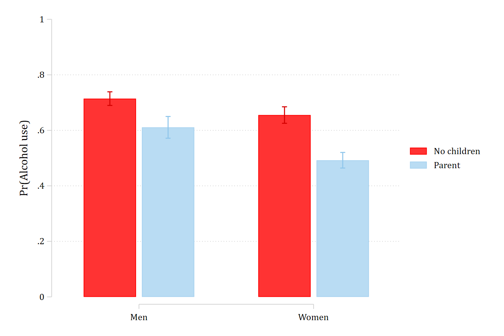
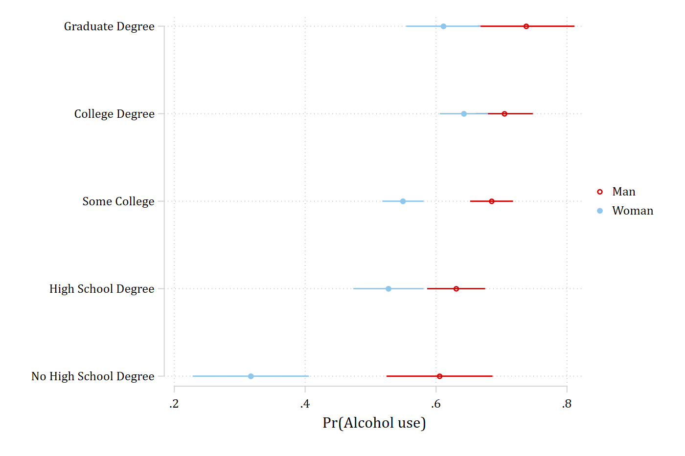

Interactions between two nominal variables are the simplest case: there are
only a few combinations of the focal variables at which to look. The article's
example asks whether becoming a parent changes the probability of drinking
alcohol differently for men and women, using Wave IV of Add Health, and then
whether the gender gap in drinking differs by level of education.

## Binary × binary: gender and parenthood

```{.stata-run}
. use "https://tdmize.github.io/data/data/nli_ah4", clear
(Add Health Wave IV | NLI - Nonlinear Interaction Effects | 2018-12-17)

. 
. quietly logit alcB i.woman##i.parrole c.age i.race c.income i.educ, vce(robust)

. estimates store alcmod

```

### The predictions (Figure 12)

The four predicted probabilities, from `margins`, plotted as bars with
`coefplot`. Each set of predictions is stored so that `coefplot` can arrange
them by parental status within gender.

```{.stata-run}
. quietly margins, at(woman=(0 1) parrole=0) post

. estimates store prno

. estimates restore alcmod
(results alcmod are active now)

. quietly margins, at(woman=(0 1) parrole=1) post

. estimates store prpar

. 
. coefplot prno prpar, vertical recast(bar) barwidth(0.3) ///
>     ciopts(recast(rcap)) citop ///
>     legend(order(1 "No children" 3 "Parent")) ///
>     xlabel(1 "Men" 2 "Women") ytitle("Pr(Alcohol use)") ylabel(0(.2)1)

. graph export "fig/nli-alcohol-predictions.png", replace width(1400)
(file fig/nli-alcohol-predictions.png not found)
file fig/nli-alcohol-predictions.png saved as PNG format

```

{width=75%}

### First and second differences (Table 3)

The effect of parenthood for men and for women is `mecompare` with
`by(woman)`; the second difference -- is the effect of parenthood the same for
both? -- is the difference between the two rows.

```{.stata-run}
. mecompare i.parrole, models(alcmod) by(woman)


Predicting: Pr(alcB)

Marginal effects (N_alcmod=4307)

                                 |  ME #   Estimate  Robust SE      P>|z|
---------------------------------+---------------------------------------
parrole                          |                                       
           Parent - No Child     |                                       
                             Man |     1     -0.103      0.023      0.000
                           Woman |     2     -0.163      0.021      0.000

. metest 1 - 2

                                 |  estimate         se     pvalue 
---------------------------------+--------------------------------
 parrole_woma~0 - parrole_woma~1 |     0.059      0.031      0.055 

```

Parents are less likely to drink than non-parents of the same gender, and the
drop is larger for women than for men: the second difference is significant.
The other side of the interaction is the gender gap for non-parents and for
parents, which is the same model with the roles reversed:

```{.stata-run}
. mecompare i.woman, models(alcmod) by(parrole)


Predicting: Pr(alcB)

Marginal effects (N_alcmod=4307)

                                 |  ME #   Estimate  Robust SE      P>|z|
---------------------------------+---------------------------------------
woman                            |                                       
                 Woman - Man     |                                       
                     No Children |     1     -0.059      0.020      0.003
                          Parent |     2     -0.118      0.025      0.000

. metest 1 - 2

                                 |  estimate         se     pvalue 
---------------------------------+--------------------------------
 woman_parrol~0 - woman_parrol~1 |     0.059      0.031      0.055 

```

## Nominal with several categories: gender and education

With a five-category education variable the logic is the same; there are
simply more comparisons.

```{.stata-run}
. quietly logit alcB i.educ##i.woman c.age i.race c.income, vce(robust)

. estimates store alcedmod

```

### The predictions (Figure 13)

A dot plot of the ten predicted probabilities, education on the axis and one
marker per gender:

```{.stata-run}
. quietly margins woman#educ

. marginsplot, recast(scatter) recastci(rspike) xdimension(educ) horizontal ///
>     ytitle("") xtitle("Pr(Alcohol use)") xlabel(.2(.2).8) title("")

Variables that uniquely identify margins: woman educ

. graph export "fig/nli-alcohol-education.png", replace width(1400)
(file fig/nli-alcohol-education.png not found)
file fig/nli-alcohol-education.png saved as PNG format

```

{width=80%}

### The gender gap at each level of education (Table 4)

`by(educ)` gives the marginal effect of gender at each level of education, one
row per level. A joint test that the five gaps are equal is the overall test of
interaction; the pairwise second differences say which levels differ.

```{.stata-run}
. mecompare i.woman, models(alcedmod) by(educ)


Predicting: Pr(alcB)

Marginal effects (N_alcedmod=4307)

                                 |  ME #   Estimate  Robust SE      P>|z|
---------------------------------+---------------------------------------
woman                            |                                       
                 Woman - Man     |                                       
                   No High Sch~e |     1     -0.288      0.061      0.000
                   High School~e |     2     -0.104      0.035      0.003
                    Some College |     3     -0.136      0.023      0.000
                   College Deg~e |     4     -0.062      0.029      0.032
                   Graduate De~e |     5     -0.126      0.047      0.007

. metest 1 = 2 = 3 = 4 = 5

Tests of equality

                                 |      chi2         df     pvalue 
---------------------------------+--------------------------------
                       1=2=3=4=5 |    12.497      4.000      0.014 

```

The gap is significant at every level of education -- men are more likely to
drink -- and the gaps are not all the same size. Table 4 of the article reports
which pairs differ; the contrasts with the lowest education level, accumulated
into one table with `add`:

```{.stata-run}
. metest 1 - 2, rowname("No HS - HS")

                                 |  estimate         se     pvalue 
---------------------------------+--------------------------------
                      No HS - HS |    -0.185      0.070      0.008 

. metest 1 - 3, add rowname("No HS - Some college")

                                 |  estimate         se     pvalue 
---------------------------------+--------------------------------
                      No HS - HS |    -0.185      0.070      0.008 
            No HS - Some college |    -0.153      0.065      0.019 

. metest 1 - 4, add rowname("No HS - College")

                                 |  estimate         se     pvalue 
---------------------------------+--------------------------------
                      No HS - HS |    -0.185      0.070      0.008 
            No HS - Some college |    -0.153      0.065      0.019 
                 No HS - College |    -0.226      0.067      0.001 

. metest 1 - 5, add rowname("No HS - Graduate")

                                 |  estimate         se     pvalue 
---------------------------------+--------------------------------
                      No HS - HS |    -0.185      0.070      0.008 
            No HS - Some college |    -0.153      0.065      0.019 
                 No HS - College |    -0.226      0.067      0.001 
                No HS - Graduate |    -0.162      0.077      0.035 

```

The gender gap among those without a high school degree is larger than at
every other level. Any other pair is tested the same way, e.g. `metest 2 - 4`.

### The other side: education within gender

The article omits this side for space but recommends examining it. With
`i.educ` as the focal variable, each row is a contrast with the base
category; `pwcompare` would give all ten pairwise contrasts instead.

```{.stata-run}
. mecompare i.educ, models(alcedmod) by(woman)


Predicting: Pr(alcB)

Marginal effects (N_alcedmod=4307)

                                 |  ME #   Estimate  Robust SE      P>|z|
---------------------------------+---------------------------------------
educ                             |                                       
     High Schoo - No High Sc     |                                       
                             Man |     1      0.025      0.047      0.590
                           Woman |     2      0.210      0.052      0.000
     Some Colle - No High Sc     |                                       
                             Man |     3      0.080      0.045      0.075
                           Woman |     4      0.232      0.047      0.000
     College De - No High Sc     |                                       
                             Man |     5      0.099      0.047      0.036
                           Woman |     6      0.326      0.049      0.000
     Graduate D - No High Sc     |                                       
                             Man |     7      0.132      0.056      0.019
                           Woman |     8      0.294      0.054      0.000

```
