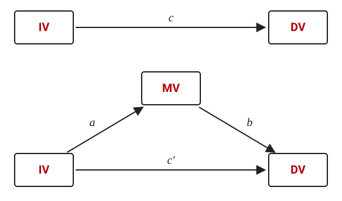
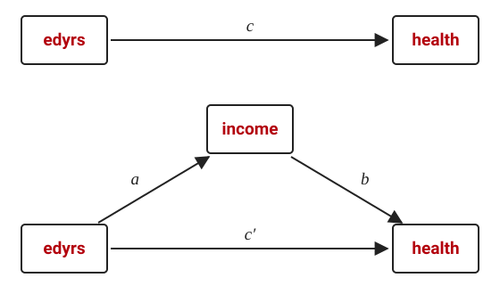

`sgmediation2` conducts Sobel-Goodman tests of statistical mediation for
linear regression models. It fits the three regressions the tests need,
reports the total, direct, and indirect effects with the proportion of the
effect that is mediated, and calculates the Sobel, Aroian, and Goodman
tests of the indirect effect. It is an updated version (with permission) of
the `sgmediation` command written by Phil Ender of the UCLA Statistical
Consulting Group, adding support for survey weights, multiply imputed data,
alternative variance estimators, factor-variable syntax for the control
variables, and stored results for bootstrapping.

## Installation

```stata
net install sgmediation2, from("https://tdmize.github.io/data") replace
```

To read the help file in Stata, type `help sgmediation2`; it is also
[on this site](help.html).

## Citation

Please cite the use of `sgmediation2` as:

> Mize, Trenton D. 2022. "sgmediation2: Sobel-Goodman tests of mediation in
> Stata." <https://www.trentonmize.com/software/sgmediation2>

## Background on the tests

A mediating variable (MV) is one through which a focal independent variable
(IV) affects the dependent variable (DV): the IV affects the mediator, and
the mediator in turn affects the outcome. If that is so, the estimated
effect of the IV will be smaller after accounting for the mediator
(*c′*) than in a model without it (*c*).

{width=60% fig-alt="Two path diagrams. Top: the IV points to the DV, labeled c, the total effect. Bottom: the IV points to the MV (path a), the MV points to the DV (path b), and the IV points directly to the DV (path c prime)."}

The tests are built from three linear regressions:

1. Regress the DV on the IV (and any control variables). The coefficient on
   the IV is *c*, the **total effect**.
2. Regress the MV on the IV (and controls). The coefficient on the IV is
   path *a*.
3. Regress the DV on both the IV and the MV (and controls). The coefficient
   on the MV is path *b*, and the coefficient on the IV is *c′*, the
   **direct effect**.

The difference between the total and direct effects is the **indirect
effect**: the amount of the IV's effect that is explained by the mediator.
It can be calculated either as the product of the two paths through the
mediator, *a*·*b* (the "product of coefficients"), or as *c* − *c′* (the
"difference in coefficients"); with the same sample in every model the two
are identical. Dividing by the total effect gives the proportion of the
IV's effect that is due to the mediator:

$$
\frac{a \cdot b}{c} \;=\; \frac{c - c'}{c} \;=\; 1 - \frac{c'}{c}
$$

All three tests calculated by `sgmediation2` use the product of
coefficients. They differ only in the standard error of *a*·*b*:

$$
\text{Sobel:}\quad z = \frac{a \cdot b}{\sqrt{a^2 \sigma_b^2 + b^2 \sigma_a^2}}
$$

$$
\text{Aroian:}\quad z = \frac{a \cdot b}{\sqrt{a^2 \sigma_b^2 + b^2 \sigma_a^2 + \sigma_a^2 \sigma_b^2}}
$$

$$
\text{Goodman:}\quad z = \frac{a \cdot b}{\sqrt{a^2 \sigma_b^2 + b^2 \sigma_a^2 - \sigma_a^2 \sigma_b^2}}
$$

The Aroian and Goodman versions include the product of the variances of
the two path coefficients, added and subtracted respectively. Results from
all three tend to be similar because that product tends to be small.

Which of the individual results establish mediation is a matter of some
debate. Baron and Kenny (1986) require that the IV affects the mediator,
that the IV affects the DV without the mediator, that the mediator affects
the DV, and that the IV's effect shrinks when the mediator is added;
Preacher and Hayes (2004) keep only the first and last of those; Zhao,
Lynch, and Chen (2010) argue that a significant indirect effect is all that
is needed, since mediation can occur without a direct effect. `sgmediation2`
reports every piece, so any of these standards can be applied.

## Illustration

Those with more education tend to report better health. A possible
mediation explanation is that more education leads to higher incomes,
which are in turn associated with better health. The example tests this
with Add Health Wave IV data. By default `sgmediation2` uses only the
observations that are non-missing on every variable in the models; it is
best to handle missing data yourself first. Here, listwise deletion:

```{.stata-run}
. use "https://tdmize.github.io/data/data/cda_ah4", clear
(cda_ah4.dta | Add Health Wave 4 - | )

. drop if missing(health, edyrs, income, race, woman, age)
(131 observations deleted)

```

{width=60% fig-alt="The same two path diagrams with edyrs as the IV, income as the MV, and health as the DV."}

The syntax is `sgmediation2 depvar [if] [in], iv(varname) mv(varname)
[options]`. The only additional option used here is `cv()`, the list of
control variables, which accepts factor-variable syntax:

```{.stata-run}
. sgmediation2 health, iv(edyrs) mv(income) cv(i.race i.woman age)

Model with dv regressed on iv (path c)
 regress health edyrs i.race i.woman age, vce() 

      Source |       SS           df       MS      Number of obs   =     4,983
-------------+----------------------------------   F(6, 4976)      =     56.32
       Model |  264.985975         6  44.1643291   Prob > F        =    0.0000
    Residual |  3902.28234     4,976  .784220727   R-squared       =    0.0636
-------------+----------------------------------   Adj R-squared   =    0.0625
       Total |  4167.26831     4,982  .836464936   Root MSE        =    .88556

----------------------------------------------------------------------------------
          health | Coefficient  Std. err.      t    P>|t|     [95% conf. interval]
-----------------+----------------------------------------------------------------
           edyrs |      0.093      0.005   16.979   0.000        0.083       0.104
                 |
            race |
          Black  |     -0.111      0.030   -3.747   0.000       -0.169      -0.053
Native American  |     -0.171      0.145   -1.179   0.238       -0.454       0.113
          Asian  |     -0.201      0.073   -2.735   0.006       -0.345      -0.057
                 |
           woman |
          Woman  |     -0.172      0.025   -6.756   0.000       -0.222      -0.122
             age |     -0.013      0.007   -1.829   0.068       -0.026       0.001
           _cons |      2.817      0.214   13.179   0.000        2.398       3.236
----------------------------------------------------------------------------------

Model with mediator regressed on iv (path a)
 regress income edyrs i.race i.woman age, vce() 

      Source |       SS           df       MS      Number of obs   =     4,983
-------------+----------------------------------   F(6, 4976)      =    171.22
       Model |  615297.309         6  102549.551   Prob > F        =    0.0000
    Residual |  2980328.07     4,976  598.940528   R-squared       =    0.1711
-------------+----------------------------------   Adj R-squared   =    0.1701
       Total |  3595625.38     4,982  721.723279   Root MSE        =    24.473

----------------------------------------------------------------------------------
          income | Coefficient  Std. err.      t    P>|t|     [95% conf. interval]
-----------------+----------------------------------------------------------------
           edyrs |      3.836      0.152   25.246   0.000        3.538       4.134
                 |
            race |
          Black  |     -5.922      0.821   -7.215   0.000       -7.531      -4.313
Native American  |      0.113      3.997    0.028   0.977       -7.723       7.949
          Asian  |      4.917      2.030    2.422   0.015        0.937       8.897
                 |
           woman |
          Woman  |    -13.135      0.704  -18.664   0.000      -14.515     -11.755
             age |      1.167      0.192    6.086   0.000        0.791       1.543
           _cons |    -47.033      5.906   -7.963   0.000      -58.612     -35.454
----------------------------------------------------------------------------------

Model with dv regressed on mediator and iv (paths b and c')
 regress health income edyrs i.race i.woman age, vce() 

      Source |       SS           df       MS      Number of obs   =     4,983
-------------+----------------------------------   F(7, 4975)      =     55.12
       Model |  299.936161         7   42.848023   Prob > F        =    0.0000
    Residual |  3867.33215     4,975  .777353196   R-squared       =    0.0720
-------------+----------------------------------   Adj R-squared   =    0.0707
       Total |  4167.26831     4,982  .836464936   Root MSE        =    .88168

----------------------------------------------------------------------------------
          health | Coefficient  Std. err.      t    P>|t|     [95% conf. interval]
-----------------+----------------------------------------------------------------
          income |      0.003      0.001    6.705   0.000        0.002       0.004
           edyrs |      0.080      0.006   13.797   0.000        0.069       0.092
                 |
            race |
          Black  |     -0.091      0.030   -3.061   0.002       -0.149      -0.033
Native American  |     -0.171      0.144   -1.187   0.235       -0.453       0.111
          Asian  |     -0.218      0.073   -2.975   0.003       -0.361      -0.074
                 |
           woman |
          Woman  |     -0.127      0.026   -4.845   0.000       -0.178      -0.076
             age |     -0.017      0.007   -2.406   0.016       -0.030      -0.003
           _cons |      2.978      0.214   13.906   0.000        2.558       3.398
----------------------------------------------------------------------------------

Sobel-Goodman Mediation Tests

                     |        Est     Std_err           z       P>|z| 
---------------------+-----------------------------------------------
               Sobel |      0.013       0.002       6.481       0.000 
              Aroian |      0.013       0.002       6.476       0.000 
             Goodman |      0.013       0.002       6.485       0.000 

Indirect, Direct, and Total Effects

                     |        Est     Std_err           z       P>|z| 
---------------------+-----------------------------------------------
       a_coefficient |      3.836       0.152      25.246       0.000 
       b_coefficient |      0.003       0.001       6.705       0.000 
 Indirect_effect_aXb |      0.013       0.002       6.481       0.000 
    Direct_effect_c' |      0.080       0.006      13.797       0.000 
      Total_effect_c |      0.093       0.005      16.979       0.000 


Proportion of total effect that is mediated:       0.141
Ratio of indirect to direct effect:                0.164
Ratio of total to direct effect:                   1.164

```

To summarize the results:

- Both the *a* and *b* paths are significant at *p* < 0.001: education is
  associated with higher incomes, and higher incomes are associated with
  better health, supporting the proposed mediating relationship.
- All three tests of *a*·*b* (the indirect effect) in the Sobel-Goodman
  table have very small p-values, supporting the explanation that income
  mediates the effect of education on health.
- The effect of education is reduced by about 14% after accounting for
  income. Theoretically, this suggests that about 14% of the effect of
  education on health is explained by the indirect effect of education on
  income.

## Survey weights and multiply imputed data

`sgmediation2` allows survey weights and multiply imputed data. Specify the
prefix you would put on `regress` in the `prefix()` option. The Add Health
data are already `svyset`; to use those weights:

```{.stata-run}
. svyset

Sampling weights: weightcross
             VCE: linearized
     Single unit: missing
        Strata 1: <one>
 Sampling unit 1: clusterw4
           FPC 1: <zero>

. sgmediation2 health, iv(edyrs) mv(income) cv(i.race i.woman age) prefix(svy:) quietly

svy: regress health edyrs i.race i.woman age, vce() 
svy: regress income edyrs i.race i.woman age, vce() 
svy: regress health income edyrs i.race i.woman age, vce() 

Sobel-Goodman Mediation Tests

                     |        Est     Std_err           z       P>|z| 
---------------------+-----------------------------------------------
               Sobel |      0.011       0.003       3.837       0.000 
              Aroian |      0.011       0.003       3.832       0.000 
             Goodman |      0.011       0.003       3.842       0.000 

Indirect, Direct, and Total Effects

                     |        Est     Std_err           z       P>|z| 
---------------------+-----------------------------------------------
       a_coefficient |      3.690       0.195      18.899       0.000 
       b_coefficient |      0.003       0.001       3.919       0.000 
 Indirect_effect_aXb |      0.011       0.003       3.837       0.000 
    Direct_effect_c' |      0.090       0.007      13.012       0.000 
      Total_effect_c |      0.101       0.006      16.787       0.000 


Proportion of total effect that is mediated:       0.108
Ratio of indirect to direct effect:                0.121
Ratio of total to direct effect:                   1.121

```

`prefix(mi est, post:)` uses multiple imputation estimates as defined by
`mi set` (the `post` option is required), and `prefix(mi est, post: svy:)`
combines the two. The `quietly` option used above suppresses the three
regression tables and shows only the summary tables.

## Alternative variance estimators

The `vce()` option requests a variance estimator other than the default:
`vce(robust)` for robust standard errors, or `vce(cluster clustvar)` for
cluster-robust ones. Here the standard errors are adjusted for clustering
within occupational categories:

```{.stata-run}
. sgmediation2 health, iv(edyrs) mv(income) cv(i.race i.woman age) vce(cluster occcat) quietly

 regress health edyrs i.race i.woman age, vce(cluster occcat) 
 regress income edyrs i.race i.woman age, vce(cluster occcat) 
 regress health income edyrs i.race i.woman age, vce(cluster occcat) 

Sobel-Goodman Mediation Tests

                     |        Est     Std_err           z       P>|z| 
---------------------+-----------------------------------------------
               Sobel |      0.013       0.002       5.930       0.000 
              Aroian |      0.013       0.002       5.915       0.000 
             Goodman |      0.013       0.002       5.945       0.000 

Indirect, Direct, and Total Effects

                     |        Est     Std_err           z       P>|z| 
---------------------+-----------------------------------------------
       a_coefficient |      3.838       0.312      12.295       0.000 
       b_coefficient |      0.003       0.001       6.769       0.000 
 Indirect_effect_aXb |      0.013       0.002       5.930       0.000 
    Direct_effect_c' |      0.080       0.004      18.574       0.000 
      Total_effect_c |      0.094       0.005      19.542       0.000 


Proportion of total effect that is mediated:       0.140
Ratio of indirect to direct effect:                0.163
Ratio of total to direct effect:                   1.163

```

## Bootstrapped standard errors and confidence intervals

The indirect, direct, and total effects are returned in `r(ind_eff)`,
`r(dir_eff)`, and `r(tot_eff)`, so Stata's `bootstrap` prefix can be used
to obtain bootstrapped standard errors and confidence intervals for them.
The example uses 100 replications so that the page builds quickly; in
practice 1,000 replications are generally recommended.

```{.stata-run}
. bootstrap r(ind_eff) r(dir_eff) r(tot_eff), reps(100) seed(2026): ///
>     sgmediation2 health, iv(edyrs) mv(income) cv(i.race i.woman age)
(running sgmediation2 on estimation sample)
 regress health edyrs i.race i.woman age, vce() 
 regress income edyrs i.race i.woman age, vce() 
 regress health income edyrs i.race i.woman age, vce() 

Bootstrap replications (100): .........10.........20.........30.........40.........50.........60....
> .....70.........80.........90.........100 done

Bootstrap results                                        Number of obs = 4,983
                                                         Replications  =   100

      Command: sgmediation2 health, iv(edyrs) mv(income) cv(i.race i.woman age)
        _bs_1: r(ind_eff)
        _bs_2: r(dir_eff)
        _bs_3: r(tot_eff)

------------------------------------------------------------------------------
             |   Observed   Bootstrap                         Normal-based
             | coefficient  std. err.      z    P>|z|     [95% conf. interval]
-------------+----------------------------------------------------------------
       _bs_1 |      0.013      0.002    7.532   0.000        0.010       0.017
       _bs_2 |      0.080      0.005   14.984   0.000        0.070       0.091
       _bs_3 |      0.093      0.005   17.746   0.000        0.083       0.104
------------------------------------------------------------------------------

```

`estat bootstrap` then reports the bias-corrected and percentile
confidence intervals:

```{.stata-run}
. estat bootstrap, bc percentile

Bootstrap results                               Number of obs     =      4,983
                                                Replications      =        100

      Command: sgmediation2 health, iv(edyrs) mv(income) cv(i.race i.woman age)
        _bs_1: r(ind_eff)
        _bs_2: r(dir_eff)
        _bs_3: r(tot_eff)

------------------------------------------------------------------------------
             |    Observed               Bootstrap
             | coefficient       Bias    std. err.  [95% conf. interval]
-------------+----------------------------------------------------------------
       _bs_1 |   .01313674   .0001615   .00174404    .0100487   .0166817   (P)
             |                                       .0095707   .0165165  (BC)
       _bs_2 |   .08021862   .0003122   .00535347    .0689332   .0904137   (P)
             |                                       .0676583     .08868  (BC)
       _bs_3 |   .09335536   .0004736   .00526056    .0822798   .1035904   (P)
             |                                       .0815194   .1035485  (BC)
------------------------------------------------------------------------------
Key:  P: Percentile
     BC: Bias-corrected

```

## Factor syntax for control variables

As in the examples above, factor-variable syntax is allowed in the list of
control variables, so each can be treated as continuous or nominal. It is
not allowed for the focal independent variable or the mediator; that
reflects a limitation of the method, not of the command. IVs and MVs are
limited to continuous or binary variables.

## Limitations of the Sobel-Goodman approach

There are many limitations to this approach to mediation (more than are
discussed here). A few of note:

1. Only continuous or binary focal independent variables can be examined.
2. Only continuous or binary mediating variables can be examined.
3. Multiple mediating variables cannot be easily incorporated.
4. The tests are limited to a single coefficient: there is no clear way to
   test whether the effect of age is mediated when both age and age² are in
   the models.
5. The approach is limited to linear regression models.
6. It is a specialized approach appropriate only for mediation and not for
   other cross-model comparisons.

These limitations were part of the motivation for the general framework of
Mize, Doan, and Long (2019), which compares marginal effects across models
of any supported type. That framework is implemented in
[`mecompare`](../mecompare/index.html), whose
[mediation examples](../mecompare/examples/mediation.html) show it in use.

## Author

`sgmediation2` is an adaptation (with permission) of the `sgmediation`
command written by Phil Ender of the UCLA Statistical Consulting Group.
`sgmediation2` is written and maintained by Trenton D. Mize (Departments of
Sociology and Statistics [by courtesy] and The Methodology Center at Purdue
University). Requests for help or suggestions can be sent to
tmize@purdue.edu.

## References

Aroian, L. A. 1944. "The Probability Function of the Product of Two
Normally Distributed Variables." *Annals of Mathematical Statistics* 18:
265--271.

Baron, R. M., and D. A. Kenny. 1986. "The Moderator-Mediator Variable
Distinction in Social Psychological Research: Conceptual, Strategic, and
Statistical Considerations." *Journal of Personality and Social Psychology*
51(6): 1173--1182.

Goodman, L. A. 1960. "On the Exact Variance of Products." *Journal of the
American Statistical Association* 55: 708--713.

Keele, L. 2015. "Causal Mediation Analysis: Warning! Assumptions Ahead."
*American Journal of Evaluation* 36(4): 500--513.

MacKinnon, D. P., C. M. Lockwood, J. M. Hoffman, S. G. West, and V.
Sheets. 2002. "A Comparison of Methods to Test Mediation and Other
Intervening Variable Effects." *Psychological Methods* 7(1): 83--104.

Mize, T. D., L. Doan, and J. S. Long. 2019. "A General Framework for
Comparing Predictions and Marginal Effects across Models." *Sociological
Methodology* 49(1): 152--189.

Preacher, K. J., and A. F. Hayes. 2004. "SPSS and SAS Procedures for
Estimating Indirect Effects in Simple Mediation Models." *Behavior Research
Methods, Instruments, & Computers* 36(4): 717--731.

Preacher, K. J., and A. F. Hayes. 2008. "Asymptotic and Resampling
Strategies for Assessing and Comparing Indirect Effects in Multiple
Mediator Models." *Behavior Research Methods* 40(3): 879--891.

Sobel, M. E. 1982. "Asymptotic Confidence Intervals for Indirect Effects in
Structural Equation Models." *Sociological Methodology* 13: 290--312.

Zhao, X., J. G. Lynch Jr., and Q. Chen. 2010. "Reconsidering Baron and
Kenny: Myths and Truths about Mediation Analysis." *Journal of Consumer
Research* 37(2): 197--206.
