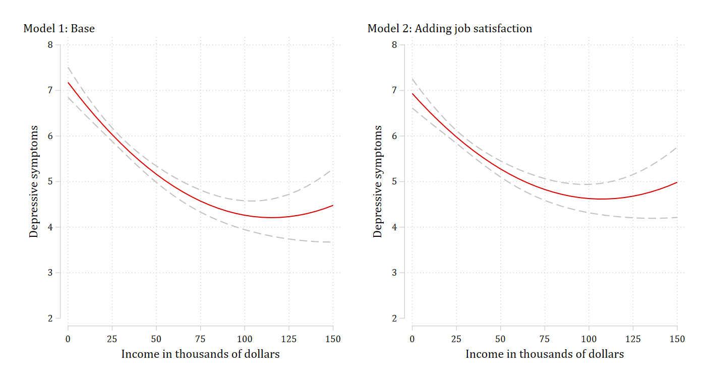
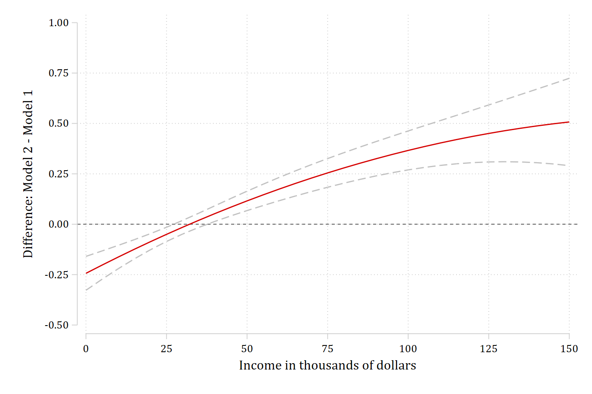
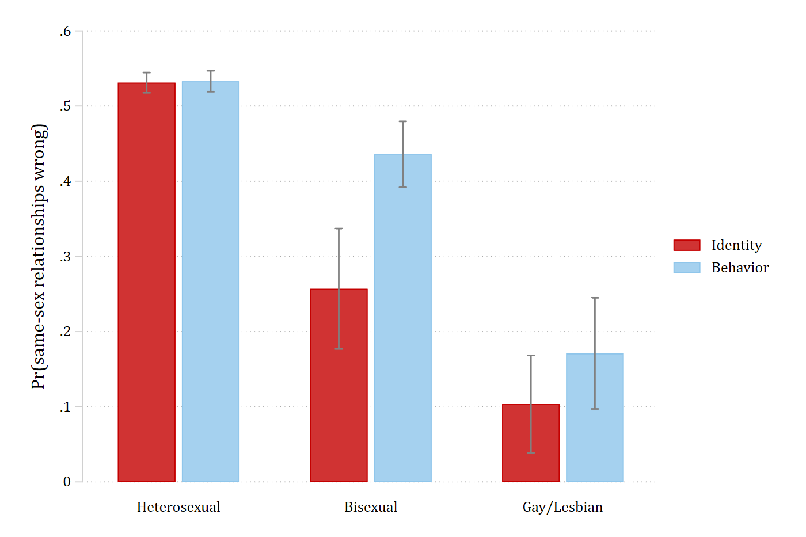
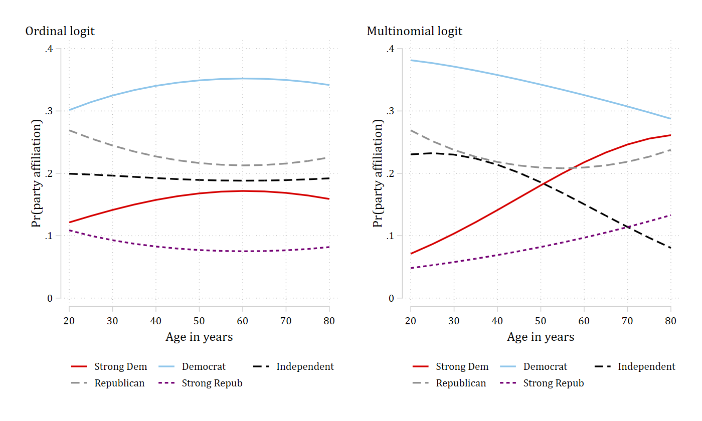

After `suest2` the combined system is the active set of estimates, and
`margins` can be pointed at any one of its models with `predict(model(name))`.
That means everything `margins` produces for a single model -- predictions
over a range of a variable, predicted probabilities for each category of an
outcome, differences between predictions -- can be produced for each model of
the system, with standard errors that use the joint covariance matrix. And
anything `margins` produces, `marginsplot` and `coefplot` can graph.

This page remakes four figures from Mize, Doan, and Long (2019). The article
fit its models jointly with `gsem` (or with Stata's `suest`) and built the
tables with `mlincom`. Here each model is fit and stored on its own, combined
with `suest2`, and then graphed with the same `margins` and `marginsplot`
calls a single model would use. The article's replication files are at
[trentonmize.com/software/mecompare](https://www.trentonmize.com/software/mecompare);
the marginal-effect tables from the same examples are on the
[`mecompare` example pages](../mecompare/examples/mediation.html).
`coefplot` (Jann) is used for one figure; install it once with
`ssc install coefplot`.

## Predictions from each model (Figure 3)

Example 6.1 of the article regresses a depressive-symptoms scale on income
and income squared, then adds job satisfaction as a possible mediator. Fit
and store the two models, then combine them:

```{.stata-run}
. use "https://tdmize.github.io/data/data/ah4_cme", clear
(ah4_cme.dta | Add Health Wave 4 | 2018-07-10)

. drop if missing(depsympB, income, inc10, age, woman, race, college, jobsat)
(0 observations deleted)

. 
. quietly regress depsympB c.income##c.income c.age i.woman i.race, vce(robust)

. estimates store basemod

. 
. quietly regress depsympB c.income##c.income c.age i.woman i.race i.jobsat, vce(robust)

. estimates store medmod

. 
. suest2 basemod medmod

Simultaneous results for basemod, medmod                 Number of obs = 4,307

---------------------------------------------------------------------------------------------------
                                  |               Robust
                                  | Coefficient  std. err.      z    P>|z|     [95% conf. interval]
----------------------------------+----------------------------------------------------------------
basemod_mean                      |
                           income |     -0.051      0.006   -7.947   0.000       -0.064      -0.039
                                  |
                c.income#c.income |      0.000      0.000    4.639   0.000        0.000       0.000
                                  |
                              age |      0.048      0.039    1.236   0.217       -0.028       0.124
                                  |
                            woman |
                           Woman  |      0.622      0.139    4.467   0.000        0.349       0.894
                                  |
                             race |
       Black or African American  |      0.502      0.169    2.976   0.003        0.171       0.832
American Indian or Alaska Native  |      0.339      0.689    0.491   0.623       -1.013       1.690
       Asian or Pacific Islander  |      1.001      0.389    2.575   0.010        0.239       1.763
                                  |
                            _cons |      5.337      1.102    4.844   0.000        3.177       7.496
----------------------------------+----------------------------------------------------------------
basemod_lnvar                     |
                            _cons |      2.993      0.030  101.384   0.000        2.935       3.051
----------------------------------+----------------------------------------------------------------
medmod_mean                       |
                           income |     -0.043      0.006   -6.886   0.000       -0.055      -0.031
                                  |
                c.income#c.income |      0.000      0.000    4.357   0.000        0.000       0.000
                                  |
                              age |      0.054      0.037    1.450   0.147       -0.019       0.128
                                  |
                            woman |
                           Woman  |      0.714      0.135    5.281   0.000        0.449       0.979
                                  |
                             race |
       Black or African American  |      0.270      0.167    1.619   0.106       -0.057       0.598
American Indian or Alaska Native  |      0.469      0.707    0.664   0.507       -0.916       1.854
       Asian or Pacific Islander  |      0.810      0.372    2.176   0.030        0.080       1.540
                                  |
                           jobsat |
                       Satisfied  |      1.250      0.149    8.408   0.000        0.959       1.541
Neither satisfied nor dissatis..  |      2.378      0.216   11.014   0.000        1.955       2.801
                    Dissatisfied  |      3.350      0.333   10.047   0.000        2.697       4.004
          Extremely dissatisfied  |      4.830      0.676    7.144   0.000        3.505       6.156
                                  |
                            _cons |      3.564      1.079    3.304   0.001        1.450       5.678
----------------------------------+----------------------------------------------------------------
medmod_lnvar                      |
                            _cons |      2.936      0.029  100.965   0.000        2.879       2.993
---------------------------------------------------------------------------------------------------

```

`predict(model(basemod))` asks `margins` for predictions from the base model
only. With `at(income=(0(5)150))` and `atmeans`, that is the predicted number
of depressive symptoms across the range of income, holding the other
variables at their means -- the left panel of the article's Figure 3.
`marginsplot` graphs it exactly as it would after `regress`:

```{.stata-run}
. margins, predict(model(basemod)) at(income=(0(5)150)) atmeans noatlegend

Adjusted predictions                                     Number of obs = 4,307
Model VCE: Robust

Expression: Linear prediction, predict(model(basemod))

------------------------------------------------------------------------------
             |            Delta-method
             |     Margin   std. err.      z    P>|z|     [95% conf. interval]
-------------+----------------------------------------------------------------
         _at |
          1  |      7.176      0.169   42.569   0.000        6.846       7.507
          2  |      6.924      0.142   48.923   0.000        6.647       7.202
          3  |      6.684      0.118   56.649   0.000        6.453       6.915
          4  |      6.454      0.099   65.524   0.000        6.261       6.647
          5  |      6.236      0.084   74.368   0.000        6.072       6.400
          6  |      6.029      0.075   80.609   0.000        5.882       6.175
          7  |      5.833      0.072   81.575   0.000        5.693       5.973
          8  |      5.648      0.073   77.254   0.000        5.505       5.791
          9  |      5.474      0.078   70.191   0.000        5.321       5.627
         10  |      5.312      0.085   62.808   0.000        5.146       5.477
         11  |      5.160      0.092   56.254   0.000        4.981       5.340
         12  |      5.020      0.099   50.797   0.000        4.826       5.214
         13  |      4.891      0.106   46.343   0.000        4.684       5.098
         14  |      4.773      0.112   42.698   0.000        4.554       4.992
         15  |      4.667      0.118   39.666   0.000        4.436       4.897
         16  |      4.571      0.123   37.069   0.000        4.329       4.813
         17  |      4.487      0.129   34.759   0.000        4.234       4.740
         18  |      4.413      0.135   32.615   0.000        4.148       4.679
         19  |      4.351      0.142   30.543   0.000        4.072       4.631
         20  |      4.300      0.151   28.486   0.000        4.005       4.596
         21  |      4.261      0.161   26.423   0.000        3.945       4.577
         22  |      4.232      0.174   24.364   0.000        3.892       4.573
         23  |      4.215      0.189   22.343   0.000        3.845       4.584
         24  |      4.208      0.206   20.403   0.000        3.804       4.613
         25  |      4.213      0.227   18.583   0.000        3.769       4.658
         26  |      4.229      0.250   16.911   0.000        3.739       4.720
         27  |      4.257      0.276   15.400   0.000        3.715       4.798
         28  |      4.295      0.306   14.054   0.000        3.696       4.894
         29  |      4.345      0.338   12.866   0.000        3.683       5.006
         30  |      4.405      0.373   11.824   0.000        3.675       5.136
         31  |      4.477      0.410   10.913   0.000        3.673       5.281
------------------------------------------------------------------------------

. 
. marginsplot, plotopts(msym(i)) recastci(rline) ciopts(lpat(dash) color(gs12)) ///
>     xlab(0(25)150) xtitle("Income in thousands of dollars") ///
>     ylab(2(1)8) ytitle("Depressive symptoms") ///
>     title("Model 1: Base", pos(11)) name(g_base, replace)

Variables that uniquely identify margins: income

```

The same call with `predict(model(medmod))` gives the right panel, and
`graph combine` puts the two side by side:

```{.stata-run}
. quietly margins, predict(model(medmod)) at(income=(0(5)150)) atmeans noatlegend

. 
. marginsplot, plotopts(msym(i)) recastci(rline) ciopts(lpat(dash) color(gs12)) ///
>     xlab(0(25)150) xtitle("Income in thousands of dollars") ///
>     ylab(2(1)8) ytitle("Depressive symptoms") ///
>     title("Model 2: Adding job satisfaction", pos(11)) name(g_med, replace)

Variables that uniquely identify margins: income

. 
. graph combine g_base g_med, ycommon xsize(10) ysize(5.5) iscale(*1.2)

. graph export "fig/plotting-predictions.png", replace width(1400)
file fig/plotting-predictions.png saved as PNG format

```

{width=90%}

## The difference in predictions across models (Figure 4)

The article's Figure 4 plots the difference between the two curves -- model 2
minus model 1 -- with a confidence interval at each value of income. With
`suest2` this is one `margins` call: `expression()` can contain more than one
`predict()`, and each can name its model. The delta-method standard errors use
the cross-model covariances, so the confidence interval is the correct one for
a difference between two models fit to the same observations.

```{.stata-run}
. margins, at(income=(0(5)150)) atmeans noatlegend ///
>     expression(predict(model(medmod)) - predict(model(basemod)))

Adjusted predictions                                     Number of obs = 4,307
Model VCE: Robust

Expression: predict(model(medmod)) - predict(model(basemod))

------------------------------------------------------------------------------
             |            Delta-method
             |     Margin   std. err.      z    P>|z|     [95% conf. interval]
-------------+----------------------------------------------------------------
         _at |
          1  |     -0.244      0.043   -5.677   0.000       -0.328      -0.159
          2  |     -0.203      0.036   -5.658   0.000       -0.273      -0.132
          3  |     -0.163      0.030   -5.507   0.000       -0.221      -0.105
          4  |     -0.124      0.024   -5.102   0.000       -0.172      -0.077
          5  |     -0.087      0.020   -4.254   0.000       -0.127      -0.047
          6  |     -0.050      0.018   -2.797   0.005       -0.085      -0.015
          7  |     -0.015      0.017   -0.859   0.390       -0.049       0.019
          8  |      0.019      0.018    1.082   0.279       -0.016       0.055
          9  |      0.053      0.020    2.664   0.008        0.014       0.091
         10  |      0.085      0.022    3.844   0.000        0.042       0.128
         11  |      0.116      0.025    4.720   0.000        0.068       0.164
         12  |      0.146      0.027    5.391   0.000        0.093       0.199
         13  |      0.175      0.029    5.925   0.000        0.117       0.232
         14  |      0.202      0.032    6.361   0.000        0.140       0.265
         15  |      0.229      0.034    6.720   0.000        0.162       0.296
         16  |      0.255      0.036    7.011   0.000        0.183       0.326
         17  |      0.279      0.039    7.237   0.000        0.204       0.355
         18  |      0.302      0.041    7.394   0.000        0.222       0.383
         19  |      0.325      0.043    7.481   0.000        0.240       0.410
         20  |      0.346      0.046    7.494   0.000        0.256       0.437
         21  |      0.366      0.049    7.432   0.000        0.270       0.463
         22  |      0.385      0.053    7.299   0.000        0.282       0.489
         23  |      0.403      0.057    7.103   0.000        0.292       0.514
         24  |      0.420      0.061    6.854   0.000        0.300       0.540
         25  |      0.436      0.066    6.564   0.000        0.306       0.566
         26  |      0.450      0.072    6.246   0.000        0.309       0.592
         27  |      0.464      0.078    5.913   0.000        0.310       0.618
         28  |      0.476      0.085    5.573   0.000        0.309       0.644
         29  |      0.488      0.093    5.235   0.000        0.305       0.670
         30  |      0.498      0.102    4.906   0.000        0.299       0.697
         31  |      0.507      0.111    4.589   0.000        0.291       0.724
------------------------------------------------------------------------------

. 
. marginsplot, plotopts(msym(i)) recastci(rline) ciopts(lpat(dash) color(gs12)) ///
>     yline(0) xlab(0(25)150) xtitle("Income in thousands of dollars") ///
>     ylab(-0.5(.25)1, format(%3.2f)) ytitle("Difference: Model 2 - Model 1") ///
>     title("")

Variables that uniquely identify margins: income

. graph export "fig/plotting-difference.png", replace width(1400)
file fig/plotting-difference.png saved as PNG format

```

{width=70%}

Above roughly $50,000 model 2 predicts more depressive symptoms than model 1,
and the interval excludes zero -- accounting for job satisfaction changes what
the model says about people with higher incomes.

**Checking the numbers.** A bare `margins` after `suest2` evaluates every
model of the system, one `_predict` per model in the order they were given
to `suest2`, so with four values of income the first four rows below are the
base model and rows 5 to 8 are the mediation model. After `post`,
[`metest`](../metest/index.html) can take any difference between rows.
The differences at income 0 and 100 match rows 1 and 21 of the `expression()`
table above:

```{.stata-run}
. margins, at(income=(0 50 100 150)) atmeans post

Adjusted predictions                                     Number of obs = 4,307
Model VCE: Robust

1._predict: Linear prediction, predict(model(basemod))
2._predict: Linear prediction, predict(model(medmod))

1._at: income   =        0
       age      = 28.41653 (mean)
       0.woman  = .4525192 (mean)
       1.woman  = .5474808 (mean)
       1.race   = .7452984 (mean)
       2.race   = .2189459 (mean)
       3.race   = .0058045 (mean)
       4.race   = .0299512 (mean)
       1.jobsat = .2437892 (mean)
       2.jobsat = .4989552 (mean)
       3.jobsat = .1715811 (mean)
       4.jobsat = .0643139 (mean)
       5.jobsat = .0213606 (mean)
2._at: income   =       50
       age      = 28.41653 (mean)
       0.woman  = .4525192 (mean)
       1.woman  = .5474808 (mean)
       1.race   = .7452984 (mean)
       2.race   = .2189459 (mean)
       3.race   = .0058045 (mean)
       4.race   = .0299512 (mean)
       1.jobsat = .2437892 (mean)
       2.jobsat = .4989552 (mean)
       3.jobsat = .1715811 (mean)
       4.jobsat = .0643139 (mean)
       5.jobsat = .0213606 (mean)
3._at: income   =      100
       age      = 28.41653 (mean)
       0.woman  = .4525192 (mean)
       1.woman  = .5474808 (mean)
       1.race   = .7452984 (mean)
       2.race   = .2189459 (mean)
       3.race   = .0058045 (mean)
       4.race   = .0299512 (mean)
       1.jobsat = .2437892 (mean)
       2.jobsat = .4989552 (mean)
       3.jobsat = .1715811 (mean)
       4.jobsat = .0643139 (mean)
       5.jobsat = .0213606 (mean)
4._at: income   =      150
       age      = 28.41653 (mean)
       0.woman  = .4525192 (mean)
       1.woman  = .5474808 (mean)
       1.race   = .7452984 (mean)
       2.race   = .2189459 (mean)
       3.race   = .0058045 (mean)
       4.race   = .0299512 (mean)
       1.jobsat = .2437892 (mean)
       2.jobsat = .4989552 (mean)
       3.jobsat = .1715811 (mean)
       4.jobsat = .0643139 (mean)
       5.jobsat = .0213606 (mean)

------------------------------------------------------------------------------
             |            Delta-method
             |     Margin   std. err.      z    P>|z|     [95% conf. interval]
-------------+----------------------------------------------------------------
_predict#_at |
        1 1  |      7.176      0.169   42.569   0.000        6.846       7.507
        1 2  |      5.160      0.092   56.254   0.000        4.981       5.340
        1 3  |      4.261      0.161   26.423   0.000        3.945       4.577
        1 4  |      4.477      0.410   10.913   0.000        3.673       5.281
        2 1  |      6.933      0.163   42.574   0.000        6.614       7.252
        2 2  |      5.276      0.090   58.559   0.000        5.100       5.453
        2 3  |      4.627      0.159   29.154   0.000        4.316       4.938
        2 4  |      4.985      0.394   12.658   0.000        4.213       5.756
------------------------------------------------------------------------------

. 
. metest 5 - 1, rowname("Income 0: Model 2 - Model 1")

                                 |  estimate         se     pvalue 
---------------------------------+--------------------------------
Income 0                         |                                
               Model 2 - Model 1 |    -0.244      0.043      0.000 

. metest 7 - 3, rowname("Income 100: Model 2 - Model 1") add

                                 |  estimate         se     pvalue 
---------------------------------+--------------------------------
Income 0                         |                                
               Model 2 - Model 1 |    -0.244      0.043      0.000 
---------------------------------+--------------------------------
Income 100                       |                                
               Model 2 - Model 1 |     0.366      0.049      0.000 

```

## Predicted probabilities from alternative predictors (Figure 5)

Example 6.3 predicts whether a person views same-sex relationships as wrong
from sexual orientation measured two ways: by self-identification in one
logit and by reported sexual behavior in the other. The article's Figure 5 is
a bar chart of the predicted probabilities for each orientation category from
each model. Fit, store, and combine, and this time store the combined system
too, because `margins, post` will replace it:

```{.stata-run}
. use "https://tdmize.github.io/data/data/gss_cme", clear
(gss_cme.dta | GSS 1972 - 2016 Weighted | 2018-07-10)

. drop if missing(samesexB, sexident, sexbehav, college, woman, race, age, year)
(57,545 observations deleted)

. 
. quietly logit samesexB i.sexident i.woman i.college c.age i.race i.year, vce(robust)

. estimates store identity

. 
. quietly logit samesexB i.sexbehav i.woman i.college c.age i.race i.year, vce(robust)

. estimates store behavior

. 
. quietly suest2 identity behavior

. estimates store system

```

Each model gets its own `margins` call: the identity model at the three
values of `sexident`, the behavior model at the three values of `sexbehav`.
For a logit the default prediction is the probability. Both sets of average
predicted probabilities are posted and stored, which is the form `coefplot`
reads:

```{.stata-run}
. margins, predict(model(identity)) at(sexident=(1 2 3)) post

Predictive margins                                       Number of obs = 4,921
Model VCE: Robust

Expression: Pr(samesexB), predict(model(identity))
1._at: sexident = 1
2._at: sexident = 2
3._at: sexident = 3

------------------------------------------------------------------------------
             |            Delta-method
             |     Margin   std. err.      z    P>|z|     [95% conf. interval]
-------------+----------------------------------------------------------------
         _at |
          1  |      0.531      0.007   77.364   0.000        0.518       0.545
          2  |      0.257      0.041    6.291   0.000        0.177       0.337
          3  |      0.104      0.033    3.136   0.002        0.039       0.168
------------------------------------------------------------------------------

. estimates store pr_identity

. 
. estimates restore system
(results system are active now)

. margins, predict(model(behavior)) at(sexbehav=(1 2 3)) post

Predictive margins                                       Number of obs = 4,921
Model VCE: Robust

Expression: Pr(samesexB), predict(model(behavior))
1._at: sexbehav = 1
2._at: sexbehav = 2
3._at: sexbehav = 3

------------------------------------------------------------------------------
             |            Delta-method
             |     Margin   std. err.      z    P>|z|     [95% conf. interval]
-------------+----------------------------------------------------------------
         _at |
          1  |      0.533      0.007   75.067   0.000        0.519       0.547
          2  |      0.436      0.022   19.487   0.000        0.392       0.480
          3  |      0.171      0.038    4.534   0.000        0.097       0.245
------------------------------------------------------------------------------

. estimates store pr_behavior

```

The two stored results have the same coefficient names (`1._at`, `2._at`,
`3._at`), so `coefplot` lines them up category by category:

```{.stata-run}
. coefplot (pr_identity, color(red*1.3)) (pr_behavior, color(eltblue*.9)), ///
>     vertical recast(bar) barw(0.3) ciopts(recast(rcap) color(gs8)) citop ///
>     legend(order(1 "Identity" 3 "Behavior")) ///
>     xlab(1 "Heterosexual" 2 "Bisexual" 3 "Gay/Lesbian", noticks) ///
>     ylab(0(0.1).6) ytitle("Pr(same-sex relationships wrong)") ///
>     xscale(noline) plotregion(style(none))

. graph export "fig/plotting-bars.png", replace width(1400)
file fig/plotting-bars.png saved as PNG format

```

{width=70%}

The article's Table 4 (panel A) reports the same probabilities with a test of
the cross-model difference in each category. One `margins` call on the
restored system, with an `at()` for each measure, evaluates both models: rows
1 to 3 are the identity model at the three values of `sexident`, and rows 10
to 12 are the behavior model at the three values of `sexbehav` (rows 4 to 6
and 7 to 9 set the variable the model does not use, and are not needed).
`metest` builds the table:

```{.stata-run}
. estimates restore system
(results system are active now)

. margins, at(sexident=(1 2 3)) at(sexbehav=(1 2 3)) post

Predictive margins                                       Number of obs = 4,921
Model VCE: Robust

1._predict: Pr(samesexB), predict(model(identity))
2._predict: Pr(samesexB), predict(model(behavior))

1._at: sexident = 1
2._at: sexident = 2
3._at: sexident = 3
4._at: sexbehav = 1
5._at: sexbehav = 2
6._at: sexbehav = 3

------------------------------------------------------------------------------
             |            Delta-method
             |     Margin   std. err.      z    P>|z|     [95% conf. interval]
-------------+----------------------------------------------------------------
_predict#_at |
        1 1  |      0.531      0.007   77.364   0.000        0.518       0.545
        1 2  |      0.257      0.041    6.291   0.000        0.177       0.337
        1 3  |      0.104      0.033    3.136   0.002        0.039       0.168
        1 4  |      0.517      0.007   78.009   0.000        0.504       0.530
        1 5  |      0.517      0.007   78.009   0.000        0.504       0.530
        1 6  |      0.517      0.007   78.009   0.000        0.504       0.530
        2 1  |      0.517      0.007   77.817   0.000        0.504       0.530
        2 2  |      0.517      0.007   77.817   0.000        0.504       0.530
        2 3  |      0.517      0.007   77.817   0.000        0.504       0.530
        2 4  |      0.533      0.007   75.067   0.000        0.519       0.547
        2 5  |      0.436      0.022   19.487   0.000        0.392       0.480
        2 6  |      0.171      0.038    4.534   0.000        0.097       0.245
------------------------------------------------------------------------------

. 
. metest, clear

. quietly metest 1,      rowname("Heterosexual: Identity") add

. quietly metest 10,     rowname("Heterosexual: Behavior") add

. quietly metest 10 - 1, rowname("Heterosexual: Difference") add

. quietly metest 2,      rowname("Bisexual: Identity") add

. quietly metest 11,     rowname("Bisexual: Behavior") add

. quietly metest 11 - 2, rowname("Bisexual: Difference") add

. quietly metest 3,      rowname("Gay/lesbian: Identity") add

. quietly metest 12,     rowname("Gay/lesbian: Behavior") add

. quietly metest 12 - 3, rowname("Gay/lesbian: Difference") add

. metest, title("Pr(wrong) by orientation: identity versus behavior")

Pr(wrong) by orientation: identity versus behavior

                                 |  estimate         se     pvalue 
---------------------------------+--------------------------------
Heterosexual                     |                                
                        Identity |     0.531      0.007      0.000 
                        Behavior |     0.533      0.007      0.000 
                      Difference |     0.002      0.002      0.319 
---------------------------------+--------------------------------
Bisexual                         |                                
                        Identity |     0.257      0.041      0.000 
                        Behavior |     0.436      0.022      0.000 
                      Difference |     0.179      0.041      0.000 
---------------------------------+--------------------------------
Gay/lesbian                      |                                
                        Identity |     0.104      0.033      0.002 
                        Behavior |     0.171      0.038      0.000 
                      Difference |     0.067      0.040      0.093 

```

Only for people classified as bisexual do the two measures give a different
answer. The marginal effects for this example -- panel B of the article's
table -- are on the [alternative predictors](../mecompare/examples/alternative-predictors.html)
page of `mecompare`.

## Two model types for one outcome (Figure 6)

Example 6.5 fits an ordinal logit and a multinomial logit to the same
five-category party identification, and the article's Figure 6 compares the
predicted probability of each category across age from the two models. For a
multi-category model, `predict()` names the model *and* the outcome, so
predictions for all five categories take five `predict()` options -- the
same as they would after `ologit` or `mlogit` alone. `partyid5` is coded 0
to 4, from strong Democrat to strong Republican:

```{.stata-run}
. use "https://tdmize.github.io/data/data/gss_cme", clear
(gss_cme.dta | GSS 1972 - 2016 Weighted | 2018-07-10)

. drop if year < 2010
(53,043 observations deleted)

. drop if missing(partyid5, woman, edyrs, age, parent, married, faminc, employed, region4, year)
(1,244 observations deleted)

. 
. quietly ologit partyid5 c.age##c.age i.woman c.edyrs i.parent i.married i.race ///
>                c.faminc i.employed i.region4 i.year, vce(robust)

. estimates store ordinal

. 
. quietly mlogit partyid5 c.age##c.age i.woman c.edyrs i.parent i.married i.race ///
>                c.faminc i.employed i.region4 i.year, vce(robust)

. estimates store nominal

. 
. quietly suest2 ordinal nominal

. 
. margins, at(age=(20 50 80)) atmeans ///
>     predict(model(ordinal) pr outcome(0)) predict(model(ordinal) pr outcome(1)) ///
>     predict(model(ordinal) pr outcome(2)) predict(model(ordinal) pr outcome(3)) ///
>     predict(model(ordinal) pr outcome(4))

Adjusted predictions                                     Number of obs = 8,179
Model VCE: Robust

1._predict: Pr(partyid5==0), predict(model(ordinal) pr outcome(0))
2._predict: Pr(partyid5==1), predict(model(ordinal) pr outcome(1))
3._predict: Pr(partyid5==2), predict(model(ordinal) pr outcome(2))
4._predict: Pr(partyid5==3), predict(model(ordinal) pr outcome(3))
5._predict: Pr(partyid5==4), predict(model(ordinal) pr outcome(4))

1._at: age        =       20
       0.woman    = .4485878 (mean)
       1.woman    = .5514122 (mean)
       edyrs      = 13.69507 (mean)
       0.parent   = .2738721 (mean)
       1.parent   = .7261279 (mean)
       0.married  = .5550801 (mean)
       1.married  = .4449199 (mean)
       1.race     = .7469128 (mean)
       2.race     = .1585768 (mean)
       3.race     = .0945103 (mean)
       faminc     = 32.91243 (mean)
       0.employed = .4013938 (mean)
       1.employed = .5986062 (mean)
       1.region4  = .1656682 (mean)
       2.region4  =  .236826 (mean)
       3.region4  = .3705832 (mean)
       4.region4  = .2269226 (mean)
       2010.year  = .2143294 (mean)
       2012.year  =  .207238 (mean)
       2014.year  = .2732608 (mean)
       2016.year  = .3051718 (mean)
2._at: age        =       50
       0.woman    = .4485878 (mean)
       1.woman    = .5514122 (mean)
       edyrs      = 13.69507 (mean)
       0.parent   = .2738721 (mean)
       1.parent   = .7261279 (mean)
       0.married  = .5550801 (mean)
       1.married  = .4449199 (mean)
       1.race     = .7469128 (mean)
       2.race     = .1585768 (mean)
       3.race     = .0945103 (mean)
       faminc     = 32.91243 (mean)
       0.employed = .4013938 (mean)
       1.employed = .5986062 (mean)
       1.region4  = .1656682 (mean)
       2.region4  =  .236826 (mean)
       3.region4  = .3705832 (mean)
       4.region4  = .2269226 (mean)
       2010.year  = .2143294 (mean)
       2012.year  =  .207238 (mean)
       2014.year  = .2732608 (mean)
       2016.year  = .3051718 (mean)
3._at: age        =       80
       0.woman    = .4485878 (mean)
       1.woman    = .5514122 (mean)
       edyrs      = 13.69507 (mean)
       0.parent   = .2738721 (mean)
       1.parent   = .7261279 (mean)
       0.married  = .5550801 (mean)
       1.married  = .4449199 (mean)
       1.race     = .7469128 (mean)
       2.race     = .1585768 (mean)
       3.race     = .0945103 (mean)
       faminc     = 32.91243 (mean)
       0.employed = .4013938 (mean)
       1.employed = .5986062 (mean)
       1.region4  = .1656682 (mean)
       2.region4  =  .236826 (mean)
       3.region4  = .3705832 (mean)
       4.region4  = .2269226 (mean)
       2010.year  = .2143294 (mean)
       2012.year  =  .207238 (mean)
       2014.year  = .2732608 (mean)
       2016.year  = .3051718 (mean)

------------------------------------------------------------------------------
             |            Delta-method
             |     Margin   std. err.      z    P>|z|     [95% conf. interval]
-------------+----------------------------------------------------------------
_predict#_at |
        1 1  |      0.121      0.006   18.804   0.000        0.109       0.134
        1 2  |      0.168      0.005   32.171   0.000        0.158       0.178
        1 3  |      0.159      0.011   14.810   0.000        0.138       0.180
        2 1  |      0.302      0.009   34.176   0.000        0.284       0.319
        2 2  |      0.349      0.006   56.391   0.000        0.337       0.361
        2 3  |      0.342      0.010   33.840   0.000        0.322       0.362
        3 1  |      0.199      0.005   42.275   0.000        0.190       0.209
        3 2  |      0.189      0.005   41.224   0.000        0.180       0.198
        3 3  |      0.192      0.005   36.155   0.000        0.182       0.202
        4 1  |      0.269      0.009   30.051   0.000        0.252       0.287
        4 2  |      0.217      0.005   40.173   0.000        0.206       0.227
        4 3  |      0.225      0.011   20.324   0.000        0.204       0.247
        5 1  |      0.109      0.006   18.229   0.000        0.097       0.120
        5 2  |      0.077      0.003   24.123   0.000        0.071       0.083
        5 3  |      0.082      0.006   13.170   0.000        0.070       0.094
------------------------------------------------------------------------------

```

The five predictions at each age sum to one, as they should. For the figure,
the same call over `age=(20(5)80)` for each model, graphed without confidence
intervals as in the article:

```{.stata-run}
. quietly margins, at(age=(20(5)80)) atmeans ///
>     predict(model(ordinal) pr outcome(0)) predict(model(ordinal) pr outcome(1)) ///
>     predict(model(ordinal) pr outcome(2)) predict(model(ordinal) pr outcome(3)) ///
>     predict(model(ordinal) pr outcome(4))

. 
. marginsplot, noci plotopts(msym(i) lwidth(medthick)) ///
>     legend(order(1 "Strong Dem" 2 "Democrat" 3 "Independent" ///
>                  4 "Republican" 5 "Strong Repub") position(6) rows(2)) ///
>     xlab(20(10)80) xtitle("Age in years") ylab(0(.1).4) ///
>     ytitle("Pr(party affiliation)") title("Ordinal logit", pos(11)) ///
>     name(g_ordinal, replace)

Variables that uniquely identify margins: age _equation

. 
. quietly margins, at(age=(20(5)80)) atmeans ///
>     predict(model(nominal) pr outcome(0)) predict(model(nominal) pr outcome(1)) ///
>     predict(model(nominal) pr outcome(2)) predict(model(nominal) pr outcome(3)) ///
>     predict(model(nominal) pr outcome(4))

. 
. marginsplot, noci plotopts(msym(i) lwidth(medthick)) ///
>     legend(order(1 "Strong Dem" 2 "Democrat" 3 "Independent" ///
>                  4 "Republican" 5 "Strong Repub") position(6) rows(2)) ///
>     xlab(20(10)80) xtitle("Age in years") ylab(0(.1).4) ///
>     ytitle("Pr(party affiliation)") title("Multinomial logit", pos(11)) ///
>     name(g_nominal, replace)

Variables that uniquely identify margins: age _equation

. 
. graph combine g_ordinal g_nominal, ycommon xsize(10) ysize(6) iscale(*1.2)

. graph export "fig/plotting-party.png", replace width(1400)
(file fig/plotting-party.png not found)
file fig/plotting-party.png saved as PNG format

```

{width=90%}

The ordinal model forces one pattern on every category -- the probability of
being an independent barely moves with age -- while the multinomial model
lets it fall steeply. The tests of whether these age effects differ across
the two models are on the [model types](../mecompare/examples/model-types.html)
page of `mecompare`.

## Reference

> Mize, Trenton D., Long Doan, and J. Scott Long. 2019. "A General Framework
> for Comparing Predictions and Marginal Effects Across Models."
> *Sociological Methodology* 49(1): 152--189.
> <https://doi.org/10.1177/0081175019852763>
